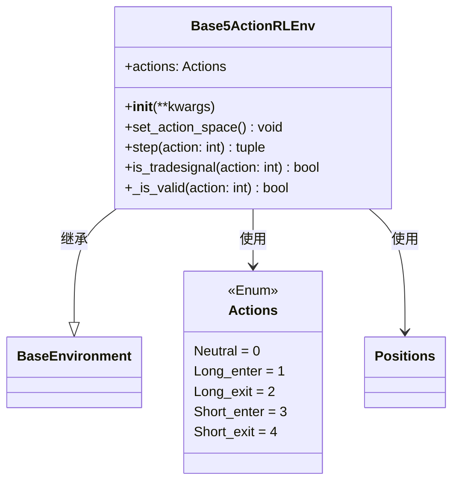

# Base5ActionRLEnv.py

## 概述

`Base5ActionRLEnv.py` 实现了一个**5 动作**的强化学习交易环境，是 FreqAI RL 模块中**最完整的动作空间**定义。它继承自 `BaseEnvironment`，定义了五种动作：Neutral、Long_enter、Long_exit、Short_enter 和 Short_exit。

5 动作环境将做多出场和做空出场分为两个独立动作，使 agent 能够更精确地控制交易行为。这也是 `BaseReinforcementLearningModel` 中 `MyRLEnv` 嵌套类的默认父类。

## 架构图

## 核心类/函数

### Actions (Enum)

5 动作枚举：
- `Neutral = 0` — 不操作
- `Long_enter = 1` — 做多入场
- `Long_exit = 2` — 做多出场
- `Short_enter = 3` — 做空入场
- `Short_exit = 4` — 做空出场

### Base5ActionRLEnv

#### `__init__`
- **参数**：通过 `**kwargs` 传递给 `BaseEnvironment.__init__`
- **职责**：调用父类初始化后，将 `self.actions` 设置为本地的 `Actions` 枚举

#### `set_action_space`
将动作空间设为 `spaces.Discrete(5)`。

#### `step(action: int)`
单步执行逻辑：
1. 递增 `_current_tick`，判断是否到达终点
2. 更新未实现利润，计算奖励，记录 TensorBoard
3. 如果是交易信号：
   - `Neutral` -> 切换到 Neutral 状态
   - `Long_enter` -> 进入 Long 持仓
   - `Short_enter` -> 进入 Short 持仓
   - `Long_exit` -> 更新已实现利润，退出 Long 回到 Neutral
   - `Short_exit` -> 更新已实现利润，退出 Short 回到 Neutral
4. 记录交易历史，检查最大回撤
5. 返回 `(observation, step_reward, done, truncated, info)`

#### `is_tradesignal(action: int) -> bool`
通过排除法判断，以下情况**不是**交易信号：
- Neutral 在任何持仓状态
- Short_enter 在 Short 或 Long 持仓时
- Short_exit 在 Long 持仓或 Neutral 时
- Long_enter 在 Long 或 Short 持仓时
- Long_exit 在 Short 持仓或 Neutral 时

核心思想是：入场动作只在 Neutral 时有效，出场动作只在对应持仓方向时有效。

#### `_is_valid(action: int) -> bool`
验证动作有效性：
- Short_exit 和 Long_exit 仅在有持仓（Short 或 Long）时有效
- Short_enter 和 Long_enter 仅在 Neutral 状态时有效
- 其他情况均有效

## 依赖关系

### 内部依赖（本项目模块）
- `freqtrade.freqai.RL.BaseEnvironment` — 导入 `BaseEnvironment`（父类）和 `Positions`

### 外部依赖（第三方库）
- `gymnasium` — 提供 `spaces.Discrete` 用于定义离散动作空间

### 被依赖（谁引用了本文件）
- `freqtrade.freqai.RL.BaseReinforcementLearningModel` — 导入 `Actions` 和 `Base5ActionRLEnv`，作为 `MyRLEnv` 嵌套类的父类
- `freqtrade.freqai.prediction_models.ReinforcementLearner` — 导入 `Actions` 和 `Base5ActionRLEnv` 用于策略实现
