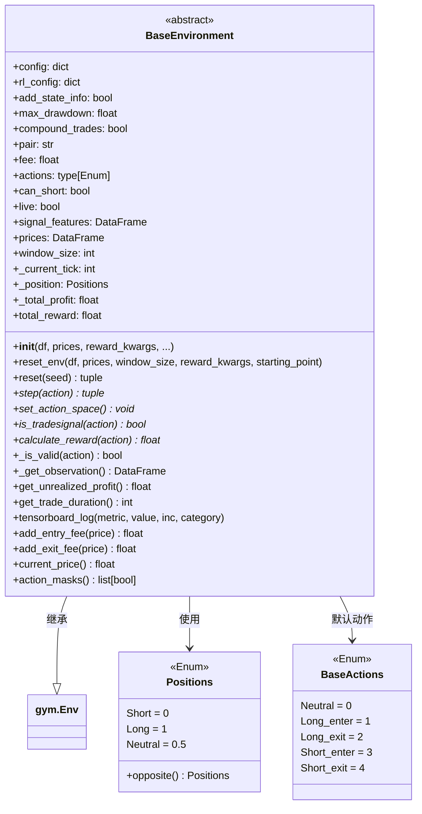

# BaseEnvironment.py

## 概述

`BaseEnvironment.py` 是 FreqAI 强化学习模块中所有交易环境的**抽象基类**。它继承自 `gymnasium.Env`，为强化学习 agent 提供了一个模拟交易的环境框架。该文件与具体的动作空间无关（action-agnostic），由子类（如 `Base3ActionRLEnv`、`Base4ActionRLEnv`、`Base5ActionRLEnv`）来定义具体的动作数量和类型。

核心功能包括：
- 管理环境状态（持仓、利润、交易历史等）
- 定义观测空间（observation space）的构建逻辑
- 提供手续费计算、未实现利润计算等交易辅助方法
- 支持 TensorBoard 日志记录
- 支持 `add_state_info` 模式，在 live 模式下将持仓状态信息注入观测数据

## 架构图

## 核心类/函数

### BaseActions (Enum)

默认的动作空间枚举，定义了 5 种基本动作：
- `Neutral = 0` — 中立/不操作
- `Long_enter = 1` — 做多入场
- `Long_exit = 2` — 做多出场
- `Short_enter = 3` — 做空入场
- `Short_exit = 4` — 做空出场

主要用于类型处理，子类环境会定义自己的 Actions 枚举。

### Positions (Enum)

持仓状态枚举：
- `Short = 0` — 空头持仓
- `Long = 1` — 多头持仓
- `Neutral = 0.5` — 空仓/中立

提供 `opposite()` 方法返回反向持仓。

### BaseEnvironment (gym.Env)

强化学习交易环境的抽象基类。

#### `__init__`
- **参数**：
  - `df: DataFrame` — 特征数据
  - `prices: DataFrame` — 训练环境中使用的价格数据
  - `reward_kwargs: dict` — 用户在 `rl_config` 中配置的奖励参数
  - `window_size: int = 10` — 传递给 agent 的时间窗口大小
  - `starting_point: bool = True` — 是否从窗口边缘开始
  - `id: str` — 环境的字符串标识（用于多进程环境的后端）
  - `seed: int = 1` — 随机种子
  - `config: dict` — 用户配置文件
  - `live: bool = False` — 是否处于 dry/live/backtesting 状态
  - `fee: float = 0.0015` — 交易手续费
  - `can_short: bool = False` — 是否允许做空
  - `pair: str` — 交易对
  - `df_raw: DataFrame` — 原始特征数据
- **关键逻辑**：初始化配置参数、设置最大回撤限制、禁止在 backtesting 中使用 `add_state_info`

#### `reset_env`
重置环境状态。当 agent 回撤超过 `max_training_drawdown_pct` 时调用。设置特征数据、价格数据、观测空间和动作空间，并将所有交易状态变量重置为初始值。

#### `reset`
每个 episode 开始时调用。支持 `randomize_starting_position` 配置来随机化起始点。返回初始观测和历史字典。

#### `step` (抽象方法)
单步执行逻辑，必须由子类实现。

#### `set_action_space` (抽象方法)
设置动作空间，由子类根据动作数量来实现。

#### `_get_observation`
构建当前时间步的观测。从 `signal_features` 中取 `window_size` 大小的窗口数据。如果 `add_state_info=True`，会额外拼接当前利润百分比、持仓方向和交易持续时间三个状态特征。

#### `get_unrealized_profit`
计算当前未实现利润。根据持仓方向（Long/Short/Neutral）使用不同的计算公式，并考虑手续费。

#### `tensorboard_log`
构建 TensorBoard 指标字典，支持增量计数和直接赋值两种模式。用于在训练环境中追踪自定义事件和指标。

#### `calculate_reward` (抽象方法)
计算奖励函数，用户需在自定义环境中实现。

#### `_is_valid`
判断动作是否有效，基类默认返回 `True`，子类可覆盖。

#### `action_masks`
返回所有动作的有效性掩码列表，配合 `MaskablePPO` 使用。

#### `_update_total_profit` / `_update_unrealized_total_profit`
更新已实现总利润和未实现总利润。支持两种模式：
- `compound_trades=True`（复利模式）：`总利润 * (1 + pnl)`
- `compound_trades=False`（非复利模式）：`总利润 + pnl`

## 依赖关系

### 内部依赖（本项目模块）
- `freqtrade.exceptions.OperationalException` — 抛出配置错误时使用

### 外部依赖（第三方库）
- `gymnasium` — OpenAI Gym 的后继者，提供 RL 环境基类 `gym.Env` 和空间定义 `spaces`
- `numpy` — 数值计算
- `pandas` — 数据处理（DataFrame 用于特征和价格数据）

### 被依赖（谁引用了本文件）
- `freqtrade.freqai.RL.Base3ActionRLEnv` — 继承 `BaseEnvironment`，导入 `Positions`
- `freqtrade.freqai.RL.Base4ActionRLEnv` — 继承 `BaseEnvironment`，导入 `Positions`
- `freqtrade.freqai.RL.Base5ActionRLEnv` — 继承 `BaseEnvironment`，导入 `Positions`
- `freqtrade.freqai.RL.BaseReinforcementLearningModel` — 导入 `BaseActions`、`BaseEnvironment`、`Positions`
- `freqtrade.freqai.tensorboard.TensorboardCallback` — 导入 `BaseEnvironment`
- `freqtrade.freqai.prediction_models.ReinforcementLearner` — 导入 `BaseEnvironment`、`Positions`
