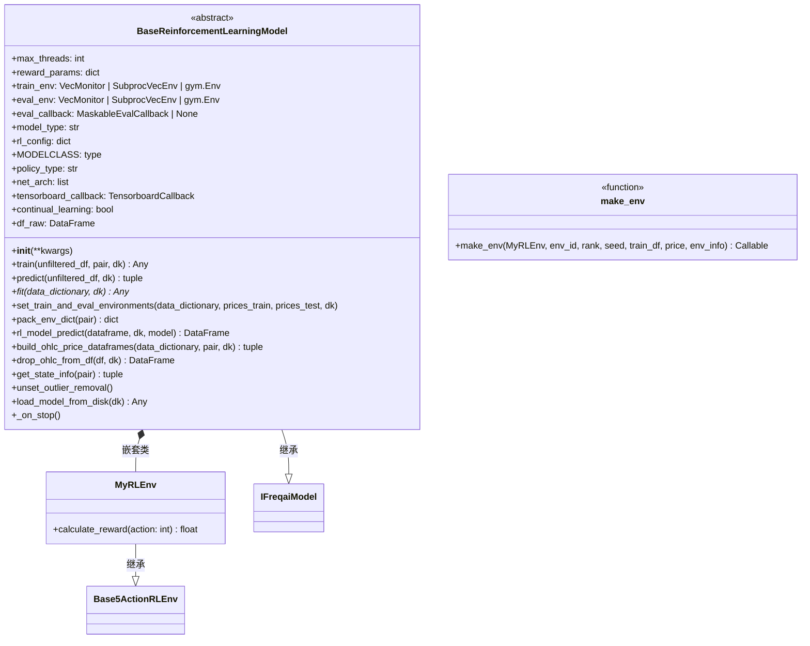

# BaseReinforcementLearningModel.py

## 概述

`BaseReinforcementLearningModel.py` 是 FreqAI 强化学习的**核心模型基类**。它继承自 `IFreqaiModel`，将强化学习算法（Stable Baselines3）与 FreqAI 框架集成在一起。该类负责：

1. **模型选择**：支持 SB3 内置模型（PPO、A2C、DQN）和 sb3-contrib 扩展模型（TRPO、ARS、RecurrentPPO、MaskablePPO、QRDQN）
2. **数据预处理**：从原始 DataFrame 中提取 OHLC 价格数据并构建训练/测试环境
3. **训练流程编排**：过滤特征、归一化数据、设置环境、调用 `fit` 方法训练模型
4. **预测执行**：使用滚动窗口在训练好的模型上进行推理
5. **环境管理**：创建训练和评估环境，支持 MaskablePPO 的 action masking
6. **嵌套 MyRLEnv 类**：提供一个默认的奖励函数实现作为示例

## 架构图

## 核心类/函数

### BaseReinforcementLearningModel

#### `__init__(**kwargs)`
- **职责**：
  1. 设置 PyTorch 线程数（取 `cpu_count` 配置和系统线程数的一半的较小值）
  2. 根据 `model_type` 动态导入 `stable_baselines3` 或 `sb3_contrib` 中的模型类
  3. 禁用与 RL 不兼容的数据处理功能（SVM 异常值移除、DBSCAN 异常值移除、DI 阈值、数据 shuffle）
  4. 初始化 TensorBoard 回调

#### `unset_outlier_removal()`
自动关闭与 RL 不兼容的离群值移除和数据混洗设置，并记录警告日志。

#### `train(unfiltered_df, pair, dk) -> Any`
完整的训练流程：
1. 过滤特征和标签
2. 构建训练/测试数据集
3. 深拷贝训练特征到 `df_raw`（用于奖励函数中访问原始特征）
4. 构建价格 DataFrame
5. 通过 `feature_pipeline` 归一化数据
6. 设置训练和评估环境
7. 调用 `self.fit()` 训练模型

#### `set_train_and_eval_environments(data_dictionary, prices_train, prices_test, dk)`
创建训练环境 (`self.train_env`) 和评估环境 (`self.eval_env`)。评估环境使用 `Monitor` 包装，并创建 `MaskableEvalCallback` 用于在训练过程中定期评估模型性能。

#### `pack_env_dict(pair) -> dict`
打包创建环境所需的参数字典，包括 `window_size`、`reward_kwargs`、`config`、`live`、`can_short`、`pair`、`df_raw` 和 `fee`。

#### `fit(data_dictionary, dk)` (抽象方法)
模型训练的抽象方法，必须由子类（如 `ReinforcementLearner`）实现。

#### `predict(unfiltered_df, dk) -> tuple[DataFrame, NDArray]`
预测流程：
1. 查找并过滤预测特征
2. 通过 `feature_pipeline` 转换数据
3. 调用 `rl_model_predict` 进行推理
4. 返回预测 DataFrame 和 `do_predict` 数组

#### `rl_model_predict(dataframe, dk, model) -> DataFrame`
使用 `rolling(window=CONV_WIDTH).apply()` 对每个时间窗口进行预测。在 live 模式且启用 `add_state_info` 时，会注入当前持仓状态信息。

#### `build_ohlc_price_dataframes(data_dictionary, pair, dk) -> tuple`
从训练/测试数据中提取 OHLC 价格列，支持新旧两种命名格式（`%-raw_open` 和 `%-{pair}raw_open_{tf}`）。提取后将价格列从特征数据中移除。

#### `get_state_info(pair) -> tuple[float, float, int]`
在 live 模式下获取当前交易对的状态信息：
- `market_side: float` — 0（空头）、0.5（空仓）、1（多头）
- `current_profit: float` — 当前未实现利润
- `trade_duration: int` — 交易持续的 K 线数量

#### `_on_stop()`
Bot 关闭时的清理钩子。关闭 `train_env` 和 `eval_env`，确保 SubprocVecEnv 子进程正常退出。

### MyRLEnv (嵌套类，继承 Base5ActionRLEnv)

提供了一个**示例奖励函数** `calculate_reward`：
- 无效动作返回 -2
- 入场时根据 RSI 指标给予额外奖励（RSI < 40 时奖励更高）
- 中立状态不入场扣 -1
- 持仓期间不操作按交易时长比例扣分
- 平仓时基于 PnL 计算奖励，超过目标利润时乘以 `win_reward_factor`

### make_env (模块级函数)

多进程环境的工厂函数：
- **参数**：`MyRLEnv`（环境类）、`env_id`、`rank`（子进程索引）、`seed`、`train_df`、`price`、`env_info`
- **返回**：`Callable`，返回一个创建环境实例的闭包函数
- **用途**：配合 `SubprocVecEnv` 使用，在 `ReinforcementLearner_multiproc` 中用于多进程训练

## 依赖关系

### 内部依赖（本项目模块）
- `freqtrade.exceptions.OperationalException` — 模型类型不支持时抛出异常
- `freqtrade.freqai.data_kitchen.FreqaiDataKitchen` — 数据处理工具
- `freqtrade.freqai.freqai_interface.IFreqaiModel` — FreqAI 模型基类（父类）
- `freqtrade.freqai.RL.Base5ActionRLEnv` — `MyRLEnv` 嵌套类的父类，导入 `Actions`
- `freqtrade.freqai.RL.BaseEnvironment` — 导入 `BaseActions`、`BaseEnvironment`、`Positions`
- `freqtrade.freqai.tensorboard.TensorboardCallback` — TensorBoard 日志回调
- `freqtrade.persistence.Trade` — 获取当前开仓交易信息

### 外部依赖（第三方库）
- `gymnasium` — RL 环境基础库
- `numpy` / `pandas` — 数据处理
- `torch` — PyTorch，用于设置线程数和多进程共享策略
- `stable_baselines3` — RL 算法库（PPO、A2C、DQN），以及工具类（`Monitor`、`SubprocVecEnv`、`VecMonitor`、`set_random_seed`）
- `sb3_contrib` — SB3 扩展模型库（MaskablePPO、TRPO 等），以及 `MaskableEvalCallback`

### 被依赖（谁引用了本文件）
- `freqtrade.freqai.prediction_models.ReinforcementLearner` — 继承 `BaseReinforcementLearningModel`，实现 `fit` 方法
- `freqtrade.freqai.prediction_models.ReinforcementLearner_multiproc` — 继承 `BaseReinforcementLearningModel`，实现多进程训练
