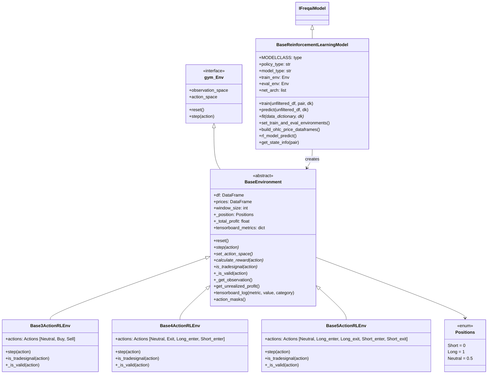
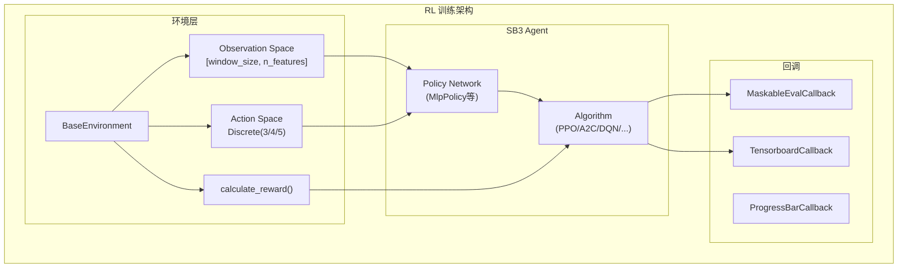
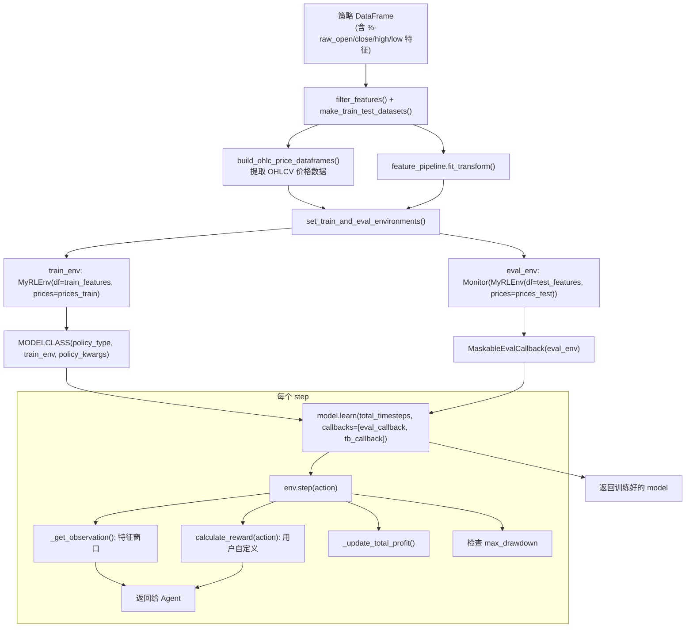
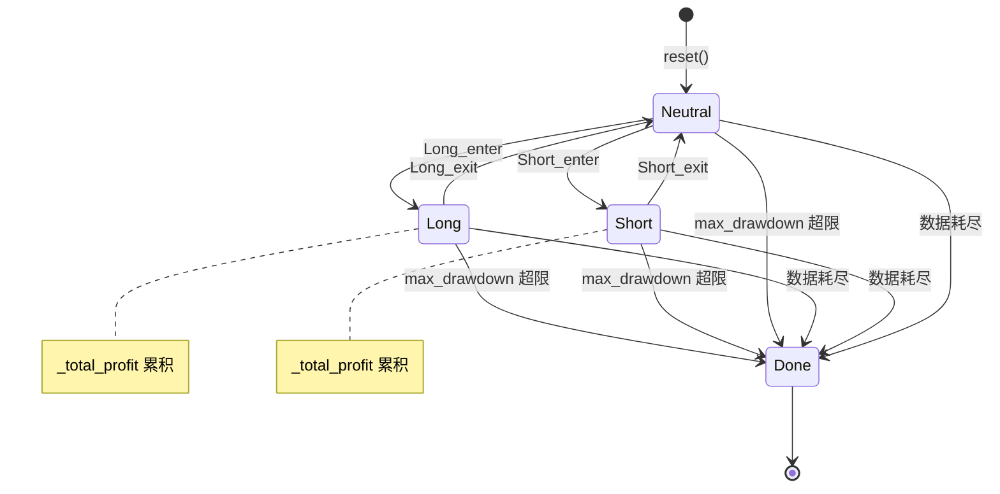

# FreqAI 强化学习模块 (RL)

## 1. 模块概述

`RL` 目录实现了 FreqAI 的强化学习（Reinforcement Learning）子系统。该模块基于 [Stable Baselines3](https://stable-baselines3.readthedocs.io/) (SB3) 和 [sb3-contrib](https://sb3-contrib.readthedocs.io/) 框架，将交易决策建模为一个马尔可夫决策过程（MDP），让 Agent 通过与模拟交易环境的交互来学习最优交易策略。

### 核心设计

强化学习模块的设计分为两层：

1. **环境层（Environment）**：基于 [Gymnasium](https://gymnasium.farama.org/) 接口实现的交易模拟环境，定义了观察空间（Observation Space）、动作空间（Action Space）、奖励函数（Reward Function）和状态转移逻辑
2. **模型层（Model）**：继承自 `IFreqaiModel`，负责环境创建、模型训练、预测推理

### 支持的 RL 算法

通过 SB3 和 sb3-contrib，该模块支持以下算法：

| 来源 | 算法 |
|------|------|
| `stable_baselines3` | PPO, A2C, DQN |
| `sb3_contrib` | TRPO, ARS, RecurrentPPO, MaskablePPO, QRDQN |

### 动作空间变体

模块提供了三种不同粒度的动作空间：

| 环境 | 动作数 | 动作定义 |
|------|--------|----------|
| `Base3ActionRLEnv` | 3 | Neutral, Buy, Sell |
| `Base4ActionRLEnv` | 4 | Neutral, Exit, Long_enter, Short_enter |
| `Base5ActionRLEnv` | 5 | Neutral, Long_enter, Long_exit, Short_enter, Short_exit |

## 2. 目录结构

```
freqtrade/freqai/RL/
|-- __init__.py                              # 包初始化文件（空）
|-- BaseEnvironment.py                       # 环境基类：定义通用状态管理、奖励框架（约 419 行）
|-- Base3ActionRLEnv.py                      # 3 动作环境（约 141 行）
|-- Base4ActionRLEnv.py                      # 4 动作环境（约 145 行）
|-- Base5ActionRLEnv.py                      # 5 动作环境（约 154 行）
|-- BaseReinforcementLearningModel.py        # RL 模型基类（约 511 行）
```

### 文件功能说明

| 文件 | 功能 |
|------|------|
| `BaseEnvironment.py` | 所有 RL 环境的抽象基类，定义了 Gymnasium 兼容的交易模拟环境框架 |
| `Base3ActionRLEnv.py` | 3 动作环境：Neutral（持有/无持仓）、Buy（买入/做多）、Sell（卖出/做空） |
| `Base4ActionRLEnv.py` | 4 动作环境：Neutral、Exit（平仓）、Long_enter（开多）、Short_enter（开空） |
| `Base5ActionRLEnv.py` | 5 动作环境：Neutral、Long_enter、Long_exit、Short_enter、Short_exit |
| `BaseReinforcementLearningModel.py` | RL 模型基类，整合环境创建、SB3 模型训练、预测推理 |

## 3. 架构图





## 4. 核心类/函数说明

### 4.1 BaseEnvironment

所有 RL 交易环境的抽象基类，继承自 `gymnasium.Env`。

#### 构造函数参数

| 参数 | 类型 | 说明 |
|------|------|------|
| `df` | DataFrame | 特征数据 |
| `prices` | DataFrame | OHLCV 价格数据（用于计算 PnL） |
| `reward_kwargs` | dict | 奖励函数参数（`rr`、`profit_aim`） |
| `window_size` | int | 时间窗口大小，默认 10 |
| `starting_point` | bool | 是否从窗口边缘开始，默认 True |
| `config` | dict | 用户配置 |
| `live` | bool | 是否为实盘模式 |
| `fee` | float | 交易费率，默认 0.0015 |
| `can_short` | bool | 是否允许做空 |
| `pair` | str | 当前交易对 |
| `df_raw` | DataFrame | 原始特征数据（供自定义 reward 使用） |

#### 关键属性

| 属性 | 说明 |
|------|------|
| `_position` | 当前持仓状态：`Positions.Neutral`/`Long`/`Short` |
| `_current_tick` | 当前时间步（K 线索引） |
| `_last_trade_tick` | 最后一次交易的时间步 |
| `_total_profit` | 累计已实现利润 |
| `_total_unrealized_profit` | 累计未实现利润 |
| `total_reward` | 累计奖励 |
| `trade_history` | 交易历史记录列表 |
| `tensorboard_metrics` | TensorBoard 指标字典 |
| `max_drawdown` | 最大回撤阈值（超过则 episode 结束） |
| `observation_space` | 观察空间：`Box(low=-1, high=1, shape=(window_size, n_features))` |
| `add_state_info` | 是否在观察中添加状态信息（仅实盘可用） |

#### 核心方法

| 方法 | 说明 |
|------|------|
| `reset(seed)` | 重置环境状态，返回初始观察 |
| `step(action)` | **抽象方法**，执行一步动作 |
| `set_action_space()` | **抽象方法**，设置动作空间 |
| `calculate_reward(action)` | **抽象方法**，计算奖励 |
| `is_tradesignal(action)` | **抽象方法**，判断是否为有效交易信号 |
| `_is_valid(action)` | 判断动作是否有效（用于 Action Masking） |
| `_get_observation()` | 获取当前观察窗口 |
| `get_unrealized_profit()` | 计算未实现利润 |
| `get_trade_duration()` | 获取当前交易持续时长 |
| `tensorboard_log(metric, value, category)` | 记录自定义 TensorBoard 指标 |
| `action_masks()` | 返回动作掩码（用于 MaskablePPO） |
| `add_entry_fee(price)` | 计算加入进场费用后的价格 |
| `add_exit_fee(price)` | 计算加入出场费用后的价格 |

#### 观察空间构建

```python
def _get_observation(self):
    features_window = self.signal_features[
        (self._current_tick - self.window_size) : self._current_tick
    ]
    if self.add_state_info:
        # 添加 3 列状态信息：current_profit_pct, position, trade_duration
        features_and_state = DataFrame(...)
        return pd.concat([features_window, features_and_state], axis=1)
    else:
        return features_window
```

#### 利润计算逻辑

```python
def get_unrealized_profit(self):
    if self._position == Positions.Long:
        current_price = self.add_exit_fee(prices[current_tick])
        last_trade_price = self.add_entry_fee(prices[last_trade_tick])
        return (current_price - last_trade_price) / last_trade_price
    elif self._position == Positions.Short:
        current_price = self.add_entry_fee(prices[current_tick])
        last_trade_price = self.add_exit_fee(prices[last_trade_tick])
        return (last_trade_price - current_price) / last_trade_price
```

### 4.2 Base3ActionRLEnv

3 动作环境，最简单的动作空间。

#### Actions 枚举

```python
class Actions(Enum):
    Neutral = 0   # 不操作
    Buy = 1       # 买入（如已做空则先平空再做多）
    Sell = 2      # 卖出（如已做多则平多；如允许做空则开空）
```

#### `step(action)` 逻辑

1. 递增 `_current_tick`
2. 更新未实现利润
3. 计算奖励
4. 如果是交易信号：
   - Buy + 已做空 → 更新利润 → 转为做多
   - Buy + 中性 → 做多
   - Sell + 已做多 + 允许做空 → 更新利润 → 做空
   - Sell + 已做多 + 不允许做空 → 平仓
5. 检查回撤是否超限
6. 返回 `(observation, reward, done, truncated, info)`

#### 交易信号判定

```python
def is_tradesignal(self, action):
    return (
        (Buy and Neutral) or      # 中性状态买入
        (Sell and Long) or         # 做多状态卖出
        (Sell and Neutral and can_short) or  # 中性状态做空
        (Buy and Short and can_short)        # 做空状态买入平仓
    )
```

### 4.3 Base4ActionRLEnv

4 动作环境，分离了开仓和平仓。

#### Actions 枚举

```python
class Actions(Enum):
    Neutral = 0        # 不操作
    Exit = 1           # 平仓（不管多空都平）
    Long_enter = 2     # 开多
    Short_enter = 3    # 开空
```

#### 动作有效性验证

```python
def _is_valid(self, action):
    if action == Exit and _position not in (Short, Long):
        return False  # 没有持仓时不能平仓
    if action in (Short_enter, Long_enter) and _position != Neutral:
        return False  # 已有持仓时不能开仓
    return True
```

### 4.4 Base5ActionRLEnv

5 动作环境，提供最细粒度的控制。这是 `ReinforcementLearner` 默认使用的环境。

#### Actions 枚举

```python
class Actions(Enum):
    Neutral = 0        # 不操作
    Long_enter = 1     # 开多
    Long_exit = 2      # 平多
    Short_enter = 3    # 开空
    Short_exit = 4     # 平空
```

#### 与 Base4ActionRLEnv 的区别

- 平多和平空是分开的动作
- 动作有效性更严格：例如 `Long_exit` 只在做多状态有效，`Short_exit` 只在做空状态有效
- 交易信号判定排除了更多无效组合

### 4.5 BaseReinforcementLearningModel

RL 模型的基类，继承自 `IFreqaiModel`。

#### 构造函数

```python
def __init__(self, **kwargs):
    # 线程配置
    self.max_threads = min(rl_config.cpu_count, max(system_threads/2, 1))
    th.set_num_threads(self.max_threads)

    # 环境初始化
    self.train_env = gym.Env()
    self.eval_env = gym.Env()

    # 动态导入 SB3 模型类
    if model_type in ["PPO", "A2C", "DQN"]:
        mod = importlib.import_module("stable_baselines3")
    elif model_type in ["TRPO", "ARS", "RecurrentPPO", "MaskablePPO", "QRDQN"]:
        mod = importlib.import_module("sb3_contrib")
    self.MODELCLASS = getattr(mod, model_type)
```

#### 初始化时的安全检查（`unset_outlier_removal()`）

RL 不兼容某些数据预处理方法，构造函数中会自动禁用：
- `use_SVM_to_remove_outliers` → False
- `use_DBSCAN_to_remove_outliers` → False
- `DI_threshold` → False
- `shuffle` → False

#### `train(unfiltered_df, pair, dk) -> Any`

1. 过滤特征和标签
2. 切分训练/测试集
3. 构建 OHLCV 价格 DataFrame（供环境使用）
4. 创建并执行 feature Pipeline
5. 调用 `set_train_and_eval_environments()` 创建训练和评估环境
6. 调用子类的 `fit()` 训练模型

#### `predict(unfiltered_df, dk) -> tuple[DataFrame, NDArray]`

1. 过滤特征 → Pipeline 变换
2. 调用 `rl_model_predict()` 执行滚动窗口预测

#### `rl_model_predict(dataframe, dk, model) -> DataFrame`

使用 DataFrame 的 `rolling()` 方法实现滑动窗口预测：

```python
def _predict(window):
    observations = dataframe.iloc[window.index]
    if self.live and add_state_info:
        # 注入实时交易状态
        observations["current_profit_pct"] = current_profit
        observations["position"] = market_side
        observations["trade_duration"] = trade_duration
    res, _ = model.predict(observations, deterministic=True)
    return res

output = output.rolling(window=self.CONV_WIDTH).apply(_predict)
```

#### `get_state_info(pair) -> tuple[float, float, int]`

在实盘模式下获取当前交易状态信息：
- `market_side`：0（做空）、0.5（中性）、1（做多）
- `current_profit`：当前交易的未实现利润
- `trade_duration`：当前交易持续的 K 线数

#### `build_ohlc_price_dataframes(data_dictionary, pair, dk)`

从训练数据中提取 OHLCV 价格列，供环境模拟交易使用：
- 查找列名 `%-raw_open`, `%-raw_low`, `%-raw_high`, `%-raw_close`
- 重命名为标准的 `open`, `low`, `high`, `close`
- 可选地从特征中移除这些列（`drop_ohlc_from_features`）

### 4.6 辅助函数 `make_env()`

用于创建多进程环境的工厂函数：

```python
def make_env(MyRLEnv, env_id, rank, seed, train_df, price, env_info) -> Callable:
    def _init() -> gym.Env:
        env = MyRLEnv(df=train_df, prices=price, id=env_id, seed=seed+rank, **env_info)
        return env
    set_random_seed(seed)
    return _init
```

## 5. 依赖关系

### 内部依赖

```
BaseReinforcementLearningModel
  |-- IFreqaiModel (freqai_interface.py)
  |-- FreqaiDataKitchen (data_kitchen.py)
  |-- Base5ActionRLEnv -> BaseEnvironment
  |-- TensorboardCallback (tensorboard/TensorboardCallback.py)
  |-- Trade (freqtrade.persistence) -- 实盘状态信息

BaseEnvironment
  |-- gymnasium (Env, spaces)

Base3/4/5ActionRLEnv
  |-- BaseEnvironment
```

### 外部依赖

| 库 | 用途 |
|----|------|
| `gymnasium` | RL 环境基类和工具 |
| `stable_baselines3` | PPO, A2C, DQN 算法，Monitor, VecEnv |
| `sb3_contrib` | MaskablePPO, TRPO 等扩展算法，MaskableEvalCallback |
| `torch` | PyTorch 多进程共享策略，线程控制 |
| `numpy` / `pandas` | 数据处理 |

## 6. 数据流



### Episode 生命周期


