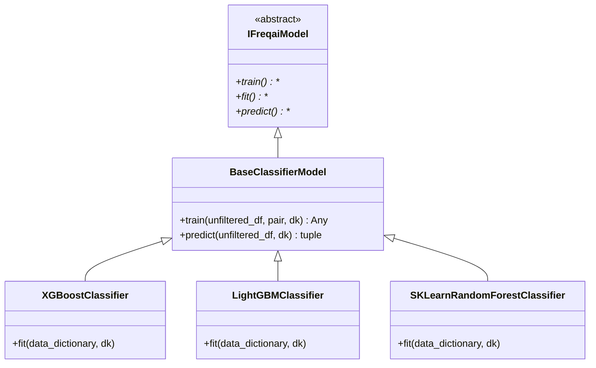

# BaseClassifierModel.py

## 概述

`BaseClassifierModel` 是 FreqAI 中分类模型的基类，继承自 `IFreqaiModel`。它实现了分类任务通用的 `train()` 和 `predict()` 方法，用户必须继承此类并实现 `fit()` 方法来创建具体的分类模型（如 XGBoostClassifier、LightGBMClassifier 等）。

该类的训练流程与 `BaseRegressionModel` 类似，但预测流程增加了分类概率输出（`predict_proba`），并将类别预测和概率预测合并返回。

## 架构图

## 核心类/函数

### BaseClassifierModel

#### `train(self, unfiltered_df: DataFrame, pair: str, dk: FreqaiDataKitchen, **kwargs) -> Any`

训练分类模型的完整流程：

1. **特征过滤**：调用 `dk.filter_features()` 从原始 DataFrame 中提取用户指定的特征和标签，并处理 NaN
2. **数据分割**：调用 `dk.make_train_test_datasets()` 分割训练/测试集
3. **标签拟合**：如果不使用 `fit_live_predictions_candles` 或在回测模式下，调用 `dk.fit_labels()` 拟合标签分布
4. **Pipeline 处理**：
   - 使用 `define_data_pipeline()` 创建特征处理 Pipeline
   - 对训练数据执行 `fit_transform()`
   - 对测试数据执行 `transform()`
   - **注意**：分类模型不创建 label_pipeline（与回归模型不同）
5. **模型训练**：调用 `self.fit(dd, dk)` 执行具体模型的拟合

参数：
- `unfiltered_df` -- 当前训练期间的完整 DataFrame
- `pair` -- 交易对名称
- `dk` -- FreqaiDataKitchen 实例

返回值：训练好的模型对象

#### `predict(self, unfiltered_df: DataFrame, dk: FreqaiDataKitchen, **kwargs) -> tuple[DataFrame, NDArray]`

分类预测流程：

1. **特征发现与过滤**：查找特征并过滤 NaN
2. **Pipeline 变换**：对预测特征应用 feature_pipeline（包含异常值检测）
3. **模型预测**：
   - 调用 `model.predict()` 获取类别预测
   - 调用 `model.predict_proba()` 获取各类别概率
4. **结果合并**：将类别预测和概率预测合并为一个 DataFrame
5. **DI 值处理**：如果启用了 DissimilarityIndex，提取 DI 值

返回值：`(pred_df, do_predict)` 元组
- `pred_df` -- 包含预测类别和各类别概率的 DataFrame
- `do_predict` -- 异常值标记数组（1=正常, 0=异常）

## 依赖关系

### 内部依赖（本项目模块）
- `freqtrade.freqai.freqai_interface.IFreqaiModel` -- 基类
- `freqtrade.freqai.data_kitchen.FreqaiDataKitchen` -- 数据处理

### 外部依赖（第三方库）
- `numpy` -- 数组操作（reshape 预测结果）
- `pandas` -- DataFrame 操作

### 被依赖（谁引用了本文件）
- `freqtrade.freqai.prediction_models.XGBoostClassifier` -- XGBoost 分类器
- `freqtrade.freqai.prediction_models.XGBoostRFClassifier` -- XGBoost Random Forest 分类器
- `freqtrade.freqai.prediction_models.SKLearnRandomForestClassifier` -- sklearn 随机森林分类器
- `freqtrade.freqai.prediction_models.LightGBMClassifier` -- LightGBM 分类器
- `freqtrade.freqai.prediction_models.LightGBMClassifierMultiTarget` -- LightGBM 多目标分类器
