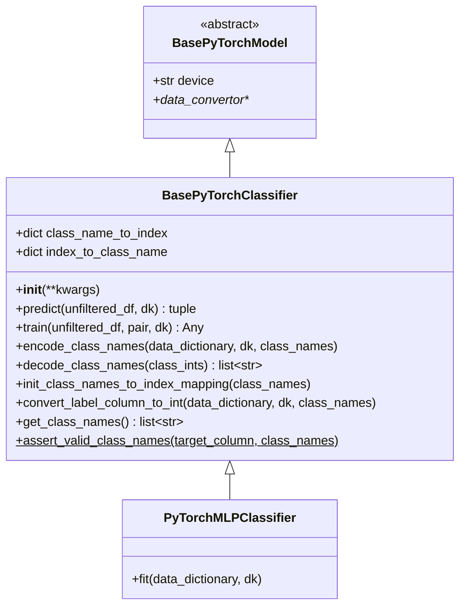

# BasePyTorchClassifier.py

## 概述

`BasePyTorchClassifier` 是 PyTorch 分类模型的基类，继承自 `BasePyTorchModel`。它实现了 PyTorch 分类任务的 `predict()` 和 `train()` 方法，同时提供了类别名称编码/解码的辅助方法。

用户必须在策略的 `set_freqai_targets()` 方法中声明目标类别名称（通过 `self.freqai.class_names`），并在子类中实现 `fit()` 方法。

## 架构图

## 核心类/函数

### BasePyTorchClassifier

#### `__init__(self, **kwargs)`
初始化分类器，创建 `class_name_to_index` 和 `index_to_class_name` 两个空映射字典。

#### `predict(self, unfiltered_df, dk, **kwargs) -> tuple[DataFrame, NDArray]`

PyTorch 分类预测流程：

1. **类别名称验证**：从 `model.model_meta_data` 获取 `class_names`，如果为空则抛出 ValueError
2. **类别映射初始化**：首次预测时初始化 class_name -> index 的双向映射
3. **特征处理**：查找特征、过滤 NaN、应用 feature_pipeline
4. **数据转换**：使用 `data_convertor.convert_x()` 将 DataFrame 转为 PyTorch tensor
5. **推理**：
   - 设置模型为 eval 模式
   - 前向传播获取 logits
   - 使用 softmax 获取概率
   - 使用 argmax 获取预测类别索引
   - 解码类别索引为类别名称字符串
6. **结果构建**：合并类别预测和概率预测到 pred_df

返回值：`(pred_df, do_predict)` -- pred_df 包含预测类别名和各类别概率

#### `train(self, unfiltered_df, pair, dk, **kwargs) -> Any`

PyTorch 分类模型训练流程：

1. 特征过滤
2. 数据分割
3. 标签拟合
4. 创建 feature_pipeline 并处理数据（**不创建 label_pipeline**，因为分类标签不需要归一化）
5. 调用 `self.fit(dd, dk)`

#### `encode_class_names(self, data_dictionary, dk, class_names)`
将标签 DataFrame 中的类别字符串编码为整数索引。遍历 train/test 分割，将目标列的字符串映射为对应的整数值。

#### `decode_class_names(self, class_ints: torch.Tensor) -> list[str]`
将整数索引 tensor 解码为类别名称字符串列表。

#### `assert_valid_class_names(target_column, class_names)` [静态方法]
验证目标列中的所有值是否都在声明的 class_names 中。如果发现未定义的标签，抛出 `OperationalException`。

#### `get_class_names(self) -> list[str]`
获取用户在策略中定义的类别名称列表。如果为空则提示用户在 `set_freqai_targets()` 中设置。

#### `convert_label_column_to_int(self, data_dictionary, dk, class_names)`
便捷方法，依次调用 `init_class_names_to_index_mapping()` 和 `encode_class_names()`。

## 依赖关系

### 内部依赖（本项目模块）
- `freqtrade.freqai.base_models.BasePyTorchModel` -- 基类
- `freqtrade.freqai.data_kitchen.FreqaiDataKitchen` -- 数据处理
- `freqtrade.exceptions.OperationalException` -- 类别名称验证异常

### 外部依赖（第三方库）
- `torch` -- PyTorch 框架（tensor 操作、softmax、argmax）
- `torch.nn.functional` -- softmax 函数
- `numpy` -- 数组操作
- `pandas` -- DataFrame 操作

### 被依赖（谁引用了本文件）
- `freqtrade.freqai.prediction_models.PyTorchMLPClassifier` -- MLP 分类器实现
