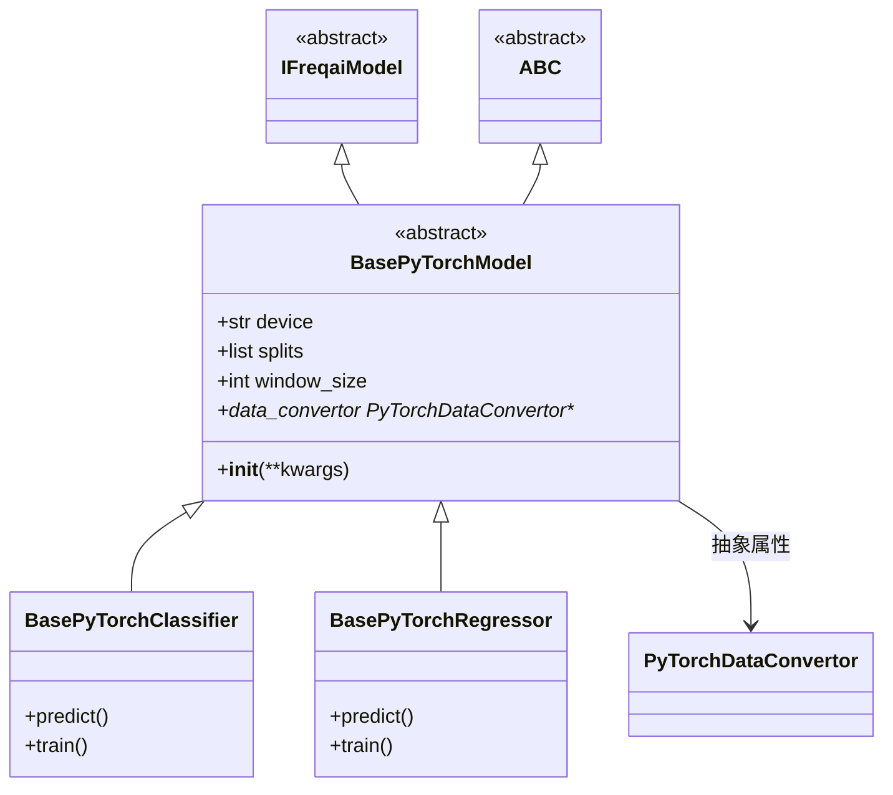

# BasePyTorchModel.py

## 概述

`BasePyTorchModel` 是所有 PyTorch 类型模型的抽象基类，继承自 `IFreqaiModel` 和 `ABC`。它设置 PyTorch 特有的配置，包括设备选择（MPS/CUDA/CPU）、数据分割配置和窗口大小。

用户必须继承此类并实现 `fit()`、`predict()` 方法以及 `data_convertor` 属性。具体的子类包括 `BasePyTorchClassifier` 和 `BasePyTorchRegressor`。

## 架构图

## 核心类/函数

### BasePyTorchModel (ABC)

#### `__init__(self, **kwargs)`

初始化 PyTorch 模型基类：
- 调用父类 `IFreqaiModel.__init__()` 传入 config
- 设置 `dd.model_type = "pytorch"`，使 DataDrawer 使用 pytorch 格式保存/加载模型
- **设备选择逻辑**（优先级从高到低）：
  1. Apple MPS（Metal Performance Shaders）-- 如果可用且已构建
  2. CUDA -- 如果可用
  3. CPU -- 默认
- 根据 `data_split_parameters.test_size` 设置 `splits` 列表（是否包含测试集）
- 从 `conv_width` 配置读取 `window_size`

#### `data_convertor` (抽象属性)

返回一个 `PyTorchDataConvertor` 实例，负责将 pandas DataFrame 的 `*_features` 和 `*_labels` 转换为 PyTorch tensor。子类必须实现此属性。

## 依赖关系

### 内部依赖（本项目模块）
- `freqtrade.freqai.freqai_interface.IFreqaiModel` -- 主要基类
- `freqtrade.freqai.torch.PyTorchDataConvertor.PyTorchDataConvertor` -- 数据转换器类型

### 外部依赖（第三方库）
- `torch` -- PyTorch 框架，用于设备检测
- `abc.ABC, abstractmethod` -- 抽象基类支持

### 被依赖（谁引用了本文件）
- `freqtrade.freqai.base_models.BasePyTorchClassifier` -- PyTorch 分类器基类
- `freqtrade.freqai.base_models.BasePyTorchRegressor` -- PyTorch 回归器基类
