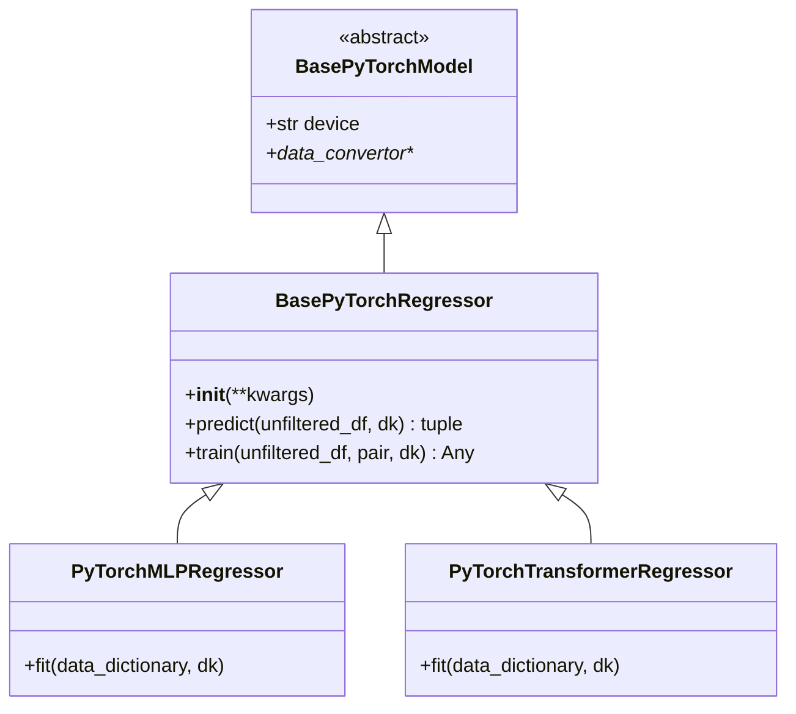

# BasePyTorchRegressor.py

## 概述

`BasePyTorchRegressor` 是 PyTorch 回归模型的基类，继承自 `BasePyTorchModel`。它实现了 PyTorch 回归任务的 `predict()` 和 `train()` 方法。

与 `BasePyTorchClassifier` 不同，回归模型使用 `label_pipeline` 对标签进行归一化处理，并在预测时通过 `inverse_transform` 将预测值还原到原始尺度。

## 架构图

## 核心类/函数

### BasePyTorchRegressor

#### `__init__(self, **kwargs)`
简单调用父类 `BasePyTorchModel.__init__()` 完成初始化。

#### `predict(self, unfiltered_df, dk, **kwargs) -> tuple[DataFrame, NDArray]`

PyTorch 回归预测流程：

1. **特征处理**：查找特征、过滤 NaN、应用 feature_pipeline（含异常值检测）
2. **数据转换**：使用 `data_convertor.convert_x()` 将 DataFrame 转为 PyTorch tensor
3. **推理**：
   - 设置模型为 eval 模式
   - 前向传播获取预测值 tensor
4. **结果处理**：
   - 将 tensor 转为 DataFrame
   - 使用 `dk.label_pipeline.inverse_transform()` 将预测值还原到原始尺度
5. **DI 值处理**：提取 DissimilarityIndex 值或填零

返回值：`(pred_df, do_predict)` -- pred_df 包含逆变换后的回归预测值

#### `train(self, unfiltered_df, pair, dk, **kwargs) -> Any`

PyTorch 回归模型训练流程：

1. 特征过滤
2. 数据分割
3. 标签拟合
4. 创建 `feature_pipeline` 和 `label_pipeline`
5. 对训练数据：
   - `feature_pipeline.fit_transform()` 处理特征
   - `label_pipeline.fit_transform()` 处理标签
6. 对测试数据（如果存在）：
   - `feature_pipeline.transform()` 处理特征
   - `label_pipeline.transform()` 处理标签
7. 调用 `self.fit(dd, dk)`

与分类器的训练流程关键区别：回归模型同时处理 feature 和 label 的 Pipeline。

## 依赖关系

### 内部依赖（本项目模块）
- `freqtrade.freqai.base_models.BasePyTorchModel` -- 基类
- `freqtrade.freqai.data_kitchen.FreqaiDataKitchen` -- 数据处理

### 外部依赖（第三方库）
- `numpy` -- 数组操作
- `pandas` -- DataFrame 操作

### 被依赖（谁引用了本文件）
- `freqtrade.freqai.prediction_models.PyTorchMLPRegressor` -- MLP 回归器实现
- `freqtrade.freqai.prediction_models.PyTorchTransformerRegressor` -- Transformer 回归器实现
