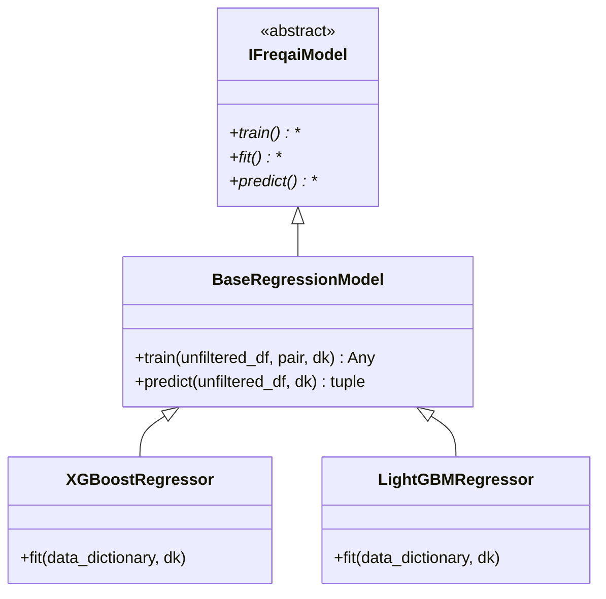

# BaseRegressionModel.py

## 概述

`BaseRegressionModel` 是 FreqAI 中回归模型的基类，继承自 `IFreqaiModel`。它实现了回归任务通用的 `train()` 和 `predict()` 方法，用户必须继承此类并实现 `fit()` 方法来创建具体的回归模型（如 XGBoostRegressor、LightGBMRegressor 等）。

与分类模型的主要区别在于：回归模型使用 label_pipeline 对标签进行归一化处理，并在预测时通过 `inverse_transform` 还原到原始尺度。

## 架构图

## 核心类/函数

### BaseRegressionModel

#### `train(self, unfiltered_df: DataFrame, pair: str, dk: FreqaiDataKitchen, **kwargs) -> Any`

回归模型的完整训练流程：

1. **特征过滤**：调用 `dk.filter_features()` 提取特征和标签，处理 NaN
2. **日志记录**：输出训练数据的日期范围
3. **数据分割**：调用 `dk.make_train_test_datasets()` 创建训练/测试集
4. **标签拟合**：如果不使用 `fit_live_predictions_candles` 或在回测模式下，调用 `dk.fit_labels()`
5. **Pipeline 处理**：
   - 创建 `feature_pipeline` 和 `label_pipeline`
   - 对训练特征执行 `feature_pipeline.fit_transform()`
   - 对训练标签执行 `label_pipeline.fit_transform()`
   - 如果测试集不为空，对测试数据执行 `transform()`
   - **空测试集保护**：如果测试集为空（被 SVM 过滤后），抛出 `DependencyException`
6. **模型训练**：调用 `self.fit(dd, dk)`

参数与返回值同 BaseClassifierModel.train()

#### `predict(self, unfiltered_df: DataFrame, dk: FreqaiDataKitchen, **kwargs) -> tuple[DataFrame, NDArray]`

回归预测流程：

1. **特征发现与过滤**：查找特征并过滤 NaN
2. **Pipeline 变换**：对预测特征应用 feature_pipeline（含异常值检测）
3. **模型预测**：调用 `model.predict()` 获取预测值
4. **标签逆变换**：调用 `dk.label_pipeline.inverse_transform()` 将预测值还原到原始尺度
5. **DI 值处理**：提取 DissimilarityIndex 值或填零

返回值：`(pred_df, do_predict)` 元组
- `pred_df` -- 包含回归预测值的 DataFrame（已逆变换到原始尺度）
- `do_predict` -- 异常值标记数组

## 依赖关系

### 内部依赖（本项目模块）
- `freqtrade.freqai.freqai_interface.IFreqaiModel` -- 基类
- `freqtrade.freqai.data_kitchen.FreqaiDataKitchen` -- 数据处理
- `freqtrade.exceptions.DependencyException` -- 空测试集异常

### 外部依赖（第三方库）
- `numpy` -- 数组操作
- `pandas` -- DataFrame 操作

### 被依赖（谁引用了本文件）
- `freqtrade.freqai.prediction_models.XGBoostRegressor` -- XGBoost 回归器
- `freqtrade.freqai.prediction_models.XGBoostRegressorMultiTarget` -- XGBoost 多目标回归器
- `freqtrade.freqai.prediction_models.XGBoostRFRegressor` -- XGBoost Random Forest 回归器
- `freqtrade.freqai.prediction_models.LightGBMRegressor` -- LightGBM 回归器
- `freqtrade.freqai.prediction_models.LightGBMRegressorMultiTarget` -- LightGBM 多目标回归器
