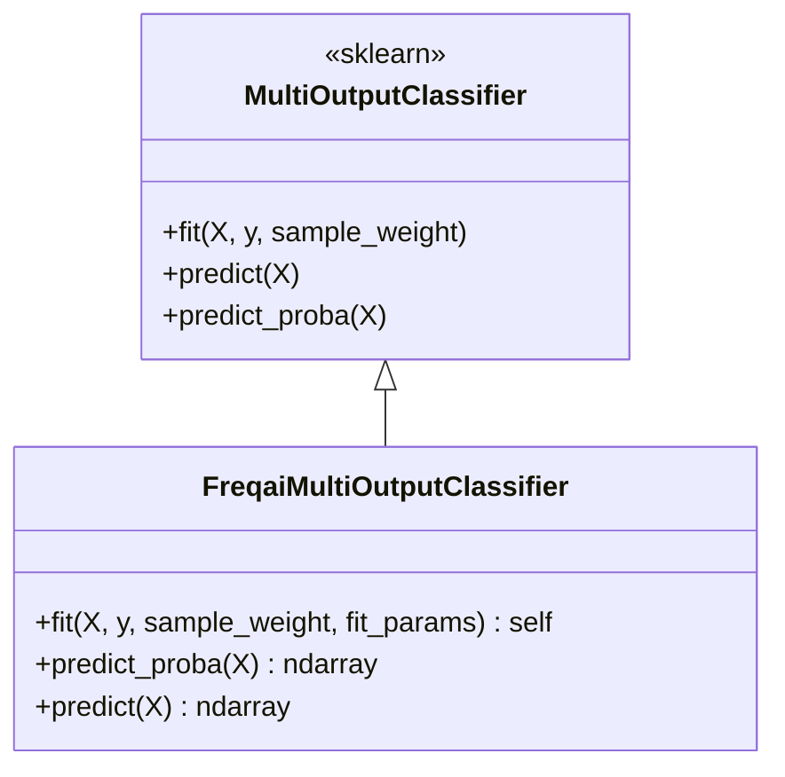

# FreqaiMultiOutputClassifier.py

## 概述

`FreqaiMultiOutputClassifier` 是对 scikit-learn `MultiOutputClassifier` 的自定义扩展，专为 FreqAI 多目标分类任务设计。它重写了 `fit()`、`predict_proba()` 和 `predict()` 方法，增加了以下功能：

- 支持通过 `fit_params` 为每个输出变量传递不同的拟合参数（如不同的 eval_set 或 init_model）
- 确保跨目标的类别标签唯一性验证
- 预测概率水平堆叠和结果降维

## 架构图

## 核心类/函数

### FreqaiMultiOutputClassifier

#### `fit(self, X, y, sample_weight=None, fit_params=None) -> self`

自定义的多输出分类器拟合方法：

参数：
- `X` -- 输入数据，形状 (n_samples, n_features)
- `y` -- 多输出目标，形状 (n_samples, n_outputs)
- `sample_weight` -- 样本权重（可选）
- `fit_params` -- **FreqAI 扩展参数**：一个 dict 列表，每个 dict 对应一个输出变量的拟合参数。允许为不同目标传递不同的 eval_set 或 init_model

流程：
1. 验证 estimator 有 fit 方法
2. 使用 `validate_data` 验证 y 的格式
3. 分类目标检查
4. 验证 y 至少有两个维度
5. 验证 sample_weight 兼容性
6. 使用 `Parallel` 并行拟合每个输出变量的 estimator
7. **类别唯一性验证**：收集所有 estimator 的 `classes_` 并检查是否有重复，如果有则抛出 `OperationalException`
8. 传递 `n_features_in_` 和 `feature_names_in_` 属性

返回值：拟合后的 self

#### `predict_proba(self, X) -> ndarray`
获取所有输出变量的预测概率并水平堆叠（`np.hstack`），然后通过 `np.squeeze` 移除多余维度。

#### `predict(self, X) -> ndarray`
获取所有输出变量的预测并通过 `np.squeeze` 压缩为二维数组。

## 依赖关系

### 内部依赖（本项目模块）
- `freqtrade.exceptions.OperationalException` -- 类别标签唯一性验证失败时抛出

### 外部依赖（第三方库）
- `numpy` -- 数组操作（hstack、squeeze）
- `sklearn.base.is_classifier` -- 判断是否为分类器
- `sklearn.multioutput.MultiOutputClassifier` -- 基类
- `sklearn.multioutput._fit_estimator` -- 单个 estimator 拟合函数
- `sklearn.utils.multiclass.check_classification_targets` -- 分类目标验证
- `sklearn.utils.parallel.Parallel, delayed` -- 并行计算
- `sklearn.utils.validation.has_fit_parameter, validate_data` -- 参数验证

### 被依赖（谁引用了本文件）
- `freqtrade.freqai.prediction_models.LightGBMClassifierMultiTarget` -- LightGBM 多目标分类器
