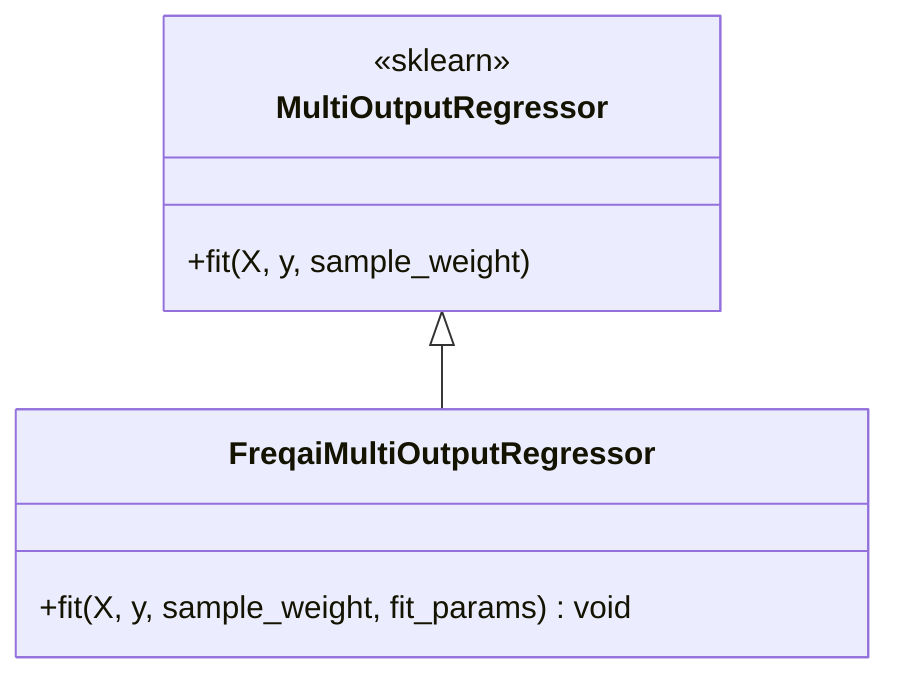

# FreqaiMultiOutputRegressor.py

## 概述

`FreqaiMultiOutputRegressor` 是对 scikit-learn `MultiOutputRegressor` 的自定义扩展，专为 FreqAI 多目标回归任务设计。它重写了 `fit()` 方法，增加了通过 `fit_params` 为每个输出变量传递不同拟合参数的能力。

这使得每个输出目标可以拥有独立的 eval_set、init_model 等训练参数，这在增量学习（continual learning）场景中尤为重要。

## 架构图

## 核心类/函数

### FreqaiMultiOutputRegressor

#### `fit(self, X, y, sample_weight=None, fit_params=None) -> None`

自定义的多输出回归器拟合方法：

参数：
- `X` -- 输入数据，形状 (n_samples, n_features)，支持 array-like 和 sparse matrix
- `y` -- 多输出目标，形状 (n_samples, n_outputs)
- `sample_weight` -- 样本权重（可选）。如果底层 estimator 不支持 sample_weight，会抛出 ValueError
- `fit_params` -- **FreqAI 扩展参数**：一个 dict 列表，列表长度等于 n_outputs。每个 dict 包含传递给对应 estimator.fit() 的参数。如果为 None，默认创建全 None 的列表

流程：
1. 验证 estimator 有 fit 方法
2. 使用 `validate_data` 验证 y 格式（multi_output=True）
3. 验证 y 至少有两个维度
4. 验证 sample_weight 兼容性
5. 如果未提供 fit_params，创建长度为 n_outputs 的 None 列表
6. 使用 `Parallel` 并行拟合每个输出变量的 estimator，每个 estimator 接收 `y[:, i]` 和对应的 `fit_params[i]`
7. 传递 `n_features_in_` 和 `feature_names_in_` 属性

**注意**：此方法没有返回 self（返回 None），这与 sklearn 的惯例稍有不同。

## 依赖关系

### 内部依赖（本项目模块）
- 无直接内部依赖

### 外部依赖（第三方库）
- `sklearn.multioutput.MultiOutputRegressor` -- 基类
- `sklearn.multioutput._fit_estimator` -- 单个 estimator 拟合函数
- `sklearn.utils.parallel.Parallel, delayed` -- 并行计算
- `sklearn.utils.validation.has_fit_parameter, validate_data` -- 参数验证

### 被依赖（谁引用了本文件）
- `freqtrade.freqai.prediction_models.LightGBMRegressorMultiTarget` -- LightGBM 多目标回归器
