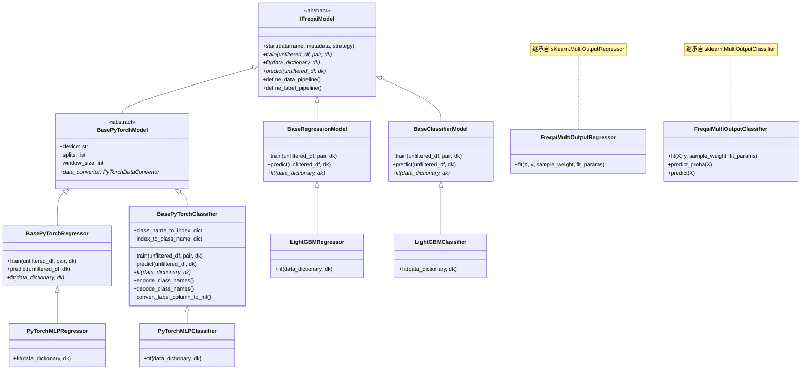
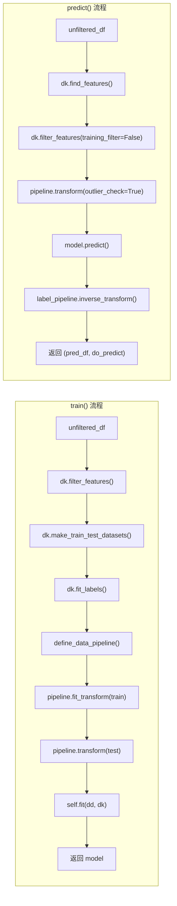
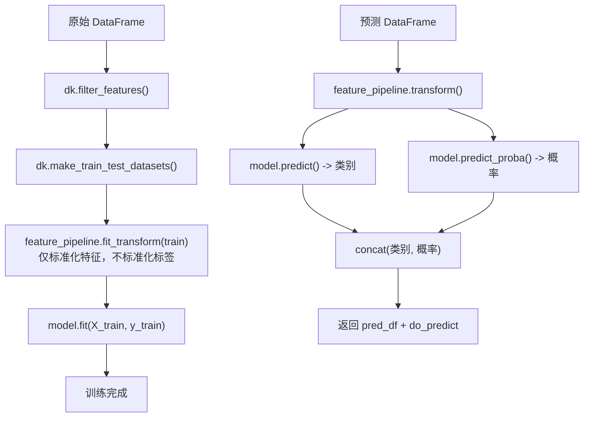
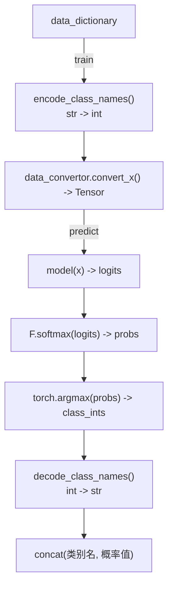

# FreqAI 基础模型类 (base_models)

## 1. 模块概述

`base_models` 目录包含了 FreqAI 所有预测模型的中间基类。这些基类继承自 `IFreqaiModel`（定义在 `freqai_interface.py` 中），实现了通用的 `train()` 和 `predict()` 方法，用户最终的预测模型（如 `LightGBMRegressor`）再从这些基类继承，只需覆写 `fit()` 方法即可。

该模块的分层设计目的是将**数据处理逻辑**（特征过滤、数据集切分、Pipeline 变换）与**模型拟合逻辑**（具体的 ML 库调用）解耦，使用户可以专注于选择和调优自己的模型。

### 分类体系

模块中的基类按两个维度组织：

1. **任务类型**：回归（Regression） vs 分类（Classification）
2. **框架类型**：传统 ML（sklearn 兼容） vs PyTorch 深度学习

另外还包含两个多目标输出的辅助类，用于同时预测多个标签。

## 2. 目录结构

```
freqtrade/freqai/base_models/
|-- BaseRegressionModel.py            # 传统 ML 回归基类（约 132 行）
|-- BaseClassifierModel.py            # 传统 ML 分类基类（约 130 行）
|-- BasePyTorchModel.py               # PyTorch 模型通用基类（约 40 行）
|-- BasePyTorchRegressor.py           # PyTorch 回归基类（约 118 行）
|-- BasePyTorchClassifier.py          # PyTorch 分类基类（约 215 行）
|-- FreqaiMultiOutputRegressor.py     # 多目标回归器（约 53 行）
|-- FreqaiMultiOutputClassifier.py    # 多目标分类器（约 88 行）
```

### 文件功能详细说明

| 文件 | 继承关系 | 功能说明 |
|------|----------|----------|
| `BaseRegressionModel.py` | `IFreqaiModel` | 实现回归任务的通用 `train()` 和 `predict()` 流程，包含 label Pipeline 处理 |
| `BaseClassifierModel.py` | `IFreqaiModel` | 实现分类任务的通用 `train()` 和 `predict()` 流程，包含概率预测 |
| `BasePyTorchModel.py` | `IFreqaiModel` + `ABC` | PyTorch 模型的轻量基类，设置设备（CPU/CUDA/MPS）、数据转换器抽象属性 |
| `BasePyTorchRegressor.py` | `BasePyTorchModel` | PyTorch 回归任务的 `train()` 和 `predict()` 实现 |
| `BasePyTorchClassifier.py` | `BasePyTorchModel` | PyTorch 分类任务的完整实现，包含类名编/解码 |
| `FreqaiMultiOutputRegressor.py` | `sklearn.MultiOutputRegressor` | 支持自定义 `fit_params` 的多目标回归包装器 |
| `FreqaiMultiOutputClassifier.py` | `sklearn.MultiOutputClassifier` | 支持自定义 `fit_params` 的多目标分类包装器 |

## 3. 架构图





## 4. 核心类/函数说明

### 4.1 BaseRegressionModel

传统 ML 回归模型的基类，适用于 LightGBM、XGBoost、CatBoost、SKLearn 等 sklearn 兼容模型。

#### `train(unfiltered_df, pair, dk) -> Any`

完整的训练流程：

1. 调用 `dk.filter_features()` 过滤特征和标签，移除 NaN 行
2. 调用 `dk.make_train_test_datasets()` 切分训练集/测试集
3. 调用 `dk.fit_labels()` 对标签拟合高斯分布（用于实盘统计）
4. 创建 feature Pipeline 和 label Pipeline
5. 对训练集执行 `fit_transform()`，对测试集执行 `transform()`
6. **同时对标签进行 Pipeline 变换**（`label_pipeline.fit_transform()`），这是回归模型与分类模型的关键区别
7. 调用子类的 `fit(dd, dk)` 进行实际模型拟合

#### `predict(unfiltered_df, dk) -> tuple[DataFrame, NDArray]`

预测流程：

1. 查找特征、过滤特征
2. 通过 feature Pipeline 变换，同时执行 outlier 检测
3. 调用 `model.predict()`
4. **通过 `label_pipeline.inverse_transform()` 将预测值反标准化**
5. 设置 DI_values 和 do_predict 异常值标记

### 4.2 BaseClassifierModel

传统 ML 分类模型的基类。

#### 与 BaseRegressionModel 的关键区别

1. **不使用 label Pipeline**：分类标签是离散值，不需要标准化
2. **predict 中额外调用 `predict_proba()`**：获取每个类别的概率预测
3. **预测结果合并概率列**：`pred_df = pd.concat([pred_df, pred_df_prob], axis=1)`

#### `predict(unfiltered_df, dk) -> tuple[DataFrame, NDArray]`

1. 通过 Pipeline 变换特征数据
2. 调用 `model.predict()` 获取类别预测
3. 调用 `model.predict_proba()` 获取概率预测
4. 将类别预测和概率预测合并到同一个 DataFrame 中返回

### 4.3 BasePyTorchModel

PyTorch 模型的轻量抽象基类，处理 PyTorch 特有的初始化逻辑。

#### 构造函数

```python
def __init__(self, **kwargs):
    super().__init__(config=kwargs["config"])
    self.dd.model_type = "pytorch"  # 设置模型保存类型
    self.device = "mps" if ... else ("cuda" if ... else "cpu")  # 自动检测计算设备
    self.splits = ["train", "test"] if test_size != 0 else ["train"]
    self.window_size = self.freqai_info.get("conv_width", 1)
```

#### 抽象属性 `data_convertor`

所有 PyTorch 子类必须实现 `data_convertor` 属性，返回一个 `PyTorchDataConvertor` 实例，负责将 pandas DataFrame 转换为 PyTorch Tensor。

### 4.4 BasePyTorchRegressor

PyTorch 回归模型的基类。

#### `predict(unfiltered_df, dk)`

1. 过滤特征 -> Pipeline 变换 -> 异常值检测
2. 使用 `data_convertor.convert_x()` 将 DataFrame 转换为 Tensor
3. 将模型设为 eval 模式：`self.model.model.eval()`
4. 执行前向传播获取预测
5. 通过 `label_pipeline.inverse_transform()` 反标准化

#### `train(unfiltered_df, pair, dk)`

与 `BaseRegressionModel.train()` 流程相同，包含 feature Pipeline 和 label Pipeline 的 `fit_transform()`/`transform()` 操作。

### 4.5 BasePyTorchClassifier

PyTorch 分类模型的基类，功能最丰富。

#### 类名编解码系统

PyTorch 的交叉熵损失（CrossEntropyLoss）要求标签为整数索引，但用户在策略中定义的类名通常是字符串（如 `"up"`, `"down"`）。`BasePyTorchClassifier` 提供了完整的编解码机制：

| 方法 | 说明 |
|------|------|
| `init_class_names_to_index_mapping(class_names)` | 初始化双向映射字典 |
| `encode_class_names(data_dictionary, dk, class_names)` | 将标签列从字符串编码为整数 |
| `decode_class_names(class_ints)` | 将预测的整数索引解码回字符串 |
| `convert_label_column_to_int(...)` | 便捷方法，组合调用上述方法 |
| `get_class_names()` | 获取类名列表，若为空则抛出 ValueError |
| `assert_valid_class_names(target_column, class_names)` | 验证所有标签值都在定义的类名中 |

#### `predict(unfiltered_df, dk)`

1. 从 `model.model_meta_data` 获取类名
2. 过滤特征 -> Pipeline 变换
3. 使用 `data_convertor.convert_x()` 转换为 Tensor
4. 前向传播 -> `F.softmax()` 获取概率 -> `torch.argmax()` 获取预测类别
5. 解码类别索引为字符串
6. 合并类别预测和概率预测

### 4.6 FreqaiMultiOutputRegressor

扩展 sklearn 的 `MultiOutputRegressor`，支持为每个输出目标传递不同的 `fit_params`。

#### 扩展的 `fit(X, y, sample_weight, fit_params)`

- `fit_params` 是一个列表，每个元素是一个字典，对应一个输出目标的拟合参数
- 这允许为每个目标设置不同的 `eval_set`、`eval_sample_weight`、`init_model`
- 使用 `sklearn.utils.parallel.Parallel` 实现并行训练

### 4.7 FreqaiMultiOutputClassifier

扩展 sklearn 的 `MultiOutputClassifier`，除了支持 `fit_params` 外还增强了：

- `predict_proba(X)`：将所有估计器的概率预测水平堆叠（`np.hstack`）
- `predict(X)`：将预测结果压缩为 2D 数组
- `classes_`：合并所有目标的类别，并验证唯一性

## 5. 依赖关系

### 内部依赖

```
BaseRegressionModel, BaseClassifierModel
  |-- IFreqaiModel (freqai_interface.py)
  |-- FreqaiDataKitchen (data_kitchen.py)

BasePyTorchModel
  |-- IFreqaiModel (freqai_interface.py)
  |-- PyTorchDataConvertor (torch/PyTorchDataConvertor.py)

BasePyTorchRegressor, BasePyTorchClassifier
  |-- BasePyTorchModel
  |-- FreqaiDataKitchen

FreqaiMultiOutputRegressor
  |-- sklearn.multioutput.MultiOutputRegressor

FreqaiMultiOutputClassifier
  |-- sklearn.multioutput.MultiOutputClassifier
```

### 外部依赖

| 库 | 使用位置 | 用途 |
|----|----------|------|
| `numpy` | 全部 | 数组操作 |
| `pandas` | 全部 | DataFrame 操作 |
| `torch` | BasePyTorch* | PyTorch 张量计算 |
| `torch.nn.functional` | BasePyTorchClassifier | softmax 概率计算 |
| `sklearn` | FreqaiMultiOutput* | 多目标输出基类 |

## 6. 数据流

### 回归模型数据流

```mermaid
flowchart TD
    A["原始 DataFrame<br/>(带 % 特征和 & 标签)"]
    B["dk.filter_features()<br/>去除 NaN，分离特征/标签"]
    C["dk.make_train_test_datasets()<br/>train_test_split"]
    D["feature_pipeline.fit_transform(train)<br/>标准化 + PCA + SVM + ...]
    E["label_pipeline.fit_transform(train_labels)<br/>标签标准化"]
    F["feature_pipeline.transform(test)"]
    G["label_pipeline.transform(test_labels)"]
    H["model.fit(X_train, y_train)"]
    I["训练完成"]

    A --> B --> C
    C --> D --> E --> H
    C --> F --> G --> H
    H --> I

    J["预测 DataFrame"]
    K["feature_pipeline.transform()"]
    L["model.predict()"]
    M["label_pipeline.inverse_transform()<br/>反标准化预测值"]
    N["返回 pred_df + do_predict"]

    J --> K --> L --> M --> N
```

### 分类模型数据流



### PyTorch 分类模型数据流


