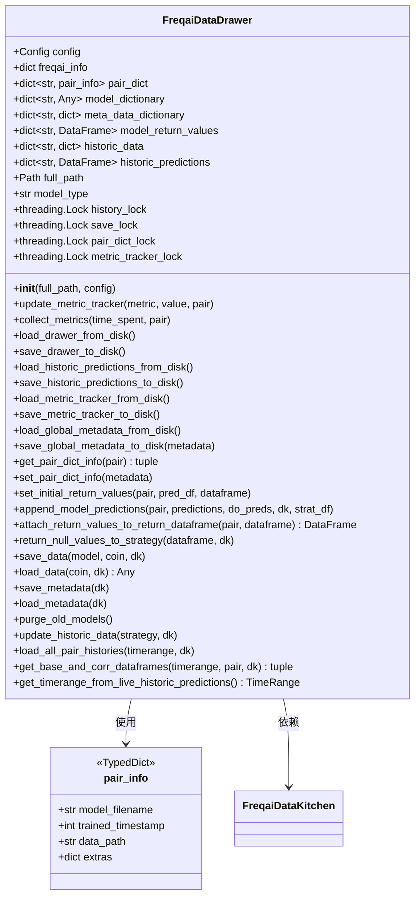

# data_drawer.py

## 概述

`FreqaiDataDrawer` 是 FreqAI 的核心数据持久化管理类。它在整个 live/dry-run 运行期间保持持久化，负责在内存中持有所有交易对的模型信息、历史预测数据、metric 追踪数据，并提供这些数据在磁盘与内存之间的加载/保存功能。

主要职责包括：
- 管理交易对元数据字典（pair_dict），记录每个交易对的模型文件名、训练时间戳等
- 管理模型字典（model_dictionary），在内存中缓存已训练模型以避免重复磁盘读取
- 管理历史预测数据（historic_predictions），支持 FreqUI 显示完整历史预测
- 管理 metric 追踪器，记录训练时间、CPU 负载等性能指标
- 支持多种模型保存格式：joblib、keras、stable_baselines3、sb3_contrib、pytorch
- 提供旧模型清理（purge_old_models）功能
- 线程安全的数据读写（通过多个 Lock 对象）

## 架构图

## 核心类/函数

### pair_info (TypedDict)

交易对元信息的类型定义，包含：
- `model_filename: str` -- 模型文件名
- `trained_timestamp: int` -- 最近一次训练的时间戳
- `data_path: str` -- 数据存储路径
- `extras: dict` -- 额外信息字典

### FreqaiDataDrawer

#### `__init__(self, full_path: Path, config: Config)`
初始化数据抽屉，设置所有字典、锁、路径，并从磁盘加载已有的 pair_dict、historic_predictions 和 metric_tracker。

#### `update_metric_tracker(self, metric: str, value: float, pair: str) -> None`
通用 metric 更新方法。以线程安全方式向 metric_tracker 追加新的 (timestamp, value) 记录。

#### `collect_metrics(self, time_spent: float, pair: str)`
收集训练性能指标，包括训练时间和 CPU 负载（1分钟、5分钟、15分钟平均值）。

#### `save_data(self, model: Any, coin: str, dk: FreqaiDataKitchen) -> None`
保存与单次子训练时间段相关的所有数据：
- 训练好的模型（支持 joblib/keras/sb3/pytorch 格式）
- 元数据 JSON
- feature_pipeline 和 label_pipeline（pickle）
- 训练特征数据和训练日期

#### `load_data(self, coin: str, dk: FreqaiDataKitchen) -> Any`
从磁盘或内存缓存加载模型及相关元数据。优先从内存 model_dictionary 读取以提高性能。

#### `set_initial_return_values(self, pair: str, pred_df: DataFrame, dataframe: DataFrame) -> None`
设置初始返回值到历史预测 DataFrame。将历史预测与新预测合并，用 NaN 填充停机期间的数据，确保 FreqUI 能正确显示历史预测。

#### `append_model_predictions(self, pair, predictions, do_preds, dk, strat_df) -> None`
将最新一条模型预测追加到 historic_predictions，同时更新价格数据（high/low/close）和日期。

#### `purge_old_models(self) -> None`
根据配置中的 `purge_old_models` 参数清理旧模型文件夹，按时间戳排序后保留指定数量。

#### `update_historic_data(self, strategy, dk) -> None`
在 live 模式下，将最新的蜡烛数据追加到内存中的历史数据中，避免重复从磁盘加载或多次调用交易所 API。

#### `load_all_pair_histories(self, timerange, dk) -> None`
启动时一次性加载所有白名单和 corr_pairlist 交易对的历史数据。

#### `get_base_and_corr_dataframes(self, timerange, pair, dk) -> tuple`
从内存中的 historic_data 搜索并返回当前交易对及其相关交易对的 DataFrame 数据。

## 依赖关系

### 内部依赖（本项目模块）
- `freqtrade.configuration.TimeRange` -- 时间范围管理
- `freqtrade.constants.Config` -- 配置类型
- `freqtrade.data.history.load_pair_history` -- 从磁盘加载交易对历史数据
- `freqtrade.enums.CandleType` -- 蜡烛类型枚举
- `freqtrade.exceptions.OperationalException` -- 自定义异常
- `freqtrade.freqai.data_kitchen.FreqaiDataKitchen` -- 数据处理工具
- `freqtrade.strategy.interface.IStrategy` -- 策略接口

### 外部依赖（第三方库）
- `numpy` -- 数值计算，numpy 类型编码
- `pandas` -- DataFrame 数据管理
- `psutil` -- 获取 CPU 负载信息
- `rapidjson` -- 高性能 JSON 序列化/反序列化
- `cloudpickle`（via joblib.externals）-- 模型和 pipeline 的序列化
- `threading` -- 线程锁，确保并发安全
- `shutil` -- 文件/目录操作（模型清理、备份）

### 被依赖（谁引用了本文件）
- `freqtrade.freqai.freqai_interface` -- IFreqaiModel 创建并使用 FreqaiDataDrawer 实例
- `freqtrade.freqai.utils` -- `get_timerange_backtest_live_models` 函数中使用
- `tests/freqai/conftest.py` -- 测试配置中使用
