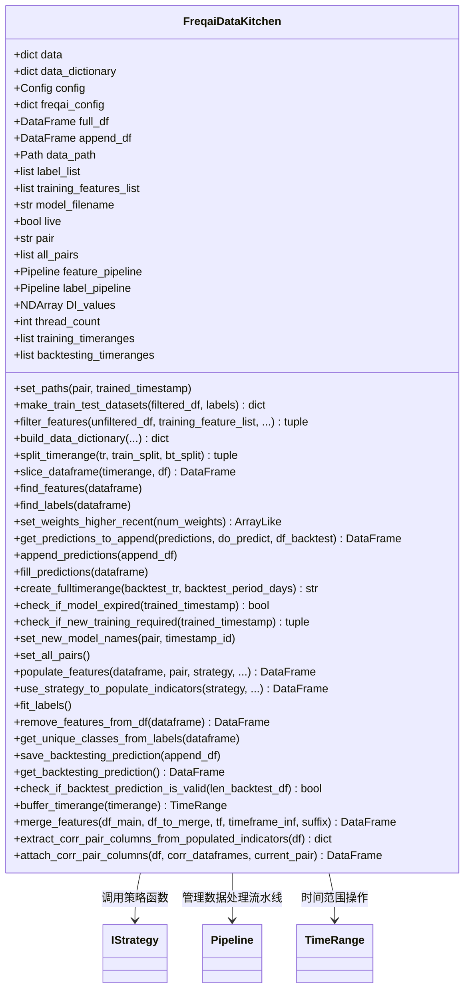

# data_kitchen.py

## 概述

`FreqaiDataKitchen` 是 FreqAI 的数据处理核心类，专门用于分析单个交易对的数据。它由 `IFreqaiModel` 类调用，提供数据持有、保存、加载、分析等功能。

该对象**不具有持久性**——每次需要对某个交易对进行推理或训练时，都会重新实例化。

主要职责包括：
- 特征发现与过滤（find_features、filter_features）
- 训练/测试数据集分割（make_train_test_datasets）
- 时间范围管理与切分（split_timerange、slice_dataframe、create_fulltimerange）
- 模型过期检查与重训练判断（check_if_model_expired、check_if_new_training_required）
- 回测预测的保存与加载（save_backtesting_prediction、get_backtesting_prediction）
- 特征工程支持：使用策略函数填充指标（populate_features、use_strategy_to_populate_indicators）
- 相关交易对数据的提取与附加（extract_corr_pair_columns、attach_corr_pair_columns）
- 数据 pipeline 管理（feature_pipeline、label_pipeline）
- 标签高斯分布拟合（fit_labels）

## 架构图

## 核心类/函数

### FreqaiDataKitchen

#### `__init__(self, config: Config, live: bool = False, pair: str = "")`
初始化数据厨房。在非 live 模式下，会创建完整时间范围并分割为训练/回测时间段。设置线程数、数据路径、feature/label pipeline 等。

#### `find_features(self, dataframe: DataFrame) -> None`
从 DataFrame 中查找以 `%` 开头的列名作为特征列表。如果没有找到任何特征，抛出 `OperationalException`。

#### `find_labels(self, dataframe: DataFrame) -> None`
从 DataFrame 中查找以 `&` 开头的列名作为标签列表。

#### `filter_features(self, unfiltered_df, training_feature_list, label_list, training_filter) -> tuple[DataFrame, DataFrame]`
过滤 DataFrame，提取用户请求的特征/标签，处理 NaN 值。在训练模式下删除含 NaN 的行；在预测模式下用 0 填充 NaN，并通过 `do_predict` 数组标记这些位置。

参数：
- `unfiltered_df` -- 当前训练期间的完整 DataFrame
- `training_feature_list` -- 特征列名列表
- `label_list` -- 标签列名列表（仅训练时需要）
- `training_filter` -- 布尔值，区分训练数据还是预测数据

返回值：(filtered_df, labels) 元组

#### `make_train_test_datasets(self, filtered_dataframe, labels) -> dict`
将完整历史数据分割为训练集和测试集。支持：
- 自定义 `test_size` 比例
- `weight_factor` 近期数据加权
- `shuffle_after_split` 分割后打乱
- `reverse_train_test_order` 反转训练/测试顺序

#### `split_timerange(self, tr, train_split, bt_split) -> tuple[list, list]`
将完整时间范围按滑动窗口方式分割为多个训练和回测子时间段。

#### `use_strategy_to_populate_indicators(self, strategy, ...) -> DataFrame`
使用用户定义的策略函数（feature_engineering_expand_all、feature_engineering_expand_basic、feature_engineering_standard、set_freqai_targets）填充特征指标。

#### `fit_labels(self) -> None`
使用 scipy 的正态分布拟合训练标签，计算均值和标准差，用于后续预测的统计分析。

#### `check_if_new_training_required(self, trained_timestamp) -> tuple[bool, TimeRange, TimeRange]`
判断是否需要重新训练模型。基于 `live_retrain_hours` 配置和上次训练时间戳计算。

#### `buffer_timerange(self, timerange) -> TimeRange`
缓冲时间范围的起止时间，用于处理边缘效应（如 argrelextrema 在时间范围边缘无法正确计算极值点）。

## 依赖关系

### 内部依赖（本项目模块）
- `freqtrade.configuration.TimeRange` -- 时间范围解析与管理
- `freqtrade.constants.Config, DOCS_LINK, ORDERFLOW_ADDED_COLUMNS` -- 配置和常量
- `freqtrade.data.converter.reduce_dataframe_footprint` -- DataFrame 内存优化
- `freqtrade.exceptions.OperationalException` -- 异常处理
- `freqtrade.exchange.timeframe_to_seconds` -- 时间框架转秒数
- `freqtrade.strategy.merge_informative_pair` -- 合并不同时间框架的数据
- `freqtrade.strategy.interface.IStrategy` -- 策略接口

### 外部依赖（第三方库）
- `numpy` -- 数值计算、权重生成
- `pandas` -- 数据框架操作
- `psutil` -- 获取 CPU 数量用于计算线程数
- `datasieve.pipeline.Pipeline` -- 数据处理 pipeline
- `sklearn.model_selection.train_test_split` -- 训练/测试分割
- `scipy` -- 正态分布拟合（在 fit_labels 中动态导入）

### 被依赖（谁引用了本文件）
- `freqtrade.freqai.freqai_interface` -- IFreqaiModel 大量使用 FreqaiDataKitchen
- `freqtrade.freqai.data_drawer` -- FreqaiDataDrawer 依赖 FreqaiDataKitchen 进行数据操作
- `freqtrade.freqai.utils` -- 工具函数中创建 FreqaiDataKitchen 实例
- `freqtrade.freqai.base_models.*` -- 所有基础模型类的 train/predict 方法
- `freqtrade.freqai.prediction_models.*` -- 所有预测模型类
- `freqtrade.freqai.RL.BaseReinforcementLearningModel` -- RL 基础模型
