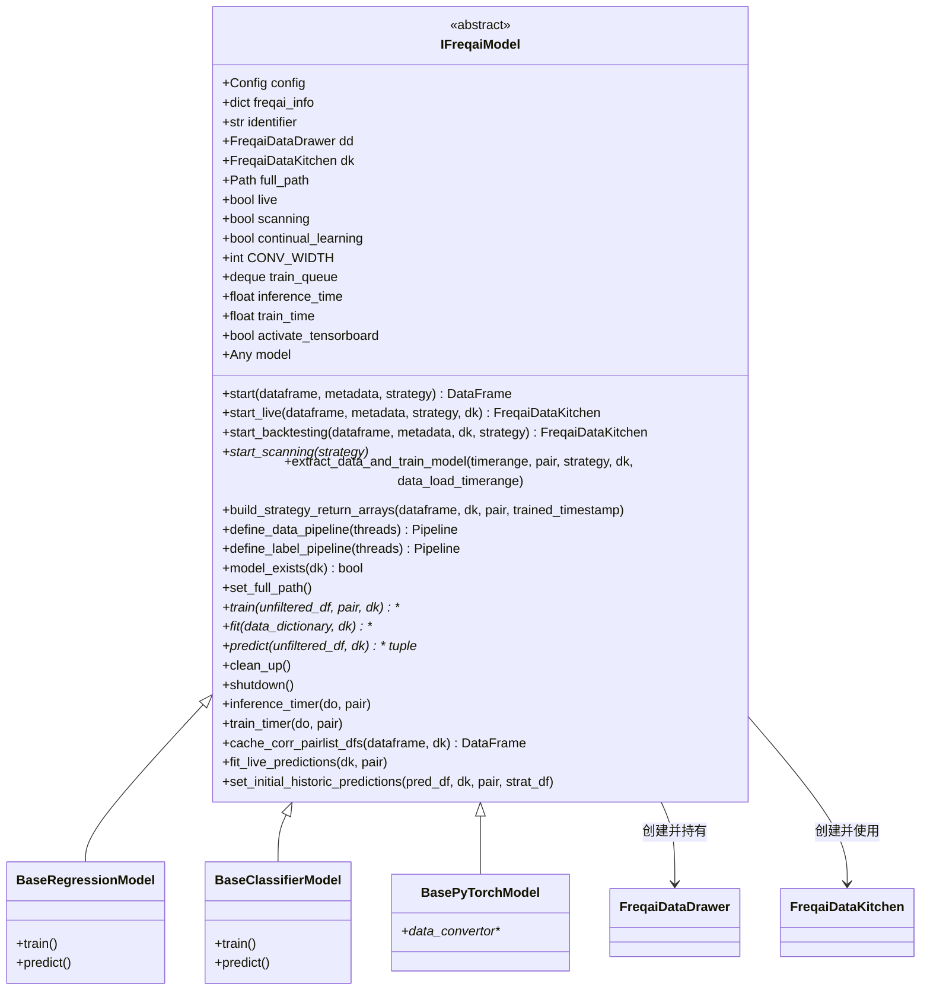

# freqai_interface.py

## 概述

`IFreqaiModel` 是 FreqAI 的核心抽象基类，包含策略中进行训练和预测所需的全部工具。所有的 Base*PredictionModel（如 BaseRegressionModel、BaseClassifierModel、BasePyTorchModel 等）都继承自此类。

该类是 FreqAI 系统的中心枢纽，负责协调数据加载、模型训练、预测推理、回测循环等全部核心流程。

主要职责包括：
- **入口调度**：`start()` 方法作为从策略进入 FreqAI 的入口点，根据运行模式（live/backtesting）分发到不同的执行路径
- **回测引擎**：`start_backtesting()` 实现滑动窗口训练/回测范式
- **实时推理**：`start_live()` 管理实时数据更新、模型加载和预测
- **异步训练**：通过 `start_scanning()` 在独立线程上持续扫描交易对进行重训练
- **数据 Pipeline 定义**：`define_data_pipeline()` / `define_label_pipeline()` 定义特征/标签处理流水线
- **性能追踪**：推理计时器和训练计时器
- **模型管理**：模型存在性检查、过期检查、训练队列管理

## 架构图

## 核心类/函数

### IFreqaiModel (ABC)

#### `__init__(self, config: Config) -> None`
初始化 FreqAI 模型：
- 解析配置参数（freqai_info、data_split_parameters、model_training_parameters）
- 创建 `FreqaiDataDrawer` 实例
- 设置训练队列、计时器、corr_pairlist 等
- 配置 PCA、DI_threshold、Keras 兼容性检查
- 调用 `record_params` 记录运行参数

#### `start(self, dataframe, metadata, strategy) -> DataFrame`
**FreqAI 入口方法**。由策略为每个交易对调用：
- live/dry-run 模式：调用 `start_live()` 进行实时推理
- 回测模式：调用 `start_backtesting()` 或 `start_backtesting_from_historic_predictions()`
- 最后调用 `clean_up()` 释放非持久性资源

#### `start_live(self, dataframe, metadata, strategy, dk) -> FreqaiDataKitchen`
实时运行的主执行流程：
1. 检查是否需要更新历史数据
2. 启动异步扫描训练线程（仅首次）
3. 加载模型和关联数据
4. 使用策略填充指标
5. 构建返回数组

#### `start_backtesting(self, dataframe, metadata, dk, strategy) -> FreqaiDataKitchen`
回测的主执行流程。实现滑动窗口范式：
1. 遍历每个 (训练时间段, 回测时间段) 对
2. 检查是否已有缓存的预测结果
3. 如果没有，进行特征填充、数据切分、模型训练、预测
4. 保存回测预测结果
5. 最后调用 `backtesting_fit_live_predictions()` 和 `fill_predictions()`

#### `start_scanning(self, strategy) -> None`
在独立线程中启动 `_start_scanning()`，持续扫描交易对队列进行重训练。训练队列按上次训练时间排序，最陈旧的模型优先训练。

#### `extract_data_and_train_model(self, new_trained_timerange, pair, strategy, dk, data_load_timerange)`
提取数据并训练模型的完整流程：获取 base/corr dataframes -> 填充指标 -> 切分时间范围 -> 查找特征/标签 -> 训练 -> 保存 -> 清理旧模型。

#### `define_data_pipeline(self, threads=-1) -> Pipeline`
定义特征数据处理 Pipeline，可包含：
- `VarianceThreshold` -- 去除常量特征
- `MinMaxScaler` -- 归一化到 [-1, 1]
- `PCA` -- 主成分分析（可选）
- `SVMOutlierExtractor` -- SVM 异常值检测（可选）
- `DissimilarityIndex` -- 不相似度指数（可选）
- `DBSCAN` -- DBSCAN 异常值检测（可选）
- `Noise` -- 添加噪声（可选）

#### `define_label_pipeline(self, threads=-1) -> Pipeline`
定义标签数据处理 Pipeline，默认仅包含 MinMaxScaler。

#### `train(self, unfiltered_df, pair, dk, **kwargs) -> Any` [抽象方法]
子类必须实现的训练方法。

#### `fit(self, data_dictionary, dk, **kwargs) -> Any` [抽象方法]
子类必须实现的模型拟合方法。

#### `predict(self, unfiltered_df, dk, **kwargs) -> tuple[DataFrame, NDArray]` [抽象方法]
子类必须实现的预测方法。返回 (预测 DataFrame, do_predict 数组)。

#### `fit_live_predictions(self, dk, pair) -> None`
使用 scipy 正态分布拟合最近 N 根蜡烛的历史预测，更新 labels_mean 和 labels_std。

#### `shutdown(self)`
关闭 FreqAI：设置停止事件、保存历史预测、等待或中断训练线程。

## 依赖关系

### 内部依赖（本项目模块）
- `freqtrade.configuration.TimeRange` -- 时间范围
- `freqtrade.constants.DOCS_LINK, Config` -- 常量和配置
- `freqtrade.data.dataprovider.DataProvider` -- 数据提供者
- `freqtrade.enums.RunMode` -- 运行模式枚举
- `freqtrade.exceptions.OperationalException` -- 异常
- `freqtrade.exchange.timeframe_to_seconds` -- 时间框架转换
- `freqtrade.freqai.data_drawer.FreqaiDataDrawer` -- 数据持久化管理
- `freqtrade.freqai.data_kitchen.FreqaiDataKitchen` -- 数据处理工具
- `freqtrade.freqai.utils.get_tb_logger, plot_feature_importance, record_params` -- 工具函数
- `freqtrade.strategy.interface.IStrategy` -- 策略接口

### 外部依赖（第三方库）
- `numpy` -- 数值计算
- `pandas` -- 数据管理
- `psutil` -- 系统信息
- `datasieve` -- 数据处理 Pipeline（transforms, Pipeline, SKLearnWrapper）
- `sklearn.preprocessing.MinMaxScaler` -- 数据归一化
- `scipy` -- 统计分布拟合（动态导入）
- `threading` -- 多线程训练扫描

### 被依赖（谁引用了本文件）
- `freqtrade.freqai.base_models.BaseRegressionModel` -- 回归模型基类继承
- `freqtrade.freqai.base_models.BaseClassifierModel` -- 分类模型基类继承
- `freqtrade.freqai.base_models.BasePyTorchModel` -- PyTorch 模型基类继承
- `freqtrade.freqai.RL.BaseReinforcementLearningModel` -- RL 模型基类继承
- `freqtrade.resolvers.freqaimodel_resolver` -- 模型解析器
