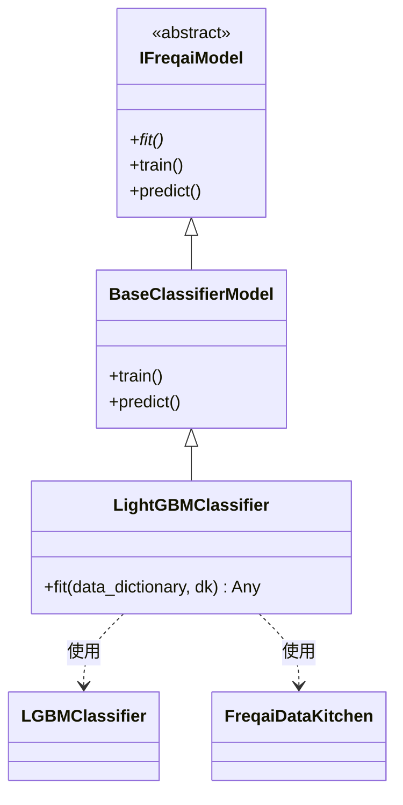

# LightGBMClassifier.py

## 概述

基于 LightGBM 梯度提升框架实现的**单目标分类**预测模型。该类继承自 `BaseClassifierModel`，通过重写 `fit()` 方法使用 LightGBM 的 `LGBMClassifier` 来训练分类模型。支持增量学习（continual learning）、评估集验证和样本权重。

## 架构图

## 核心类/函数

### LightGBMClassifier

继承自 `BaseClassifierModel`，是 FreqAI 中使用 LightGBM 进行分类任务的标准实现。

#### fit(data_dictionary, dk, **kwargs) -> Any

训练 LightGBM 分类模型的核心方法。

**参数：**
- `data_dictionary: dict` — 包含所有训练/测试数据的字典，关键 key 包括：
  - `train_features` — 训练特征 DataFrame
  - `train_labels` — 训练标签 DataFrame
  - `train_weights` — 训练样本权重
  - `test_features` — 测试特征 DataFrame
  - `test_labels` — 测试标签 DataFrame
  - `test_weights` — 测试样本权重
- `dk: FreqaiDataKitchen` — 当前交易对/模型的数据处理对象

**返回值：** 训练好的 `LGBMClassifier` 模型对象

**关键逻辑：**
1. 检查配置中的 `test_size` 参数：若为 0 则不使用评估集，否则准备 `eval_set` 和 `test_weights`
2. 将训练特征和标签转换为 numpy 数组（取第一列标签）
3. 调用 `self.get_init_model(dk.pair)` 获取增量学习的初始模型
4. 使用 `self.model_training_parameters` 中的配置参数实例化 `LGBMClassifier`
5. 调用 `model.fit()` 进行训练，传入样本权重和评估集

## 依赖关系

### 内部依赖（本项目模块）
- `freqtrade.freqai.base_models.BaseClassifierModel` — 分类模型基类，提供 `train()` 和 `predict()` 方法
- `freqtrade.freqai.data_kitchen.FreqaiDataKitchen` — 数据处理工具类

### 外部依赖（第三方库）
- `lightgbm.LGBMClassifier` — LightGBM 分类器实现
- `logging` — 日志记录

### 被依赖（谁引用了本文件）
- 通过 `freqtrade.resolvers.freqaimodel_resolver` 动态加载 — 用户在配置文件中指定 `"freqaimodel": "LightGBMClassifier"` 时使用
