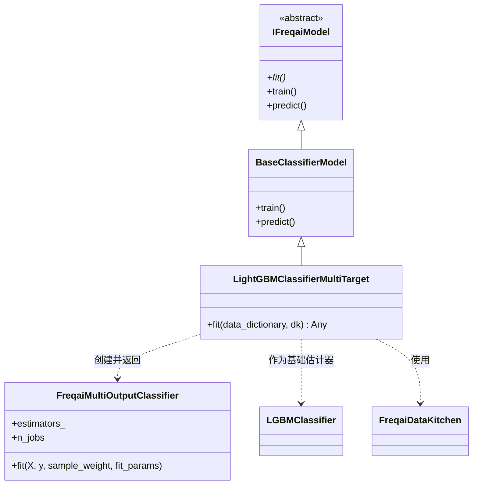

# LightGBMClassifierMultiTarget.py

## 概述

基于 LightGBM 梯度提升框架实现的**多目标分类**预测模型。与 `LightGBMClassifier` 不同，该类使用 `FreqaiMultiOutputClassifier` 包装器来同时训练多个分类目标。每个目标标签拥有独立的 LGBMClassifier 估计器，支持并行训练和增量学习。

## 架构图

## 核心类/函数

### LightGBMClassifierMultiTarget

继承自 `BaseClassifierModel`，实现多目标分类任务的训练逻辑。

#### fit(data_dictionary, dk, **kwargs) -> Any

训练多目标 LightGBM 分类模型。

**参数：**
- `data_dictionary: dict` — 包含所有训练/测试数据的字典
- `dk: FreqaiDataKitchen` — 当前交易对/模型的数据处理对象

**返回值：** 训练好的 `FreqaiMultiOutputClassifier` 模型对象

**关键逻辑：**
1. 使用 `self.model_training_parameters` 创建基础 `LGBMClassifier` 估计器
2. 根据标签列数（`y.shape[1]`）为每个目标准备独立的评估集：
   - 若 `test_size != 0`，为每个标签列构建 `(test_features, test_labels.iloc[:, i])` 评估集
   - 若 `test_size == 0`，评估集设为 `None`
3. 调用 `self.get_init_model(dk.pair)` 获取增量学习的初始模型：
   - 若存在初始模型，提取其 `estimators_` 作为各子模型的初始权重
   - 否则初始化为 `None` 列表
4. 为每个目标构建 `fit_params` 列表，包含 `eval_set`、`eval_sample_weight`、`init_model`
5. 创建 `FreqaiMultiOutputClassifier` 并检查是否启用多线程并行训练（`multitarget_parallel_training`）
6. 调用 `model.fit()` 进行训练

## 依赖关系

### 内部依赖（本项目模块）
- `freqtrade.freqai.base_models.BaseClassifierModel` — 分类模型基类
- `freqtrade.freqai.base_models.FreqaiMultiOutputClassifier` — 多输出分类器包装器，扩展了 scikit-learn 的 MultiOutputClassifier
- `freqtrade.freqai.data_kitchen.FreqaiDataKitchen` — 数据处理工具类

### 外部依赖（第三方库）
- `lightgbm.LGBMClassifier` — LightGBM 分类器实现
- `logging` — 日志记录

### 被依赖（谁引用了本文件）
- 通过 `freqtrade.resolvers.freqaimodel_resolver` 动态加载 — 用户在配置文件中指定 `"freqaimodel": "LightGBMClassifierMultiTarget"` 时使用
- `freqtrade.templates.FreqaiExampleStrategy` — 示例策略中引用了此模型作为参考
