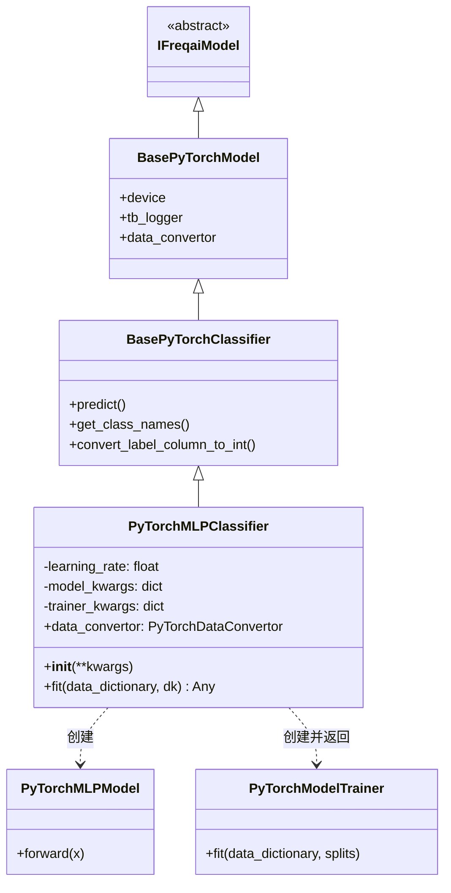

# PyTorchMLPClassifier.py

## 概述

基于 PyTorch 实现的**多层感知机（MLP）分类**预测模型。该类继承自 `BasePyTorchClassifier`，使用 `PyTorchMLPModel` 作为神经网络架构，`PyTorchModelTrainer` 管理训练循环。支持持续学习（continual learning）、TensorBoard 日志记录，以及通过配置文件灵活调整模型超参数。

## 架构图



## 核心类/函数

### PyTorchMLPClassifier

继承自 `BasePyTorchClassifier`，实现基于 MLP 的分类任务。

#### 属性

- `data_convertor` (property) — 返回 `DefaultPyTorchDataConvertor` 实例，配置 `target_tensor_type=torch.long` 和 `squeeze_target_tensor=True`，适配分类任务的标签格式要求

#### __init__(**kwargs)

从 `freqai_info["model_training_parameters"]` 中读取配置：
- `learning_rate: float` — 学习率，默认 `3e-4`
- `model_kwargs: dict` — 模型参数（如 `hidden_dim`、`dropout_percent`、`n_layer`）
- `trainer_kwargs: dict` — 训练器参数（如 `n_steps`、`batch_size`、`n_epochs`）

#### fit(data_dictionary, dk, **kwargs) -> Any

训练 PyTorch MLP 分类模型。

**参数：**
- `data_dictionary: dict` — 包含训练/测试数据的字典
- `dk: FreqaiDataKitchen` — 数据处理对象

**返回值：** `PyTorchModelTrainer` 实例（包含训练好的模型、优化器等）

**关键逻辑：**
1. 调用 `self.get_class_names()` 获取分类名称列表
2. 调用 `self.convert_label_column_to_int()` 将标签列转换为整数编码
3. 根据训练特征维度和类别数创建 `PyTorchMLPModel`（`input_dim=n_features, output_dim=len(class_names)`）
4. 将模型移动到指定设备（CPU/GPU）
5. 创建 `AdamW` 优化器和 `CrossEntropyLoss` 损失函数
6. 检查是否存在持续学习模型（`self.get_init_model(dk.pair)`）
7. 若无初始模型，创建新的 `PyTorchModelTrainer`，包含 `class_names` 元数据
8. 调用 `trainer.fit()` 执行训练

**配置示例：**
```json
{
    "freqai": {
        "model_training_parameters": {
            "learning_rate": 3e-4,
            "trainer_kwargs": {
                "n_steps": 5000,
                "batch_size": 64,
                "n_epochs": null
            },
            "model_kwargs": {
                "hidden_dim": 512,
                "dropout_percent": 0.2,
                "n_layer": 1
            }
        }
    }
}
```

## 依赖关系

### 内部依赖（本项目模块）
- `freqtrade.freqai.base_models.BasePyTorchClassifier` — PyTorch 分类模型基类，提供 `predict()` 方法
- `freqtrade.freqai.data_kitchen.FreqaiDataKitchen` — 数据处理工具类
- `freqtrade.freqai.torch.PyTorchDataConvertor` — 数据转换器接口和默认实现
- `freqtrade.freqai.torch.PyTorchMLPModel` — MLP 网络架构定义
- `freqtrade.freqai.torch.PyTorchModelTrainer` — 模型训练循环管理器

### 外部依赖（第三方库）
- `torch` — PyTorch 深度学习框架（AdamW 优化器、CrossEntropyLoss 损失函数）

### 被依赖（谁引用了本文件）
- 通过 `freqtrade.resolvers.freqaimodel_resolver` 动态加载 — 用户在配置文件中指定 `"freqaimodel": "PyTorchMLPClassifier"` 时使用
