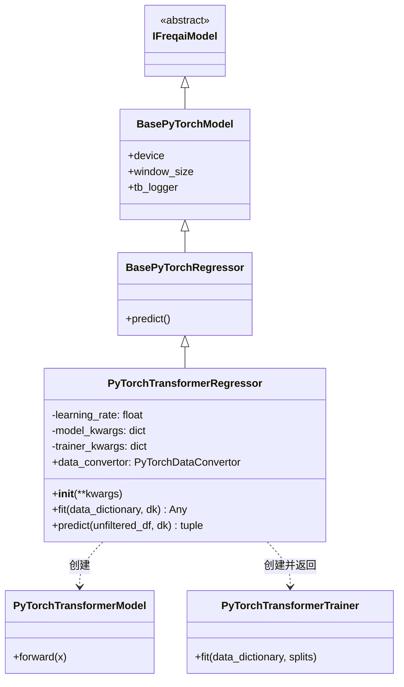

# PyTorchTransformerRegressor.py

## 概述

基于 PyTorch 实现的 **Transformer 回归**预测模型。该类继承自 `BasePyTorchRegressor`，使用 `PyTorchTransformerModel` 作为网络架构，`PyTorchTransformerTrainer` 管理训练循环。与 MLP 版本的核心区别在于 Transformer 基于**滑动窗口（windowing）** 机制处理时间序列数据，因此需要配置 `conv_width` 参数并重写了 `predict()` 方法来实现窗口滑动推理。

## 架构图



## 核心类/函数

### PyTorchTransformerRegressor

继承自 `BasePyTorchRegressor`，实现基于 Transformer 的时间序列回归任务。

#### 属性

- `data_convertor` (property) — 返回 `DefaultPyTorchDataConvertor` 实例，配置 `target_tensor_type=torch.float`

#### __init__(**kwargs)

从 `freqai_info["model_training_parameters"]` 中读取配置：
- `learning_rate: float` — 学习率，默认 `3e-4`
- `model_kwargs: dict` — 模型参数（如 `hidden_dim`、`dropout_percent`、`n_layer`）
- `trainer_kwargs: dict` — 训练器参数（如 `n_steps`、`batch_size`、`n_epochs`）

#### fit(data_dictionary, dk, **kwargs) -> Any

训练 PyTorch Transformer 回归模型。

**参数：**
- `data_dictionary: dict` — 包含训练/测试数据的字典
- `dk: FreqaiDataKitchen` — 数据处理对象

**返回值：** `PyTorchTransformerTrainer` 实例

**关键逻辑：**
1. 获取特征维度 `n_features` 和标签维度 `n_labels`
2. 创建 `PyTorchTransformerModel`，传入 `input_dim`、`output_dim`、`time_window=self.window_size`
3. 创建 `AdamW` 优化器和 `MSELoss` 损失函数
4. 检查是否存在持续学习模型
5. 创建 `PyTorchTransformerTrainer`（注意与 MLP 不同，使用的是 `PyTorchTransformerTrainer` 而非 `PyTorchModelTrainer`），额外传入 `window_size` 参数
6. 调用 `trainer.fit()` 执行训练

#### predict(unfiltered_df, dk, **kwargs) -> tuple[DataFrame, NDArray]

自定义预测方法，实现滑动窗口推理。

**参数：**
- `unfiltered_df: DataFrame` — 当前回测周期的完整数据
- `dk: FreqaiDataKitchen` — 数据处理对象

**返回值：** `(pred_df, do_predict)` 元组
- `pred_df` — 包含预测结果的 DataFrame
- `do_predict` — 1/0 数组，标识哪些位置的预测是有效的

**关键逻辑：**
1. 调用 `dk.find_features()` 和 `dk.filter_features()` 提取预测特征
2. 通过 `dk.feature_pipeline.transform()` 进行特征变换和异常检测
3. 使用 `data_convertor.convert_x()` 将特征转换为 PyTorch 张量
4. **滑动窗口推理**：
   - 若输入序列长度 > `window_size`，逐步滑动窗口进行预测，拼接所有窗口的输出
   - 否则直接对整个序列进行一次推理
5. 将预测结果转换为 DataFrame，通过 `dk.label_pipeline.inverse_transform()` 反变换
6. 处理 DI（Dissimilarity Index）值
7. 对于多时间步预测，在前面填充零行以保持与输入相同的行数

**配置示例：**
```json
{
    "freqai": {
        "conv_width": 30,
        "feature_parameters": {
            "include_shifted_candles": 0
        },
        "model_training_parameters": {
            "learning_rate": 3e-4,
            "trainer_kwargs": {
                "n_steps": 5000,
                "batch_size": 64,
                "n_epochs": null
            },
            "model_kwargs": {
                "hidden_dim": 512,
                "dropout_percent": 0.2,
                "n_layer": 1
            }
        }
    }
}
```

> **注意**：Transformer 模型基于窗口机制工作，因此建议将 `include_shifted_candles` 设为 0，以避免冗余的时序特征。

## 依赖关系

### 内部依赖（本项目模块）
- `freqtrade.freqai.base_models.BasePyTorchRegressor` — PyTorch 回归模型基类
- `freqtrade.freqai.data_kitchen.FreqaiDataKitchen` — 数据处理工具类
- `freqtrade.freqai.torch.PyTorchDataConvertor` — 数据转换器接口和默认实现
- `freqtrade.freqai.torch.PyTorchTransformerModel` — Transformer 网络架构定义
- `freqtrade.freqai.torch.PyTorchModelTrainer.PyTorchTransformerTrainer` — Transformer 专用训练循环管理器

### 外部依赖（第三方库）
- `torch` — PyTorch 深度学习框架
- `numpy` — 数值计算（用于 DI 值和零填充）
- `pandas` — 数据处理（DataFrame 操作）

### 被依赖（谁引用了本文件）
- 通过 `freqtrade.resolvers.freqaimodel_resolver` 动态加载 — 用户在配置文件中指定 `"freqaimodel": "PyTorchTransformerRegressor"` 时使用
