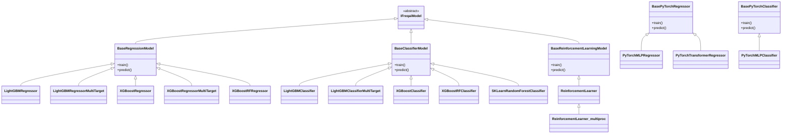
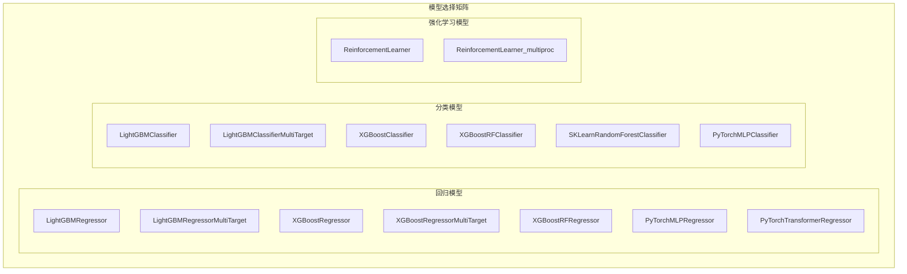
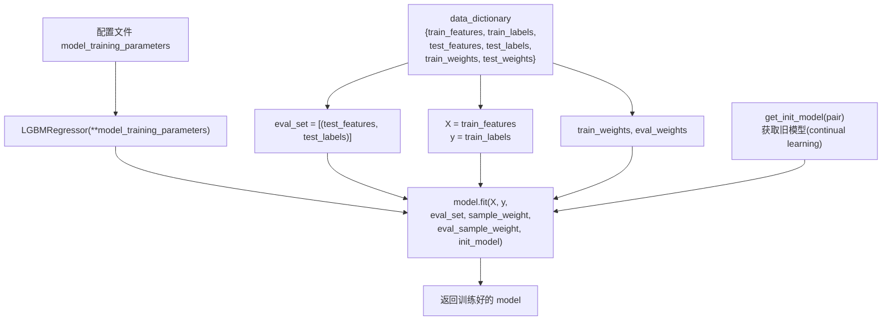
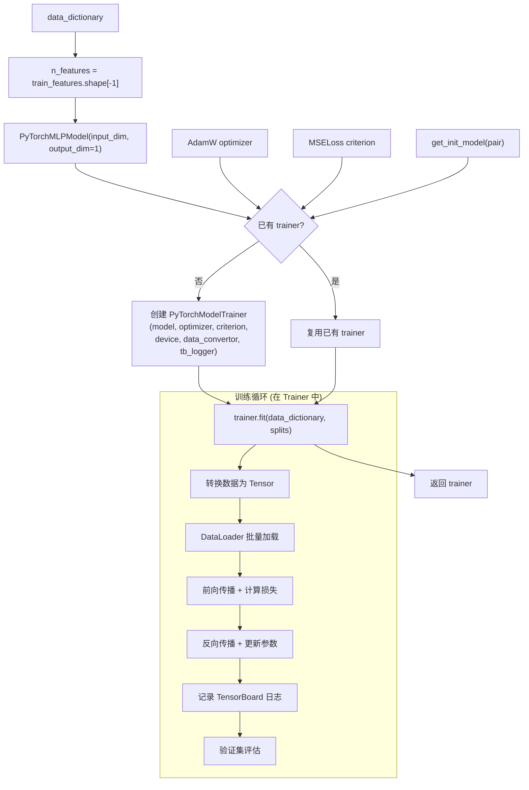
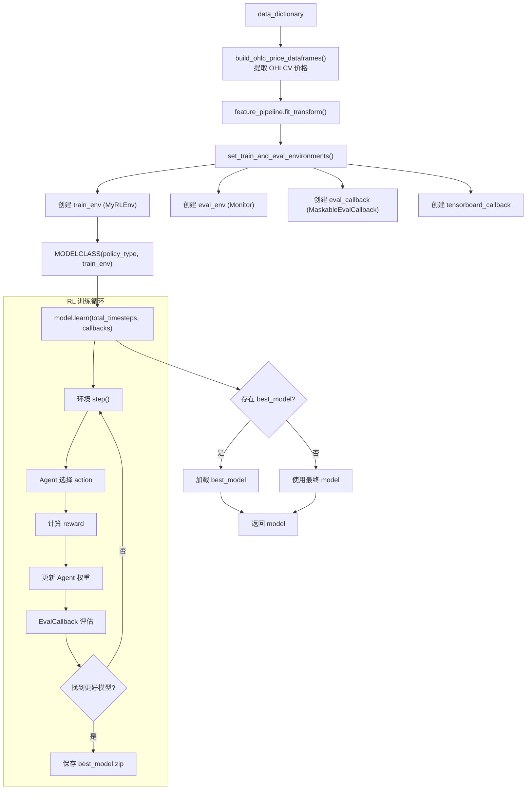

# FreqAI 预测模型实现 (prediction_models)

## 1. 模块概述

`prediction_models` 目录包含了 FreqAI 提供的所有开箱即用的预测模型实现。这些模型继承自 `base_models` 中定义的基类，通过实现 `fit()` 方法来集成具体的机器学习框架。用户可以直接使用这些模型，也可以将它们作为模板来创建自定义模型。

该目录涵盖四大类模型框架：

1. **LightGBM**：微软的梯度提升框架，速度快、内存占用低
2. **XGBoost**：经典的梯度提升框架，支持 GPU 加速
3. **PyTorch**：深度学习框架，提供 MLP 和 Transformer 模型
4. **Stable Baselines3**：强化学习框架集成
5. **SKLearn**：随机森林分类器

每个模型都遵循统一的接口规范：只需实现 `fit()` 方法，`train()` 和 `predict()` 由基类提供。

## 2. 目录结构

```
freqtrade/freqai/prediction_models/
|-- __init__.py                              # 包初始化文件（空）
|
|-- # LightGBM 系列
|-- LightGBMRegressor.py                     # LightGBM 回归（约 55 行）
|-- LightGBMClassifier.py                    # LightGBM 分类（约 59 行）
|-- LightGBMRegressorMultiTarget.py          # LightGBM 多目标回归（约 75 行）
|-- LightGBMClassifierMultiTarget.py         # LightGBM 多目标分类（约 73 行）
|
|-- # XGBoost 系列
|-- XGBoostRegressor.py                      # XGBoost 回归（约 61 行）
|-- XGBoostClassifier.py                     # XGBoost 分类 + LabelEncoder（约 89 行）
|-- XGBoostRegressorMultiTarget.py           # XGBoost 多目标回归（约 62 行）
|-- XGBoostRFClassifier.py                   # XGBoost Random Forest 分类（约 89 行）
|-- XGBoostRFRegressor.py                    # XGBoost Random Forest 回归（约 65 行）
|
|-- # SKLearn 系列
|-- SKLearnRandomForestClassifier.py         # SKLearn 随机森林分类（约 85 行）
|
|-- # PyTorch 系列
|-- PyTorchMLPClassifier.py                  # PyTorch MLP 分类（约 91 行）
|-- PyTorchMLPRegressor.py                   # PyTorch MLP 回归（约 84 行）
|-- PyTorchTransformerRegressor.py           # PyTorch Transformer 回归（约 156 行）
|
|-- # 强化学习系列
|-- ReinforcementLearner.py                  # RL 单进程模型（约 172 行）
|-- ReinforcementLearner_multiproc.py        # RL 多进程模型（约 86 行）
```

### 文件功能总览

| 文件 | 基类 | ML 框架 | 任务类型 | 特殊功能 |
|------|------|---------|----------|----------|
| `LightGBMRegressor` | `BaseRegressionModel` | LightGBM | 单目标回归 | continual_learning |
| `LightGBMClassifier` | `BaseClassifierModel` | LightGBM | 单目标分类 | continual_learning |
| `LightGBMRegressorMultiTarget` | `BaseRegressionModel` | LightGBM | 多目标回归 | 并行训练 |
| `LightGBMClassifierMultiTarget` | `BaseClassifierModel` | LightGBM | 多目标分类 | 并行训练 |
| `XGBoostRegressor` | `BaseRegressionModel` | XGBoost | 单目标回归 | TBCallback |
| `XGBoostClassifier` | `BaseClassifierModel` | XGBoost | 单目标分类 | LabelEncoder |
| `XGBoostRegressorMultiTarget` | `BaseRegressionModel` | XGBoost | 多目标回归 | TBCallback |
| `XGBoostRFClassifier` | `BaseClassifierModel` | XGBoost RF | 单目标分类 | LabelEncoder |
| `XGBoostRFRegressor` | `BaseRegressionModel` | XGBoost RF | 单目标回归 | 无 callback |
| `SKLearnRandomForestClassifier` | `BaseClassifierModel` | SKLearn | 单目标分类 | 不支持 continual_learning |
| `PyTorchMLPClassifier` | `BasePyTorchClassifier` | PyTorch | 分类 | MLP + AdamW + CrossEntropy |
| `PyTorchMLPRegressor` | `BasePyTorchRegressor` | PyTorch | 回归 | MLP + AdamW + MSELoss |
| `PyTorchTransformerRegressor` | `BasePyTorchRegressor` | PyTorch | 回归 | Transformer + 滑动窗口 |
| `ReinforcementLearner` | `BaseReinforcementLearningModel` | SB3 | RL | 自定义 reward |
| `ReinforcementLearner_multiproc` | `ReinforcementLearner` | SB3 | RL | SubprocVecEnv |

## 3. 架构图





## 4. 核心类/函数说明

### 4.1 LightGBM 系列

#### LightGBMRegressor

```python
class LightGBMRegressor(BaseRegressionModel):
    def fit(self, data_dictionary: dict, dk: FreqaiDataKitchen, **kwargs) -> Any:
```

**实现细节**：
- 使用 `lightgbm.LGBMRegressor` 作为底层模型
- 支持 `eval_set`（验证集早停）
- 支持 `sample_weight`（样本权重）
- 支持 `init_model`（continual learning，通过 `self.get_init_model()` 获取旧模型）
- 模型训练参数通过 `self.model_training_parameters` 传入（来自配置文件 `freqai.model_training_parameters`）

#### LightGBMRegressorMultiTarget

**实现细节**：
- 使用 `FreqaiMultiOutputRegressor` 包装 `LGBMRegressor`
- 为每个目标标签创建独立的 `eval_set` 和 `init_model`
- 支持通过 `multitarget_parallel_training` 配置开启并行训练
- `fit_params` 列表为每个子模型指定不同的参数

#### LightGBMClassifier / LightGBMClassifierMultiTarget

与回归系列类似，主要区别：
- 使用 `lightgbm.LGBMClassifier`
- 输入标签转换为 numpy 数组并取第一列：`y = data_dictionary["train_labels"].to_numpy()[:, 0]`
- 多目标版本使用 `FreqaiMultiOutputClassifier`

### 4.2 XGBoost 系列

#### XGBoostRegressor

```python
class XGBoostRegressor(BaseRegressionModel):
    def fit(self, data_dictionary: dict, dk: FreqaiDataKitchen, **kwargs) -> Any:
```

**实现细节**：
- 使用 `xgboost.XGBRegressor`
- **集成 TensorBoard Callback**：`model.set_params(callbacks=[TBCallback(dk.data_path)])`
- 训练完成后清空 callbacks 以支持序列化：`model.set_params(callbacks=[])`
- `eval_set` 同时包含测试集和训练集以跟踪两者的损失

#### XGBoostClassifier

**实现细节**：
- 使用 `xgboost.XGBClassifier`
- **使用 sklearn LabelEncoder** 将字符串标签编码为整数
- 重写 `predict()` 方法，在预测后通过 `le.inverse_transform()` 将整数标签还原为字符串
- 同时重命名概率列名为原始类名

#### XGBoostRFRegressor

**实现细节**：
- 使用 `xgboost.XGBRFRegressor`（XGBoost 的随机森林实现）
- **不支持 callbacks**：XGBoost 2.1.x 起随机森林不支持 `early_stopping_rounds` 和 `callbacks`

#### XGBoostRFClassifier

与 `XGBoostClassifier` 类似，使用 `xgboost.XGBRFClassifier` 作为底层模型。

### 4.3 SKLearn 系列

#### SKLearnRandomForestClassifier

**实现细节**：
- 使用 `sklearn.ensemble.RandomForestClassifier`
- **不支持 continual learning**：无 `init_model` 参数
- 训练后输出验证集得分：`model.score(eval_set[0], eval_set[1])`
- 重写 `predict()` 使用 `LabelEncoder` 进行标签反转换

### 4.4 PyTorch 系列

#### PyTorchMLPRegressor

```python
class PyTorchMLPRegressor(BasePyTorchRegressor):
```

**实现细节**：
- 使用 `PyTorchMLPModel` 作为神经网络结构
- 优化器：`torch.optim.AdamW`
- 损失函数：`torch.nn.MSELoss`
- 支持 continual learning（通过 `get_init_model()` 获取已训练的 trainer）
- 通过配置文件传入超参数：
  - `learning_rate`：学习率，默认 3e-4
  - `model_kwargs`：`hidden_dim`、`dropout_percent`、`n_layer`
  - `trainer_kwargs`：`n_steps`、`batch_size`、`n_epochs`

#### PyTorchMLPClassifier

**实现细节**：
- 优化器：`torch.optim.AdamW`
- 损失函数：`torch.nn.CrossEntropyLoss`
- 在训练前调用 `convert_label_column_to_int()` 将字符串标签转为整数
- `model_meta_data` 中保存 `class_names` 供预测时使用
- `data_convertor` 使用 `torch.long` 类型且 squeeze target tensor

#### PyTorchTransformerRegressor

**实现细节**：
- 使用 `PyTorchTransformerModel` 作为神经网络结构
- 使用 `PyTorchTransformerTrainer` 支持窗口化数据加载
- 配置 `conv_width` 参数控制时间窗口大小
- **重写 `predict()` 方法**：实现滑动窗口推理
  - 如果输入长度 > `window_size`，逐步滑动窗口进行预测并拼接
  - 否则直接整体预测
  - 预测结果前补零到与输入等长

```python
# 滑动窗口预测逻辑
if x.shape[1] > self.window_size:
    for i in range(0, x.shape[1] - ws):
        xb = x[:, i : i + ws, :]
        y = self.model.model(xb)
        yb = torch.cat((yb, y), dim=1)
```

### 4.5 强化学习系列

#### ReinforcementLearner

```python
class ReinforcementLearner(BaseReinforcementLearningModel):
```

**实现细节**：
- 使用 Stable Baselines3 的 RL 算法（PPO、A2C、DQN 等）
- 在 `fit()` 中创建 RL 模型实例并调用 `model.learn()`
- 总训练步数 = `train_cycles * len(train_df)`
- 使用 `ReLU` 激活函数和自定义网络架构
- 支持 TensorBoard 和进度条回调
- 训练结束后检查是否存在 `best_model.zip`（来自 EvalCallback）
- **内嵌 `MyRLEnv` 类**：用户可重写的自定义奖励环境
  - 继承 `Base5ActionRLEnv`（5 种动作：Neutral、Long_enter、Long_exit、Short_enter、Short_exit）
  - `calculate_reward()` 是用户最主要需要自定义的方法
  - 内置的示例奖励考虑了：交易方向、持仓时长、PnL、交易验证等

#### ReinforcementLearner_multiproc

**实现细节**：
- 继承自 `ReinforcementLearner`
- 重写 `set_train_and_eval_environments()` 方法
- 使用 `SubprocVecEnv` 创建多进程向量化环境
- 使用 `VecMonitor` 包装环境以进行监控
- 训练环境和评估环境都在多个子进程中运行
- **注意**：TensorBoard Callback 在多进程环境下可能返回不准确的信息

## 5. 依赖关系

### 继承关系总览

```
IFreqaiModel
├── BaseRegressionModel
│   ├── LightGBMRegressor
│   ├── LightGBMRegressorMultiTarget
│   ├── XGBoostRegressor
│   ├── XGBoostRegressorMultiTarget
│   ├── XGBoostRFRegressor
│   └── (用户自定义回归模型)
├── BaseClassifierModel
│   ├── LightGBMClassifier
│   ├── LightGBMClassifierMultiTarget
│   ├── XGBoostClassifier
│   ├── XGBoostRFClassifier
│   ├── SKLearnRandomForestClassifier
│   └── (用户自定义分类模型)
├── BasePyTorchModel
│   ├── BasePyTorchRegressor
│   │   ├── PyTorchMLPRegressor
│   │   └── PyTorchTransformerRegressor
│   └── BasePyTorchClassifier
│       └── PyTorchMLPClassifier
└── BaseReinforcementLearningModel
    └── ReinforcementLearner
        └── ReinforcementLearner_multiproc
```

### 外部依赖

| 库 | 使用位置 | 用途 |
|----|----------|------|
| `lightgbm` | LightGBM* | LGBMRegressor, LGBMClassifier |
| `xgboost` | XGBoost* | XGBRegressor, XGBClassifier, XGBRFRegressor, XGBRFClassifier |
| `sklearn` | SKLearn*, XGBoost* | RandomForestClassifier, LabelEncoder |
| `torch` | PyTorch* | 神经网络构建与训练 |
| `stable_baselines3` | RL* | PPO, A2C, DQN 等 RL 算法 |
| `sb3_contrib` | RL* | MaskablePPO, TRPO 等扩展算法 |

## 6. 数据流

### 传统 ML 模型数据流（以 LightGBMRegressor 为例）



### PyTorch 模型数据流（以 PyTorchMLPRegressor 为例）



### 强化学习数据流



### 模型配置示例

```json
{
    "freqai": {
        "model_training_parameters": {
            "n_estimators": 1000,
            "learning_rate": 0.02,
            "max_depth": 8
        }
    }
}
```

对于 PyTorch 模型：

```json
{
    "freqai": {
        "model_training_parameters": {
            "learning_rate": 3e-4,
            "trainer_kwargs": {
                "n_steps": 5000,
                "batch_size": 64,
                "n_epochs": null
            },
            "model_kwargs": {
                "hidden_dim": 512,
                "dropout_percent": 0.2,
                "n_layer": 1
            }
        }
    }
}
```

对于强化学习模型：

```json
{
    "freqai": {
        "rl_config": {
            "train_cycles": 25,
            "model_type": "PPO",
            "policy_type": "MlpPolicy",
            "max_trade_duration_candles": 300,
            "model_reward_parameters": {
                "rr": 1,
                "profit_aim": 0.025,
                "win_reward_factor": 2
            }
        }
    }
}
```
