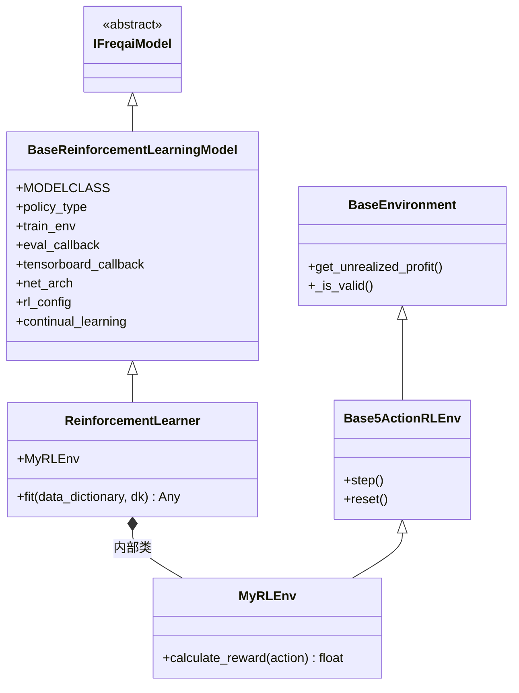

# ReinforcementLearner.py

## 概述

FreqAI 框架中的**强化学习（Reinforcement Learning）**预测模型。该类继承自 `BaseReinforcementLearningModel`，实现了基于 Stable Baselines3 的强化学习训练流程。核心特性包括：自定义奖励函数（`calculate_reward`）、支持持续学习（continual learning）、TensorBoard 日志、进度条回调，以及最佳模型自动保存与加载。用户可以通过继承该类并重写 `MyRLEnv` 内部类来自定义交易环境。

## 架构图

## 核心类/函数

### ReinforcementLearner

继承自 `BaseReinforcementLearningModel`，是 FreqAI 中强化学习模型的默认实现。

#### fit(data_dictionary, dk, **kwargs) -> Any

训练强化学习 agent 的核心方法。

**参数：**
- `data_dictionary: dict[str, Any]` — 包含训练/测试特征、标签、权重的字典
- `dk: FreqaiDataKitchen` — 当前交易对的数据处理对象

**返回值：** 训练好的 Stable Baselines3 模型对象

**关键逻辑：**
1. 计算总训练步数：`train_cycles * len(train_df)`
2. 配置策略网络参数：使用 ReLU 激活函数和自定义网络架构 `self.net_arch`
3. 配置 TensorBoard 日志路径（若 `activate_tensorboard` 为 True）
4. **模型创建/持续学习**：
   - 若当前交易对无已有模型或未启用持续学习，使用 `self.MODELCLASS` 创建新模型
   - 否则从 `self.dd.model_dictionary` 加载已有模型并设置新环境
5. 配置回调函数列表：`eval_callback`、`tensorboard_callback`，以及可选的 `ProgressBarCallback`
6. 调用 `model.learn()` 执行训练（在 try/finally 中确保进度条正确关闭）
7. 训练完成后检查是否存在 `best_model.zip`（由 eval_callback 保存），若存在则加载最佳模型返回；否则返回最终模型

### MyRLEnv（内部类）

继承自 `Base5ActionRLEnv`，定义自定义交易环境，核心是 `calculate_reward()` 方法。

#### calculate_reward(action: int) -> float

根据 agent 的动作计算奖励值。这是用户最可能需要自定义的函数。

**参数：**
- `action: int` — agent 在当前 K 线做出的动作

**返回值：** 给予 agent 的奖励值（float）

**奖励逻辑：**
1. **非法动作**：返回 `-2`，并记录到 TensorBoard
2. **开仓奖励**：
   - 从中性位置进入多头或空头：返回 `25`（鼓励交易）
   - 中性位置保持中性：返回 `-1`（惩罚不交易）
3. **持仓时间因子**：
   - 持仓时间 <= `max_trade_duration_candles`：factor 乘以 1.5
   - 持仓时间 > `max_trade_duration_candles`：factor 乘以 0.5
4. **持仓不动惩罚**：返回 `-1 * trade_duration / max_trade_duration`
5. **平仓奖励**：
   - 平多仓/空仓时，若盈利超过目标（`profit_aim * rr`），factor 额外乘以 `win_reward_factor`
   - 返回 `pnl * factor`

> **警告**：此奖励函数仅为功能展示用途，旨在展示尽可能多的环境控制特性。它不适合直接用于实盘交易。

## 依赖关系

### 内部依赖（本项目模块）
- `freqtrade.freqai.RL.BaseReinforcementLearningModel` — 强化学习模型基类，提供环境设置、训练流程等
- `freqtrade.freqai.RL.Base5ActionRLEnv` — 5 动作交易环境基类（Long_enter, Long_exit, Short_enter, Short_exit, Neutral）
- `freqtrade.freqai.RL.BaseEnvironment` — 环境基类，定义基础交易逻辑
- `freqtrade.freqai.data_kitchen.FreqaiDataKitchen` — 数据处理工具类

### 外部依赖（第三方库）
- `torch` — PyTorch（用于 ReLU 激活函数配置）
- `stable_baselines3.common.callbacks.ProgressBarCallback` — 训练进度条
- `logging` — 日志记录
- `pathlib.Path` — 路径操作

### 被依赖（谁引用了本文件）
- `freqtrade.freqai.prediction_models.ReinforcementLearner_multiproc` — 多进程版本继承自本类
- `tests.freqai.test_models.ReinforcementLearner_test_3ac` — 3 动作 RL 测试模型
- `tests.freqai.test_models.ReinforcementLearner_test_4ac` — 4 动作 RL 测试模型
- 通过 `freqtrade.resolvers.freqaimodel_resolver` 动态加载
