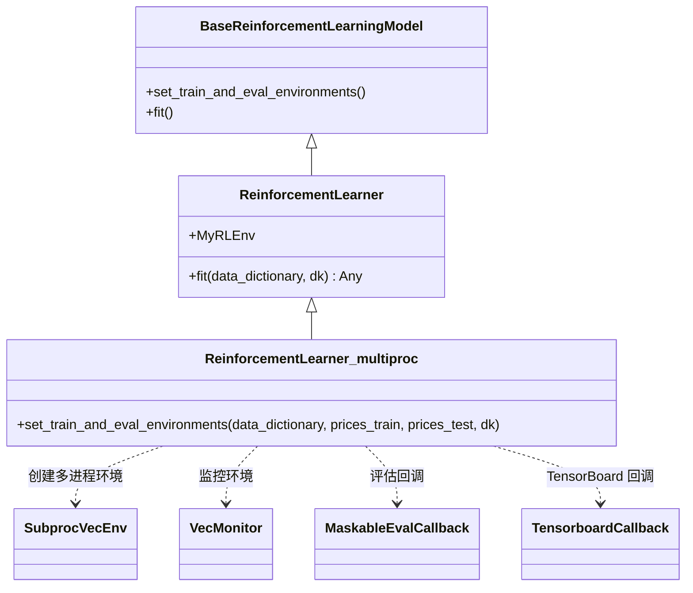

# ReinforcementLearner_multiproc.py

## 概述

`ReinforcementLearner` 的**多进程（multi-process）**版本，展示了如何使用向量化环境（Vectorized Environments）加速强化学习训练。该类继承自 `ReinforcementLearner`，仅重写了 `set_train_and_eval_environments()` 方法，使用 `SubprocVecEnv` 创建多个并行子进程环境。训练逻辑（`fit()` 方法）仍然复用父类实现。

## 架构图

## 核心类/函数

### ReinforcementLearner_multiproc

继承自 `ReinforcementLearner`，通过多进程并行化环境来加速训练。

#### set_train_and_eval_environments(data_dictionary, prices_train, prices_test, dk)

设置多进程训练和评估环境。

**参数：**
- `data_dictionary: dict[str, Any]` — 包含训练/测试特征和标签的字典
- `prices_train: DataFrame` — 训练期间的价格数据
- `prices_test: DataFrame` — 测试期间的价格数据
- `dk: FreqaiDataKitchen` — 当前交易对的数据处理对象

**关键逻辑：**
1. **关闭旧环境**：若 `train_env` 或 `eval_env` 已存在，先调用 `close()` 释放资源
2. **打包环境配置**：调用 `self.pack_env_dict(dk.pair)` 获取环境参数字典
3. **计算评估频率**：`eval_freq = len(train_df) // self.max_threads`
4. **创建训练环境**：
   - 使用 `SubprocVecEnv` 创建 `self.max_threads` 个并行子进程
   - 每个子进程通过 `make_env()` 工厂函数创建 `MyRLEnv` 实例
   - 用 `VecMonitor` 包装以监控训练指标
5. **创建评估环境**：同样使用多进程方式，但使用测试数据
6. **配置评估回调**：
   - 使用 `MaskableEvalCallback`（支持 action masking）
   - 设置确定性评估（`deterministic=True`）
   - 指定最佳模型保存路径
   - 根据模型类型判断是否启用 masking
7. **配置 TensorBoard 回调**：
   - 从训练环境获取动作空间
   - 创建 `TensorboardCallback`

> **警告**：TensorBoard 回调不推荐在多环境设置中使用，因为它会返回不准确的信息，且与 SB3 不具备线程安全性。

## 依赖关系

### 内部依赖（本项目模块）
- `freqtrade.freqai.prediction_models.ReinforcementLearner` — 父类，提供 `fit()` 和 `MyRLEnv`
- `freqtrade.freqai.RL.BaseReinforcementLearningModel.make_env` — 环境工厂函数
- `freqtrade.freqai.data_kitchen.FreqaiDataKitchen` — 数据处理工具类
- `freqtrade.freqai.tensorboard.TensorboardCallback` — TensorBoard 回调实现

### 外部依赖（第三方库）
- `stable_baselines3.common.vec_env.SubprocVecEnv` — 多子进程向量化环境
- `stable_baselines3.common.vec_env.VecMonitor` — 向量化环境监控器
- `sb3_contrib.common.maskable.callbacks.MaskableEvalCallback` — 支持 masking 的评估回调
- `sb3_contrib.common.maskable.utils.is_masking_supported` — masking 支持检查工具
- `pandas.DataFrame` — 数据处理
- `logging` — 日志记录

### 被依赖（谁引用了本文件）
- 通过 `freqtrade.resolvers.freqaimodel_resolver` 动态加载 — 用户在配置文件中指定 `"freqaimodel": "ReinforcementLearner_multiproc"` 时使用
