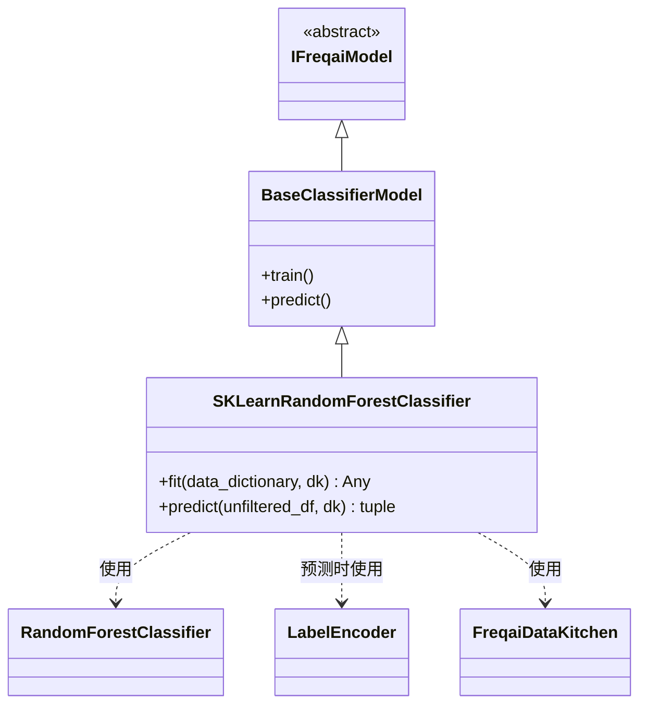

# SKLearnRandomForestClassifier.py

## 概述

基于 scikit-learn 的 `RandomForestClassifier` 实现的分类预测模型。该类继承自 `BaseClassifierModel`，与基于 LightGBM/XGBoost 的分类器不同，它重写了 `fit()` 和 `predict()` 两个方法。该模型**不支持增量学习**（会输出警告），并且在预测阶段使用 `LabelEncoder` 将整数预测结果反映射为原始标签字符串。

## 架构图

## 核心类/函数

### SKLearnRandomForestClassifier

继承自 `BaseClassifierModel`，使用 scikit-learn 的随机森林进行分类。

#### fit(data_dictionary, dk, **kwargs) -> Any

训练随机森林分类模型。

**参数：**
- `data_dictionary: dict` — 包含训练/测试数据的字典
- `dk: FreqaiDataKitchen` — 数据处理对象

**返回值：** 训练好的 `RandomForestClassifier` 模型对象

**关键逻辑：**
1. 将训练特征和标签转换为 numpy 数组（取第一列标签）
2. 根据 `test_size` 配置准备评估集
3. 检查是否启用了 `continual_learning`，若是则输出警告（不支持）
4. 使用 `self.model_training_parameters` 配置实例化 `RandomForestClassifier`
5. 调用 `model.fit()` 训练，传入样本权重
6. 若有评估集，使用 `model.score()` 打印测试集得分

**与其他分类器的区别：**
- 不支持增量学习（`continual_learning`）
- 不支持 `eval_set` 回调式验证（仅在训练后计算得分）
- 不调用 `get_init_model()`

#### predict(unfiltered_df, dk, **kwargs) -> tuple[DataFrame, NDArray]

预测并将数字标签反映射为原始标签名称。

**参数：**
- `unfiltered_df: DataFrame` — 当前回测周期的完整数据
- `dk: FreqaiDataKitchen` — 数据处理对象

**返回值：** `(pred_df, do_predict)` 元组

**关键逻辑：**
1. 调用父类 `super().predict()` 获取原始预测结果
2. 使用 `LabelEncoder` 对 `dk.data["labels_std"]` 中的标签名进行编码/解码
3. 调用 `le.inverse_transform()` 将整数预测值还原为标签字符串
4. 重命名 DataFrame 列名从编码后的整数映射回原始标签名

## 依赖关系

### 内部依赖（本项目模块）
- `freqtrade.freqai.base_models.BaseClassifierModel` — 分类模型基类
- `freqtrade.freqai.data_kitchen.FreqaiDataKitchen` — 数据处理工具类

### 外部依赖（第三方库）
- `sklearn.ensemble.RandomForestClassifier` — scikit-learn 随机森林分类器
- `sklearn.preprocessing.LabelEncoder` — 标签编码器
- `numpy` — 数值计算
- `pandas.DataFrame` — 数据处理
- `logging` — 日志记录

### 被依赖（谁引用了本文件）
- 通过 `freqtrade.resolvers.freqaimodel_resolver` 动态加载 — 用户在配置文件中指定 `"freqaimodel": "SKLearnRandomForestClassifier"` 时使用
