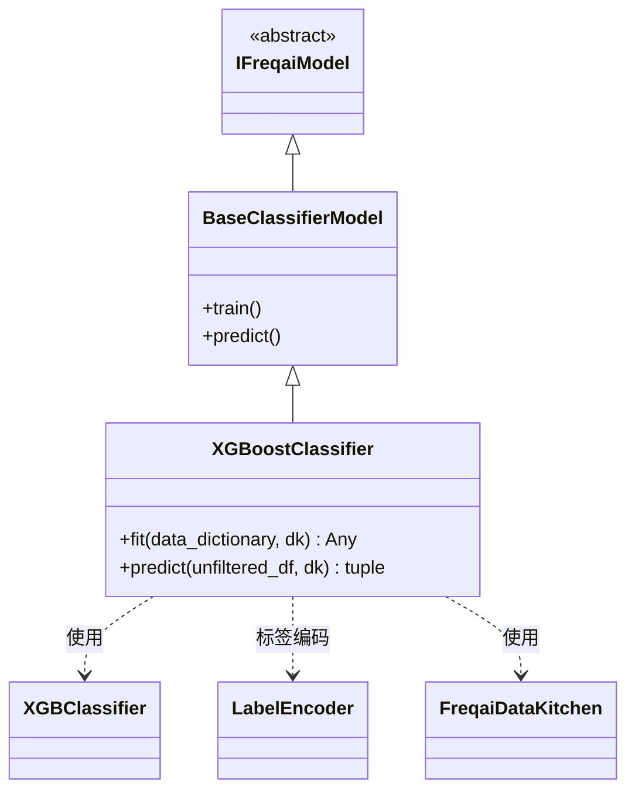

# XGBoostClassifier.py

## 概述

基于 XGBoost 实现的**分类**预测模型。该类继承自 `BaseClassifierModel`，使用 `XGBClassifier` 进行分类任务。与 LightGBM 版本相比，XGBoost 分类器额外处理了**非整数标签的编码**问题（使用 `LabelEncoder` 将字符串标签转为整数），并在预测阶段执行反向映射。支持增量学习（通过 `xgb_model` 参数）。

## 架构图

## 核心类/函数

### XGBoostClassifier

继承自 `BaseClassifierModel`，实现基于 XGBoost 的分类任务。

#### fit(data_dictionary, dk, **kwargs) -> Any

训练 XGBoost 分类模型。

**参数：**
- `data_dictionary: dict` — 包含训练/测试数据的字典
- `dk: FreqaiDataKitchen` — 数据处理对象

**返回值：** 训练好的 `XGBClassifier` 模型对象

**关键逻辑：**
1. 将训练特征和标签转换为 numpy 数组（取第一列标签）
2. **标签编码**：使用 `LabelEncoder` 检查标签是否为整数类型：
   - 若非整数（如字符串标签），调用 `le.fit_transform()` 转为 int64
   - 测试标签同样使用 `le.transform()` 转换（保持映射一致）
3. 根据 `test_size` 配置准备评估集
4. 调用 `self.get_init_model(dk.pair)` 获取增量学习的初始模型
5. 使用 `self.model_training_parameters` 配置实例化 `XGBClassifier`
6. 调用 `model.fit()` 训练，通过 `xgb_model` 参数传入初始模型

#### predict(unfiltered_df, dk, **kwargs) -> tuple[DataFrame, NDArray]

预测并将整数标签反映射为原始标签名称。

**参数：**
- `unfiltered_df: DataFrame` — 当前回测周期的完整数据
- `dk: FreqaiDataKitchen` — 数据处理对象

**返回值：** `(pred_df, do_predict)` 元组

**关键逻辑：**
1. 调用父类 `super().predict()` 获取原始预测结果
2. 使用 `LabelEncoder` 对 `dk.data["labels_std"]` 中的标签名进行编码/解码
3. 调用 `le.inverse_transform()` 将整数预测值还原为标签字符串
4. 重命名 DataFrame 列名

## 依赖关系

### 内部依赖（本项目模块）
- `freqtrade.freqai.base_models.BaseClassifierModel` — 分类模型基类
- `freqtrade.freqai.data_kitchen.FreqaiDataKitchen` — 数据处理工具类

### 外部依赖（第三方库）
- `xgboost.XGBClassifier` — XGBoost 分类器实现
- `sklearn.preprocessing.LabelEncoder` — 标签编码器
- `pandas` — 数据处理（DataFrame、`is_integer_dtype`）
- `numpy` — 数值计算
- `logging` — 日志记录

### 被依赖（谁引用了本文件）
- 通过 `freqtrade.resolvers.freqaimodel_resolver` 动态加载 — 用户在配置文件中指定 `"freqaimodel": "XGBoostClassifier"` 时使用
