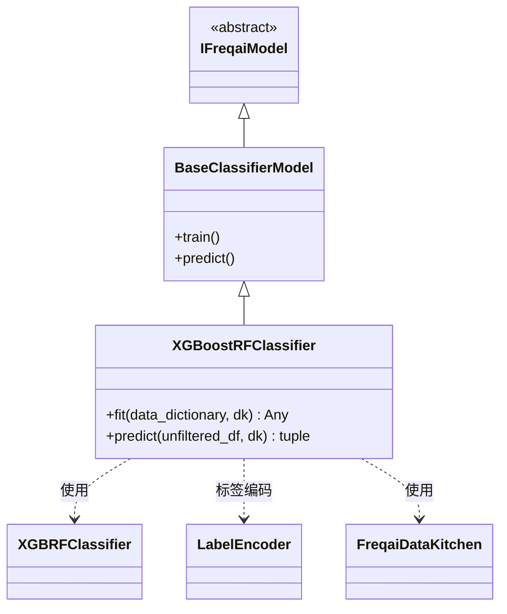

# XGBoostRFClassifier.py

## 概述

基于 XGBoost 的 **Random Forest 分类**预测模型。该类继承自 `BaseClassifierModel`，使用 `XGBRFClassifier`（XGBoost 的随机森林实现）进行分类任务。代码结构与 `XGBoostClassifier` 几乎完全相同，唯一的区别是底层估计器从 `XGBClassifier` 变为 `XGBRFClassifier`。同样支持标签编码和增量学习。

## 架构图

## 核心类/函数

### XGBoostRFClassifier

继承自 `BaseClassifierModel`，使用 XGBoost 的随机森林变体进行分类。

#### fit(data_dictionary, dk, **kwargs) -> Any

训练 XGBoost Random Forest 分类模型。

**参数：**
- `data_dictionary: dict` — 包含训练/测试数据的字典
- `dk: FreqaiDataKitchen` — 数据处理对象

**返回值：** 训练好的 `XGBRFClassifier` 模型对象

**关键逻辑：**
1. 将训练特征和标签转换为 numpy 数组
2. **标签编码**：使用 `LabelEncoder` 将非整数标签转为 int64
3. 根据 `test_size` 配置准备评估集，测试标签同样进行编码
4. 调用 `self.get_init_model(dk.pair)` 获取增量学习的初始模型
5. 使用 `self.model_training_parameters` 实例化 `XGBRFClassifier`
6. 调用 `model.fit()` 训练

#### predict(unfiltered_df, dk, **kwargs) -> tuple[DataFrame, NDArray]

预测并将整数标签反映射为原始标签名称。逻辑与 `XGBoostClassifier.predict()` 完全一致。

**关键逻辑：**
1. 调用父类 `super().predict()` 获取原始预测
2. 使用 `LabelEncoder` 反向映射标签
3. 重命名 DataFrame 列名

## 依赖关系

### 内部依赖（本项目模块）
- `freqtrade.freqai.base_models.BaseClassifierModel` — 分类模型基类
- `freqtrade.freqai.data_kitchen.FreqaiDataKitchen` — 数据处理工具类

### 外部依赖（第三方库）
- `xgboost.XGBRFClassifier` — XGBoost 随机森林分类器实现
- `sklearn.preprocessing.LabelEncoder` — 标签编码器
- `pandas` — 数据处理（DataFrame、`is_integer_dtype`）
- `numpy` — 数值计算
- `logging` — 日志记录

### 被依赖（谁引用了本文件）
- 通过 `freqtrade.resolvers.freqaimodel_resolver` 动态加载 — 用户在配置文件中指定 `"freqaimodel": "XGBoostRFClassifier"` 时使用
