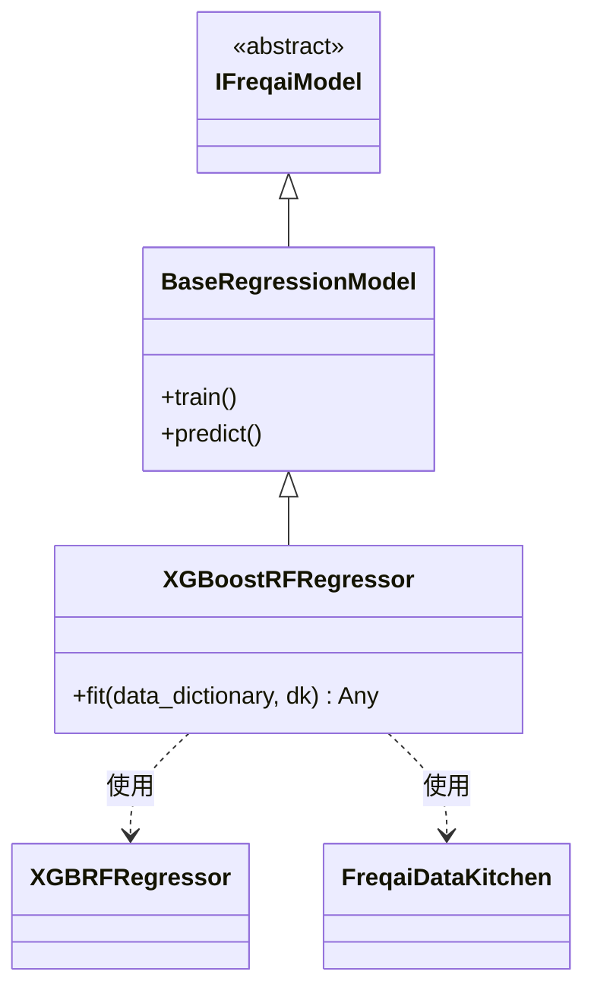

# XGBoostRFRegressor.py

## 概述

基于 XGBoost 的 **Random Forest 回归**预测模型。该类继承自 `BaseRegressionModel`，使用 `XGBRFRegressor`（XGBoost 的随机森林回归实现）进行回归任务。与标准的 `XGBoostRegressor` 不同，随机森林变体**不支持 callbacks**（包括 `early_stopping_rounds`），因此代码中注释掉了 TBCallback 相关逻辑。支持增量学习。

## 架构图

## 核心类/函数

### XGBoostRFRegressor

继承自 `BaseRegressionModel`，使用 XGBoost 的随机森林变体进行回归。

#### fit(data_dictionary, dk, **kwargs) -> Any

训练 XGBoost Random Forest 回归模型。

**参数：**
- `data_dictionary: dict` — 包含训练/测试数据的字典
- `dk: FreqaiDataKitchen` — 数据处理对象

**返回值：** 训练好的 `XGBRFRegressor` 模型对象

**关键逻辑：**
1. 直接使用 DataFrame 形式的训练特征和标签（不转为 numpy 数组）
2. 根据 `test_size` 配置准备评估集和评估权重
3. 调用 `self.get_init_model(dk.pair)` 获取增量学习的初始模型
4. 使用 `self.model_training_parameters` 实例化 `XGBRFRegressor`
5. 调用 `model.fit()` 训练，传入 `sample_weight_eval_set` 和 `xgb_model`

**与 XGBoostRegressor 的区别：**
- 使用 `XGBRFRegressor` 代替 `XGBRegressor`
- **不使用 TBCallback**：XGBRFRegressor 从 xgboost 2.1.x 版本开始不支持 `early_stopping_rounds` 和 `callbacks`，调用会抛出 `NotImplementedError`
- 评估集仅包含测试集 `[(test_features, test_labels)]`，不包含训练集本身（XGBoostRegressor 评估集包含训练和测试数据）
- 不需要在训练后清空 callbacks

## 依赖关系

### 内部依赖（本项目模块）
- `freqtrade.freqai.base_models.BaseRegressionModel` — 回归模型基类
- `freqtrade.freqai.data_kitchen.FreqaiDataKitchen` — 数据处理工具类

### 外部依赖（第三方库）
- `xgboost.XGBRFRegressor` — XGBoost 随机森林回归器实现
- `logging` — 日志记录

### 被依赖（谁引用了本文件）
- 通过 `freqtrade.resolvers.freqaimodel_resolver` 动态加载 — 用户在配置文件中指定 `"freqaimodel": "XGBoostRFRegressor"` 时使用
