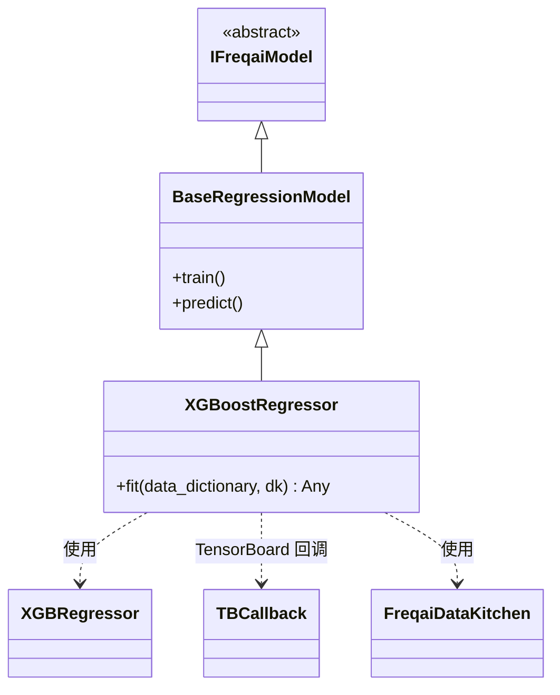

# XGBoostRegressor.py

## 概述

基于 XGBoost 实现的**回归**预测模型。该类继承自 `BaseRegressionModel`，使用 `XGBRegressor` 进行回归任务。该模型集成了 **TensorBoard 回调**（通过 `TBCallback`）用于训练过程监控，支持增量学习，评估集同时包含测试数据和训练数据以便对比分析。这是 FreqAI 中最基础且被频繁参考的回归模型实现之一。

## 架构图

## 核心类/函数

### XGBoostRegressor

继承自 `BaseRegressionModel`，是 FreqAI 中使用 XGBoost 进行回归的标准实现。

#### fit(data_dictionary, dk, **kwargs) -> Any

训练 XGBoost 回归模型。

**参数：**
- `data_dictionary: dict` — 包含训练/测试数据的字典
- `dk: FreqaiDataKitchen` — 数据处理对象

**返回值：** 训练好的 `XGBRegressor` 模型对象

**关键逻辑：**
1. 直接使用 DataFrame 形式的训练特征和标签
2. 根据 `test_size` 配置准备评估集：
   - 若 `test_size != 0`，`eval_set` 包含**两组数据**：`[(test_features, test_labels), (X, y)]`，即测试集和训练集都作为评估集
   - `eval_weights` 同样包含两组权重
3. 调用 `self.get_init_model(dk.pair)` 获取增量学习的初始模型
4. 使用 `self.model_training_parameters` 实例化 `XGBRegressor`
5. **设置 TBCallback**：`model.set_params(callbacks=[TBCallback(dk.data_path)])` 用于 TensorBoard 日志
6. 调用 `model.fit()` 训练，传入 `sample_weight_eval_set` 和 `xgb_model`
7. **清空 callbacks**：训练完成后调用 `model.set_params(callbacks=[])` 以便模型可以正常序列化保存到磁盘

**评估集设计说明：**
- 同时包含测试集和训练集作为评估集，使用户可以在 TensorBoard 中对比训练损失和测试损失，判断是否过拟合

## 依赖关系

### 内部依赖（本项目模块）
- `freqtrade.freqai.base_models.BaseRegressionModel` — 回归模型基类
- `freqtrade.freqai.data_kitchen.FreqaiDataKitchen` — 数据处理工具类
- `freqtrade.freqai.tensorboard.TBCallback` — XGBoost 专用的 TensorBoard 回调

### 外部依赖（第三方库）
- `xgboost.XGBRegressor` — XGBoost 回归器实现
- `logging` — 日志记录

### 被依赖（谁引用了本文件）
- `freqtrade.freqai.base_models.BaseRegressionModel` — 文档中引用为示例实现
- `freqtrade.freqai.freqai_interface` — 注释中引用为示例
- 通过 `freqtrade.resolvers.freqaimodel_resolver` 动态加载 — 用户在配置文件中指定 `"freqaimodel": "XGBoostRegressor"` 时使用
