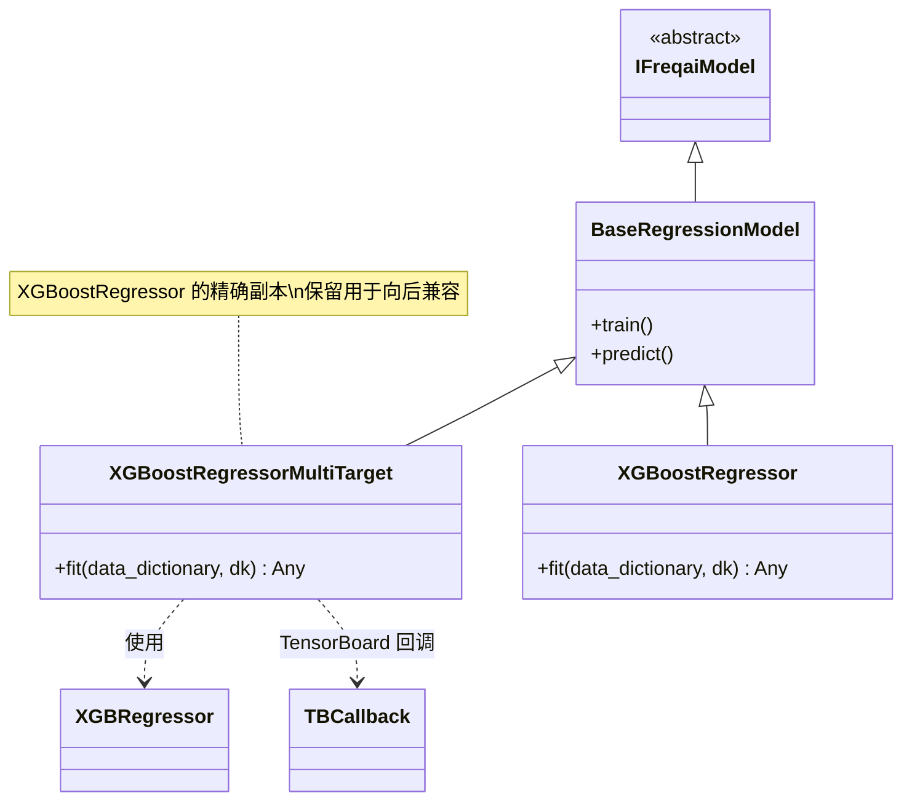

# XGBoostRegressorMultiTarget.py

## 概述

基于 XGBoost 实现的**多目标回归**预测模型。该类继承自 `BaseRegressionModel`，是 `XGBoostRegressor` 的精确副本（exact copy），保留为独立文件仅为了**向后兼容**。与 LightGBM 的多目标版本不同，该类并未使用 `FreqaiMultiOutputRegressor` 包装器，而是直接利用 XGBoost 原生的多输出支持（XGBRegressor 本身支持多列标签输入）。

## 架构图

## 核心类/函数

### XGBoostRegressorMultiTarget

继承自 `BaseRegressionModel`，代码与 `XGBoostRegressor` 完全一致。

#### fit(data_dictionary, dk, **kwargs) -> Any

训练 XGBoost 回归模型（与 XGBoostRegressor.fit() 完全相同）。

**参数：**
- `data_dictionary: dict` — 包含训练/测试数据的字典
- `dk: FreqaiDataKitchen` — 数据处理对象

**返回值：** 训练好的 `XGBRegressor` 模型对象

**关键逻辑：**
1. 直接使用 DataFrame 形式的训练特征和标签
2. 根据 `test_size` 配置准备评估集，包含测试集和训练集
3. 调用 `self.get_init_model(dk.pair)` 获取增量学习的初始模型
4. 使用 `self.model_training_parameters` 实例化 `XGBRegressor`
5. 设置 `TBCallback` 进行 TensorBoard 日志记录
6. 调用 `model.fit()` 训练
7. 训练完成后清空 callbacks 以便序列化

**为何保留为独立文件：**
- 类文档字符串明确说明 "This is an exact copy of XGBoostRegressor kept for compatibility reasons"
- 早期版本中多目标和单目标可能使用不同实现，统一后为保持用户配置不需修改而保留

## 依赖关系

### 内部依赖（本项目模块）
- `freqtrade.freqai.base_models.BaseRegressionModel` — 回归模型基类
- `freqtrade.freqai.data_kitchen.FreqaiDataKitchen` — 数据处理工具类
- `freqtrade.freqai.tensorboard.TBCallback` — XGBoost 专用的 TensorBoard 回调

### 外部依赖（第三方库）
- `xgboost.XGBRegressor` — XGBoost 回归器实现
- `logging` — 日志记录

### 被依赖（谁引用了本文件）
- 通过 `freqtrade.resolvers.freqaimodel_resolver` 动态加载 — 用户在配置文件中指定 `"freqaimodel": "XGBoostRegressorMultiTarget"` 时使用
