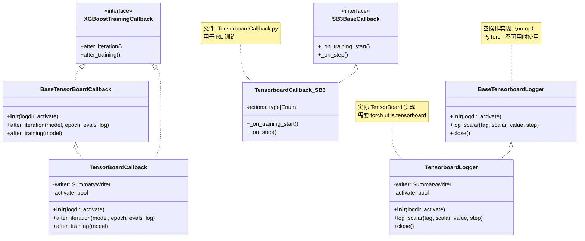
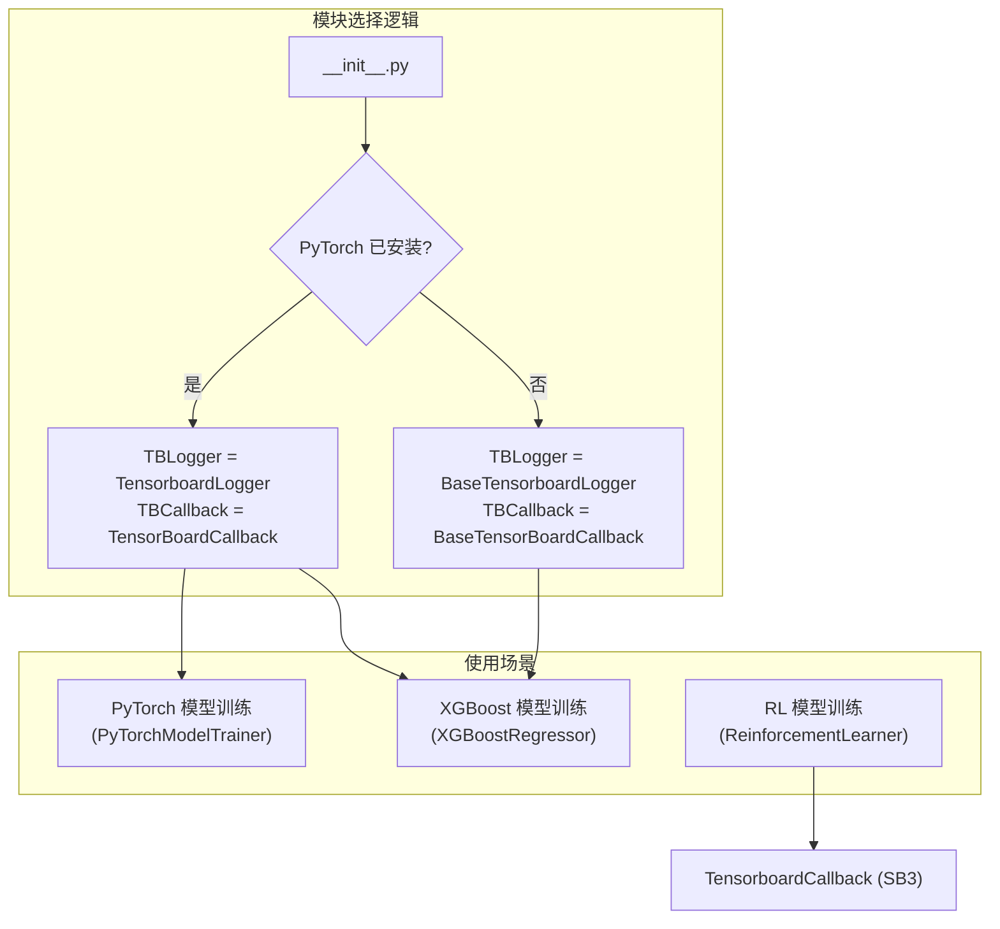
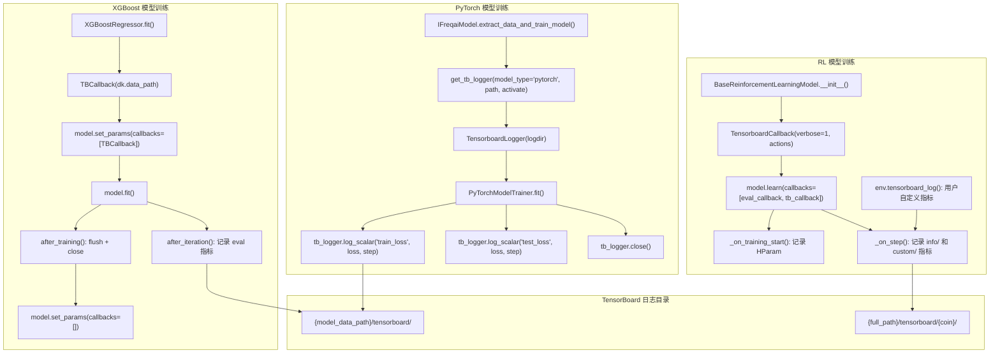

# FreqAI TensorBoard 集成模块 (tensorboard)

## 1. 模块概述

`tensorboard` 目录实现了 FreqAI 与 [TensorBoard](https://www.tensorflow.org/tensorboard) 可视化工具的集成。该模块提供了三个层次的功能：

1. **TensorBoard Logger**：用于在 PyTorch 模型训练过程中记录标量指标（如 train_loss、test_loss）
2. **XGBoost TensorBoard Callback**：用于在 XGBoost 模型训练过程中记录验证集指标
3. **SB3 TensorBoard Callback**：用于在强化学习训练过程中记录环境指标和超参数

### 设计亮点：优雅降级（Graceful Degradation）

该模块采用了优雅降级设计：当 PyTorch（及其 `torch.utils.tensorboard`）未安装时，系统会自动回退到空操作（no-op）的基类实现，确保不依赖 PyTorch 的模型（如 LightGBM、XGBoost）也能正常运行。

这一机制通过 `__init__.py` 中的 try/except 实现：

```python
try:
    from freqtrade.freqai.tensorboard.tensorboard import TensorBoardCallback, TensorboardLogger
    TBLogger = TensorboardLogger
    TBCallback = TensorBoardCallback
except ModuleNotFoundError:
    from freqtrade.freqai.tensorboard.base_tensorboard import (
        BaseTensorBoardCallback, BaseTensorboardLogger,
    )
    TBLogger = BaseTensorboardLogger
    TBCallback = BaseTensorBoardCallback
```

## 2. 目录结构

```
freqtrade/freqai/tensorboard/
|-- __init__.py                  # 模块入口，实现优雅降级逻辑（约 17 行）
|-- base_tensorboard.py          # 空操作基类：BaseTensorboardLogger, BaseTensorBoardCallback（约 31 行）
|-- tensorboard.py               # 实际实现：TensorboardLogger, TensorBoardCallback（约 62 行）
|-- TensorboardCallback.py       # SB3 强化学习 TensorBoard 回调（约 62 行）
```

### 文件功能说明

| 文件 | 功能 |
|------|------|
| `__init__.py` | 导出 `TBLogger` 和 `TBCallback`，实现 PyTorch 可选依赖的优雅降级 |
| `base_tensorboard.py` | 定义空操作基类，所有方法都是 no-op，作为 PyTorch 不可用时的回退 |
| `tensorboard.py` | 基于 `torch.utils.tensorboard.SummaryWriter` 的实际 TensorBoard 实现 |
| `TensorboardCallback.py` | 基于 `stable_baselines3.common.callbacks.BaseCallback` 的 RL 训练回调 |

## 3. 架构图





## 4. 核心类/函数说明

### 4.1 BaseTensorboardLogger (base_tensorboard.py)

空操作日志记录器，作为 TensorBoard 不可用时的回退。

```python
class BaseTensorboardLogger:
    def __init__(self, logdir: Path, activate: bool = True):
        pass  # 不做任何初始化

    def log_scalar(self, tag: str, scalar_value: Any, step: int):
        return  # 空操作

    def close(self):
        return  # 空操作
```

**使用场景**：
- 当用户使用非 PyTorch 模型（如 LightGBM）且未安装 PyTorch 时
- 当 `activate_tensorboard` 配置为 `False` 时（虽然此时实际实现也会跳过记录）

### 4.2 BaseTensorBoardCallback (base_tensorboard.py)

空操作的 XGBoost 训练回调，继承自 `xgboost.callback.TrainingCallback`。

```python
class BaseTensorBoardCallback(TrainingCallback):
    def __init__(self, logdir: Path, activate: bool = True):
        pass

    def after_iteration(self, model, epoch: int, evals_log) -> bool:
        return False  # False 表示不停止训练

    def after_training(self, model):
        return model
```

### 4.3 TensorboardLogger (tensorboard.py)

实际的 TensorBoard 日志记录器，用于 PyTorch 模型训练过程中记录标量指标。

#### 构造函数

```python
def __init__(self, logdir: Path, activate: bool = True):
    self.activate = activate
    if self.activate:
        self.writer = SummaryWriter(f"{str(logdir)}/tensorboard")
```

日志文件保存在 `{model_data_path}/tensorboard/` 目录下。

#### `log_scalar(tag, scalar_value, step)`

记录一个标量值到 TensorBoard。

```python
def log_scalar(self, tag: str, scalar_value: Any, step: int):
    if self.activate:
        self.writer.add_scalar(tag, scalar_value, step)
```

**典型调用**（在 `PyTorchModelTrainer.fit()` 中）：
```python
self.tb_logger.log_scalar("train_loss", loss.item(), batch_counter)
self.tb_logger.log_scalar("test_loss", loss.item(), self.test_batch_counter)
```

#### `close()`

刷新并关闭 SummaryWriter。

```python
def close(self):
    if self.activate:
        self.writer.flush()
        self.writer.close()
```

**调用时机**：在 `IFreqaiModel.extract_data_and_train_model()` 和 `start_backtesting()` 中，每次训练完成后调用。

### 4.4 TensorBoardCallback (tensorboard.py)

XGBoost 训练过程的 TensorBoard 回调，继承自 `BaseTensorBoardCallback`。

#### `after_iteration(model, epoch, evals_log) -> bool`

在 XGBoost 的每个 boosting 迭代后调用。

```python
def after_iteration(self, model, epoch, evals_log):
    if not self.activate or not evals_log:
        return False

    evals = ["validation", "train"]
    for metric, eval_ in zip(evals_log.items(), evals):
        for metric_name, log in metric[1].items():
            score = log[-1][0] if isinstance(log[-1], tuple) else log[-1]
            self.writer.add_scalar(f"{eval_}-{metric_name}", score, epoch)

    return False  # 不停止训练
```

**记录的指标示例**：
- `validation-rmse`
- `train-rmse`
- `validation-logloss`

#### `after_training(model)`

训练完成后刷新并关闭 writer。

**使用方式**（在 `XGBoostRegressor.fit()` 中）：
```python
model.set_params(callbacks=[TBCallback(dk.data_path)])
model.fit(X=X, y=y, ...)
model.set_params(callbacks=[])  # 清空以支持序列化
```

### 4.5 TensorboardCallback (TensorboardCallback.py)

Stable Baselines3 的自定义 TensorBoard 回调，用于 RL 训练。

#### 构造函数

```python
class TensorboardCallback(BaseCallback):
    def __init__(self, verbose=1, actions: type[Enum] = BaseActions):
        super().__init__(verbose)
        self.model = None
        self.actions = actions
```

#### `_on_training_start()`

在训练开始时记录超参数（HParam）：

```python
def _on_training_start(self):
    hparam_dict = {
        "algorithm": self.model.__class__.__name__,
        "learning_rate": self.model.learning_rate,
    }
    metric_dict = {
        "eval/mean_reward": 0,
        "rollout/ep_rew_mean": 0,
        "rollout/ep_len_mean": 0,
        "train/value_loss": 0,
        "train/explained_variance": 0,
    }
    self.logger.record("hparams", HParam(hparam_dict, metric_dict), ...)
```

#### `_on_step() -> bool`

在每个训练 step 后调用，记录：

1. **环境信息指标**（来自 `locals["infos"]`）：
   - `info/tick`
   - `info/action`
   - `info/total_reward`
   - `info/total_profit`
   - `info/position`
   - `info/trade_duration`
   - `info/current_profit_pct`

2. **自定义 TensorBoard 指标**（来自 `env.tensorboard_metrics`）：
   - 由环境中 `tensorboard_log()` 方法记录
   - 按 category 分组，例如 `actions/Long_enter`、`custom/invalid`

```python
def _on_step(self):
    local_info = self.locals["infos"][0]

    # 获取 tensorboard_metrics
    if hasattr(self.training_env, "envs"):
        tensorboard_metrics = self.training_env.envs[0].unwrapped.tensorboard_metrics
    else:
        tensorboard_metrics = self.training_env.get_attr("tensorboard_metrics")[0]

    # 记录环境信息
    for metric in local_info:
        if metric not in ["episode", "terminal_observation"]:
            self.logger.record(f"info/{metric}", local_info[metric])

    # 记录自定义指标
    for category in tensorboard_metrics:
        for metric in tensorboard_metrics[category]:
            self.logger.record(f"{category}/{metric}", tensorboard_metrics[category][metric])

    return True  # 继续训练
```

## 5. 依赖关系

### 内部依赖

```
__init__.py
  |-- tensorboard.py (优先导入)
  |-- base_tensorboard.py (回退导入)

tensorboard.py
  |-- base_tensorboard.py (继承)
  |-- torch.utils.tensorboard.SummaryWriter

TensorboardCallback.py
  |-- stable_baselines3.common.callbacks.BaseCallback
  |-- stable_baselines3.common.logger.HParam
  |-- freqai.RL.BaseEnvironment.BaseActions

使用方:
  IFreqaiModel (utils.get_tb_logger()) --> TBLogger
  XGBoostRegressor/XGBoostRegressorMultiTarget --> TBCallback
  PyTorchModelTrainer --> TBLogger
  BaseReinforcementLearningModel --> TensorboardCallback
  ReinforcementLearner --> TensorboardCallback
```

### 外部依赖

| 库 | 用途 | 必须? |
|----|------|-------|
| `torch.utils.tensorboard` | SummaryWriter | 可选（仅 PyTorch 模型需要） |
| `xgboost.callback` | TrainingCallback 基类 | 是 |
| `stable_baselines3` | BaseCallback, HParam | 仅 RL 模型需要 |

## 6. 数据流



### TensorBoard 启动方式

用户可以通过以下命令查看训练指标：

```bash
tensorboard --logdir user_data/models/{identifier}/
```

### 配置选项

在 `config.json` 中通过 `activate_tensorboard` 控制是否启用：

```json
{
    "freqai": {
        "activate_tensorboard": true
    }
}
```

默认值为 `true`。设为 `false` 时，Logger 和 Callback 仍会被创建但不会写入任何数据。
