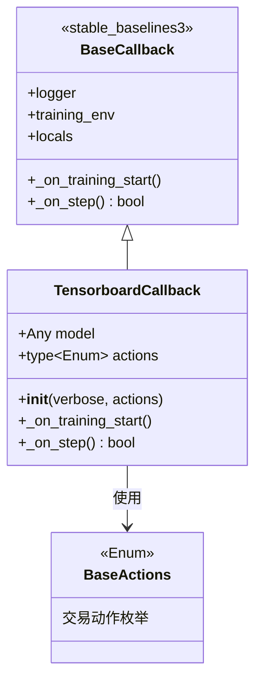

# TensorboardCallback.py

## 概述

`TensorboardCallback` 是一个专为 Stable Baselines3 强化学习框架设计的自定义 TensorBoard 回调类，继承自 `stable_baselines3.common.callbacks.BaseCallback`。

它用于在 RL 训练过程中将额外的自定义指标（如交易环境中的奖励信息、动作分布等）记录到 TensorBoard，并在训练开始时记录超参数信息。

**注意**：此回调与 `tensorboard.py` 中的 `TensorBoardCallback`（针对 XGBoost）不同。本文件中的回调专门用于 Stable Baselines3 的 RL 训练循环。

## 架构图

## 核心类/函数

### TensorboardCallback

#### `__init__(self, verbose=1, actions: type[Enum] = BaseActions)`
初始化回调。

参数：
- `verbose` -- 日志详细程度
- `actions` -- 交易动作枚举类型，默认为 `BaseActions`（来自 FreqAI 的 RL 环境）

#### `_on_training_start(self) -> None`
训练开始时调用。记录超参数和指标到 TensorBoard：

超参数（hparam_dict）：
- `algorithm` -- 模型类名（如 "PPO"、"A2C"）
- `learning_rate` -- 学习率

指标（metric_dict）：
- `eval/mean_reward` -- 评估平均奖励
- `rollout/ep_rew_mean` -- 回合平均奖励
- `rollout/ep_len_mean` -- 回合平均长度
- `train/value_loss` -- 价值函数损失
- `train/explained_variance` -- 解释方差

使用 `HParam` 对象记录，排除 stdout/log/json/csv 输出。

#### `_on_step(self) -> bool`
每个训练步骤调用。

流程：
1. 从 `self.locals["infos"][0]` 获取当前步骤的信息字典
2. 从训练环境获取 `tensorboard_metrics`：
   - 单进程模式：通过 `envs[0].unwrapped.tensorboard_metrics`
   - 多进程模式：通过 `get_attr("tensorboard_metrics")[0]`
3. 记录 info 中的所有指标（排除 "episode" 和 "terminal_observation"）到 `info/` 前缀
4. 记录 tensorboard_metrics 中的所有分类指标到对应的 `{category}/` 前缀

返回值：始终返回 `True`（继续训练）

## 依赖关系

### 内部依赖（本项目模块）
- `freqtrade.freqai.RL.BaseEnvironment.BaseActions` -- 默认交易动作枚举

### 外部依赖（第三方库）
- `stable_baselines3.common.callbacks.BaseCallback` -- SB3 回调基类
- `stable_baselines3.common.logger.HParam` -- 超参数记录工具
- `enum.Enum` -- 枚举类型

### 被依赖（谁引用了本文件）
- `freqtrade.freqai.RL.BaseReinforcementLearningModel` -- RL 训练中使用此回调
- `freqtrade.freqai.prediction_models.ReinforcementLearner` -- RL 预测模型
- `freqtrade.freqai.prediction_models.ReinforcementLearner_multiproc` -- 多进程 RL 预测模型
