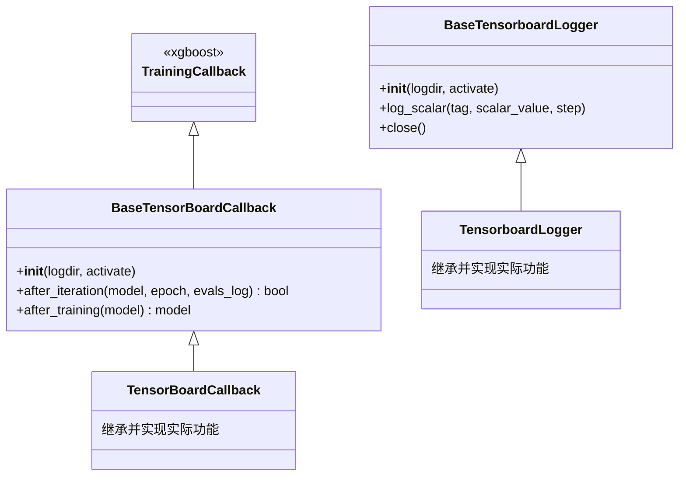

# base_tensorboard.py

## 概述

`base_tensorboard.py` 提供了 TensorBoard 日志记录和回调的**无操作基类实现**（No-Op Base Classes）。当用户未安装 PyTorch/TensorBoard 依赖时，这些类作为占位符使用，确保系统能正常运行而不会抛出异常。

包含两个类：
- `BaseTensorboardLogger` -- 空的日志记录器，所有方法都是空操作
- `BaseTensorBoardCallback` -- 空的 XGBoost 训练回调，继承自 xgboost 的 `TrainingCallback`

## 架构图

## 核心类/函数

### BaseTensorboardLogger

空操作的 TensorBoard 日志记录器。

#### `__init__(self, logdir: Path, activate: bool = True)`
初始化方法为空操作，不创建任何 SummaryWriter。

#### `log_scalar(self, tag: str, scalar_value: Any, step: int)`
空操作方法。在完整实现中会将标量值写入 TensorBoard。

#### `close(self)`
空操作方法。在完整实现中会刷新并关闭 SummaryWriter。

### BaseTensorBoardCallback

空操作的 XGBoost 训练回调，继承自 `xgboost.callback.TrainingCallback`。

#### `__init__(self, logdir: Path, activate: bool = True)`
初始化方法为空操作。

#### `after_iteration(self, model, epoch: int, evals_log) -> bool`
每次训练迭代后的回调。返回 `False` 表示不中断训练。

#### `after_training(self, model)`
训练完成后的回调。直接返回原始模型，不做任何处理。

## 依赖关系

### 内部依赖（本项目模块）
- 无

### 外部依赖（第三方库）
- `xgboost.callback.TrainingCallback` -- XGBoost 回调基类
- `pathlib.Path` -- 路径类型

### 被依赖（谁引用了本文件）
- `freqtrade.freqai.tensorboard.__init__` -- 在 torch 不可用时作为降级实现
- `freqtrade.freqai.tensorboard.tensorboard` -- TensorboardLogger 和 TensorBoardCallback 继承自这些基类
- `freqtrade.freqai.utils` -- `get_tb_logger()` 在非 pytorch 模式下直接使用 BaseTensorboardLogger
