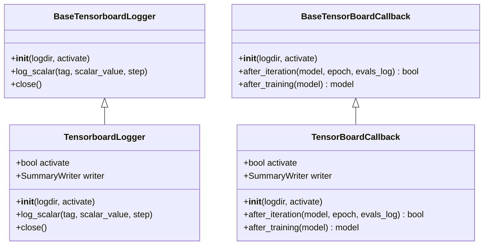

# tensorboard.py

## 概述

`tensorboard.py` 提供了 TensorBoard 日志记录和 XGBoost 训练回调的**完整实现**。这些类继承自 `base_tensorboard.py` 中的基类，使用 PyTorch 的 `SummaryWriter` 将训练指标写入 TensorBoard。

包含两个类：
- `TensorboardLogger` -- 通用的标量日志记录器，用于 PyTorch 模型训练过程中记录自定义指标
- `TensorBoardCallback` -- XGBoost 训练回调，自动将每次迭代的验证/训练指标写入 TensorBoard

## 架构图

## 核心类/函数

### TensorboardLogger

继承自 `BaseTensorboardLogger`，提供实际的 TensorBoard 日志写入功能。

#### `__init__(self, logdir: Path, activate: bool = True)`
初始化 TensorBoard 日志记录器。如果 `activate` 为 True，创建 `SummaryWriter`，日志目录为 `{logdir}/tensorboard`。

#### `log_scalar(self, tag: str, scalar_value: Any, step: int)`
将标量值写入 TensorBoard。仅在 `activate` 为 True 时执行写入。

参数：
- `tag` -- 指标名称（如 "loss"、"accuracy"）
- `scalar_value` -- 标量值
- `step` -- 步骤编号（通常是 epoch 或 iteration）

#### `close(self)`
刷新（flush）并关闭 SummaryWriter。仅在 `activate` 为 True 时执行。

### TensorBoardCallback

继承自 `BaseTensorBoardCallback`，提供 XGBoost 训练过程中自动记录指标到 TensorBoard 的功能。

#### `__init__(self, logdir: Path, activate: bool = True)`
初始化回调。如果 `activate` 为 True，创建 `SummaryWriter`。

#### `after_iteration(self, model, epoch: int, evals_log) -> bool`
每次 XGBoost 训练迭代后自动调用。

流程：
1. 如果未激活或无日志数据，返回 False
2. 遍历评估日志，将 "validation" 和 "train" 的指标（如 rmse、logloss 等）写入 TensorBoard
3. 处理 tuple 格式（如 early stopping 返回的格式）和简单数值格式

返回值：始终返回 `False`（不中断训练）

#### `after_training(self, model)`
训练完成后调用。刷新并关闭 SummaryWriter，然后返回模型。

## 依赖关系

### 内部依赖（本项目模块）
- `freqtrade.freqai.tensorboard.base_tensorboard.BaseTensorboardLogger` -- Logger 基类
- `freqtrade.freqai.tensorboard.base_tensorboard.BaseTensorBoardCallback` -- Callback 基类

### 外部依赖（第三方库）
- `torch.utils.tensorboard.SummaryWriter` -- PyTorch TensorBoard 写入器
- `xgboost.callback` -- XGBoost 回调系统

### 被依赖（谁引用了本文件）
- `freqtrade.freqai.tensorboard.__init__` -- 作为 TBLogger/TBCallback 的完整实现导出
