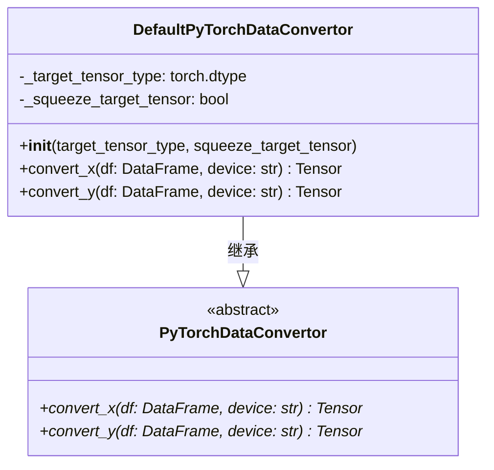

# PyTorchDataConvertor.py

## 概述

`PyTorchDataConvertor.py` 定义了 pandas DataFrame 到 PyTorch Tensor 的数据转换接口和默认实现。它是 FreqAI PyTorch 模块中数据流转的关键组件，负责将 FreqAI 的特征/标签数据从 DataFrame 格式转换为模型可直接消费的 Tensor 格式。

该文件包含：
- `PyTorchDataConvertor`：抽象基类，定义转换接口
- `DefaultPyTorchDataConvertor`：默认实现，支持自定义目标张量类型和维度压缩

## 架构图



## 核心类/函数

### PyTorchDataConvertor (ABC)

抽象基类，定义了两个抽象方法：

#### `convert_x(df: pd.DataFrame, device: str) -> torch.Tensor`
将特征 DataFrame 转换为 Tensor。
- **参数**：
  - `df` — `*_features` DataFrame（如 `train_features`、`test_features`）
  - `device` — 训练设备（如 `'cpu'`、`'cuda'`）

#### `convert_y(df: pd.DataFrame, device: str) -> torch.Tensor`
将标签 DataFrame 转换为 Tensor。
- **参数**：
  - `df` — `*_labels` DataFrame
  - `device` — 训练设备

### DefaultPyTorchDataConvertor

默认的数据转换实现，保持 DataFrame 的原始形状。

#### `__init__(target_tensor_type, squeeze_target_tensor)`
- **参数**：
  - `target_tensor_type: torch.dtype = torch.float32` — 目标张量的数据类型。分类任务应使用 `torch.long`，回归任务使用 `torch.float` 或 `torch.double`
  - `squeeze_target_tensor: bool = False` — 是否压缩目标张量维度。某些损失函数（如 `CrossEntropyLoss`）要求目标为 0D 或 1D 张量

#### `convert_x(df, device) -> Tensor`
将特征 DataFrame 转换为 `torch.float32` 类型的 Tensor：
```python
numpy_arrays = df.values
x = torch.tensor(numpy_arrays, device=device, dtype=torch.float32)
```

#### `convert_y(df, device) -> Tensor`
将标签 DataFrame 转换为指定类型的 Tensor，如果 `squeeze_target_tensor=True` 则压缩维度：
```python
y = torch.tensor(numpy_arrays, device=device, dtype=self._target_tensor_type)
if self._squeeze_target_tensor:
    y = y.squeeze()
```

## 依赖关系

### 内部依赖（本项目模块）
- 无

### 外部依赖（第三方库）
- `pandas` — 输入数据格式
- `torch` — PyTorch 核心库，提供 Tensor 类型和数据类型定义

### 被依赖（谁引用了本文件）
- `freqtrade.freqai.torch.PyTorchModelTrainer` — 在训练器中使用 `PyTorchDataConvertor` 将数据转换为 DataLoader
- `freqtrade.freqai.prediction_models.PyTorchMLPClassifier` — 创建 `DefaultPyTorchDataConvertor` 实例（`target_tensor_type=torch.long`, `squeeze_target_tensor=True`）
- `freqtrade.freqai.prediction_models.PyTorchMLPRegressor` — 创建 `DefaultPyTorchDataConvertor` 实例（默认参数）
- `freqtrade.freqai.prediction_models.PyTorchTransformerRegressor` — 创建 `DefaultPyTorchDataConvertor` 实例
- `freqtrade.freqai.base_models.BasePyTorchModel` — 类型注解中引用 `PyTorchDataConvertor`
