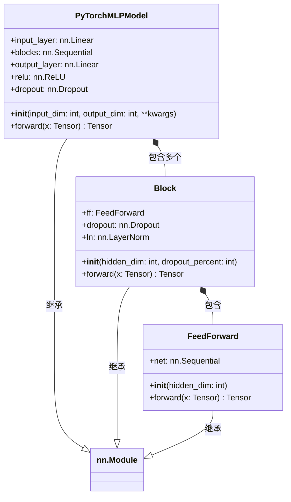

# PyTorchMLPModel.py

## 概述

`PyTorchMLPModel.py` 实现了一个基于 PyTorch 的**多层感知机 (MLP)** 模型。该模型是 FreqAI PyTorch 集成的一个简单示例，展示了如何将自定义 PyTorch 模型接入 FreqAI 框架。

模型由以下组件构成：
- 输入层：将原始特征映射到隐藏维度
- 多个 Block 层：每个 Block 包含 LayerNorm + FeedForward + Dropout
- 输出层：将隐藏表示映射到输出维度

注意：官方文档明确指出该模型未经优化，仅作为示例和基准，不适合直接用于生产环境。

## 架构图



## 核心类/函数

### PyTorchMLPModel (nn.Module)

多层感知机模型。

#### `__init__(input_dim: int, output_dim: int, **kwargs)`
- **参数**：
  - `input_dim: int` — 输入特征数量
  - `output_dim: int` — 输出类别/维度数量
  - `hidden_dim: int = 256` — 每层隐藏单元数量，控制模型复杂度
  - `dropout_percent: float = 0.2` — Dropout 概率，用于防止过拟合
  - `n_layer: int = 1` — Block 层的数量
- **网络结构**：
  1. `input_layer`: `Linear(input_dim, hidden_dim)`
  2. `blocks`: `n_layer` 个 `Block` 组成的 `Sequential`
  3. `output_layer`: `Linear(hidden_dim, output_dim)`

#### `forward(x: Tensor) -> Tensor`
前向传播流程：
```
x -> input_layer -> ReLU -> Dropout -> blocks -> output_layer -> output
```
- 输入形状：`(batch_size, input_dim)`
- 输出形状：`(batch_size, output_dim)`

### Block (nn.Module)

MLP 的基本构建块。

#### `__init__(hidden_dim: int, dropout_percent: int)`
包含：
- `ln`: `LayerNorm(hidden_dim)` — 层归一化
- `ff`: `FeedForward(hidden_dim)` — 前馈网络
- `dropout`: `Dropout(p=dropout_percent)` — 正则化

#### `forward(x: Tensor) -> Tensor`
前向传播：`x -> LayerNorm -> FeedForward -> Dropout -> output`

### FeedForward (nn.Module)

简单的全连接前馈网络块。

#### `__init__(hidden_dim: int)`
内部网络：`Linear(hidden_dim, hidden_dim) -> ReLU`

#### `forward(x: Tensor) -> Tensor`
通过内部 `Sequential` 网络进行前向传播。输入输出维度不变。

## 依赖关系

### 内部依赖（本项目模块）
- 无

### 外部依赖（第三方库）
- `torch` — PyTorch 核心库
- `torch.nn` — 神经网络模块，提供 `Linear`、`ReLU`、`Dropout`、`LayerNorm`、`Sequential` 等

### 被依赖（谁引用了本文件）
- `freqtrade.freqai.prediction_models.PyTorchMLPClassifier` — 使用 `PyTorchMLPModel` 构建分类器
- `freqtrade.freqai.prediction_models.PyTorchMLPRegressor` — 使用 `PyTorchMLPModel` 构建回归器
