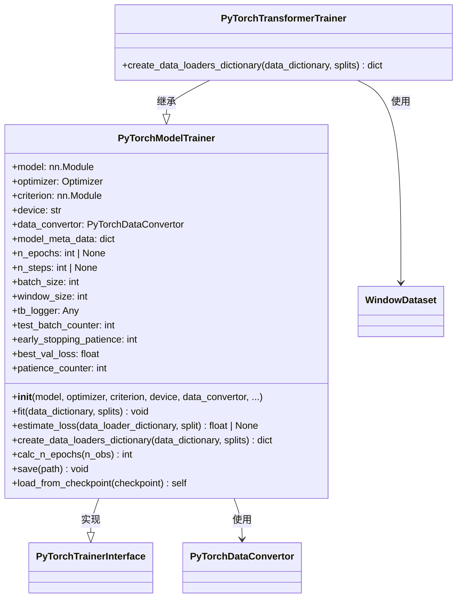

# PyTorchModelTrainer.py

## 概述

`PyTorchModelTrainer.py` 实现了 PyTorch 模型的**训练器**，是 FreqAI PyTorch 模块中负责模型训练、评估、保存和加载的核心组件。该文件包含两个类：

1. **`PyTorchModelTrainer`**：通用 PyTorch 模型训练器，适用于 MLP 等不需要时序窗口的模型，使用 `TensorDataset`
2. **`PyTorchTransformerTrainer`**：Transformer 模型专用训练器，重写了数据加载器创建方法，使用 `WindowDataset` 来构建滑动窗口样本

训练器支持以下关键特性：
- 灵活的训练轮次控制（通过 `n_epochs` 或 `n_steps`）
- 训练/测试分离评估
- TensorBoard 日志记录
- Early stopping（提前停止）
- 模型 checkpoint 的保存和加载
- 持续学习（continual learning）支持

## 架构图

## 核心类/函数

### PyTorchModelTrainer

#### `__init__(model, optimizer, criterion, device, data_convertor, model_meta_data, window_size, tb_logger, **kwargs)`
- **参数**：
  - `model: nn.Module` — 待训练的 PyTorch 模型
  - `optimizer: Optimizer` — 优化器（如 Adam、SGD）
  - `criterion: nn.Module` — 损失函数（如 CrossEntropyLoss、MSELoss）
  - `device: str` — 训练设备（`'cpu'` 或 `'cuda'`）
  - `data_convertor: PyTorchDataConvertor` — DataFrame 到 Tensor 的转换器
  - `model_meta_data: dict | None` — 模型附加元数据（如分类名称）
  - `window_size: int = 1` — 时间窗口大小（Transformer 模型使用）
  - `tb_logger: Any` — TensorBoard 日志记录器
  - `n_epochs: int = 10` — 训练轮数
  - `n_steps: int | None` — 训练步数（与 `n_epochs` 二选一）
  - `batch_size: int = 64` — 批大小
  - `early_stopping_patience: int = 0` — Early stopping 的耐心值，0 表示禁用

#### `fit(data_dictionary: dict, splits: list[str])`
核心训练方法：
1. 将模型设为训练模式
2. 通过 `create_data_loaders_dictionary` 创建数据加载器
3. 计算训练轮数（`n_epochs` 或通过 `calc_n_epochs` 根据 `n_steps` 计算）
4. 双重循环：外层遍历 epoch，内层遍历 batch
5. 每个 batch：前向传播 -> 计算损失 -> 反向传播 -> 更新参数
6. 每个 epoch 结束后评估测试集损失
7. 支持 Early stopping：如果验证损失在 `patience` 个 epoch 内无改善则停止训练

#### `estimate_loss(data_loader_dictionary, split) -> float | None`
使用 `@torch.no_grad()` 装饰器评估指定数据分割上的平均损失。切换到 eval 模式评估，完成后恢复 train 模式。返回平均损失值或 `None`（当没有 batch 时）。

#### `create_data_loaders_dictionary(data_dictionary, splits) -> dict`
为每个 split 创建 `DataLoader`：
1. 使用 `data_convertor` 将 DataFrame 转换为 Tensor
2. 包装为 `TensorDataset`
3. 创建 `DataLoader`，启用 shuffle 和 drop_last

#### `calc_n_epochs(n_obs: int) -> int`
基于 `n_steps` 和数据量计算等效的 epoch 数。公式：`n_epochs = max(n_steps // n_batches, 1)`。如果计算出的 epoch 数 <= 10，会记录警告建议增大 `n_steps`。

#### `save(path: Path)`
保存模型 checkpoint 到磁盘，包含：
- `model_state_dict` — 模型权重
- `optimizer_state_dict` — 优化器状态
- `model_meta_data` — 元数据
- `pytrainer` — 训练器实例自身

#### `load_from_checkpoint(checkpoint: dict)`
从 checkpoint 字典恢复模型和优化器状态，支持持续学习场景。

### PyTorchTransformerTrainer

继承自 `PyTorchModelTrainer`，仅重写了 `create_data_loaders_dictionary` 方法。

#### `create_data_loaders_dictionary(data_dictionary, splits) -> dict`
与父类的区别：
- 使用 `WindowDataset` 替代 `TensorDataset`，传入 `window_size` 参数
- DataLoader 的 `shuffle=False`（因为时序窗口数据不应随机打乱）

## 依赖关系

### 内部依赖（本项目模块）
- `freqtrade.freqai.torch.PyTorchDataConvertor` — 数据格式转换器
- `freqtrade.freqai.torch.PyTorchTrainerInterface` — 训练器抽象接口（父类）
- `freqtrade.freqai.torch.datasets.WindowDataset` — 滑动窗口数据集（Transformer 训练器使用）

### 外部依赖（第三方库）
- `torch` — PyTorch 核心库
- `torch.nn` — 神经网络模块
- `torch.optim.Optimizer` — 优化器基类
- `torch.utils.data` — `DataLoader`、`TensorDataset`
- `pandas` — 输入数据格式

### 被依赖（谁引用了本文件）
- `freqtrade.freqai.prediction_models.PyTorchMLPClassifier` — 创建 `PyTorchModelTrainer` 实例
- `freqtrade.freqai.prediction_models.PyTorchMLPRegressor` — 创建 `PyTorchModelTrainer` 实例
- `freqtrade.freqai.prediction_models.PyTorchTransformerRegressor` — 创建 `PyTorchTransformerTrainer` 实例
