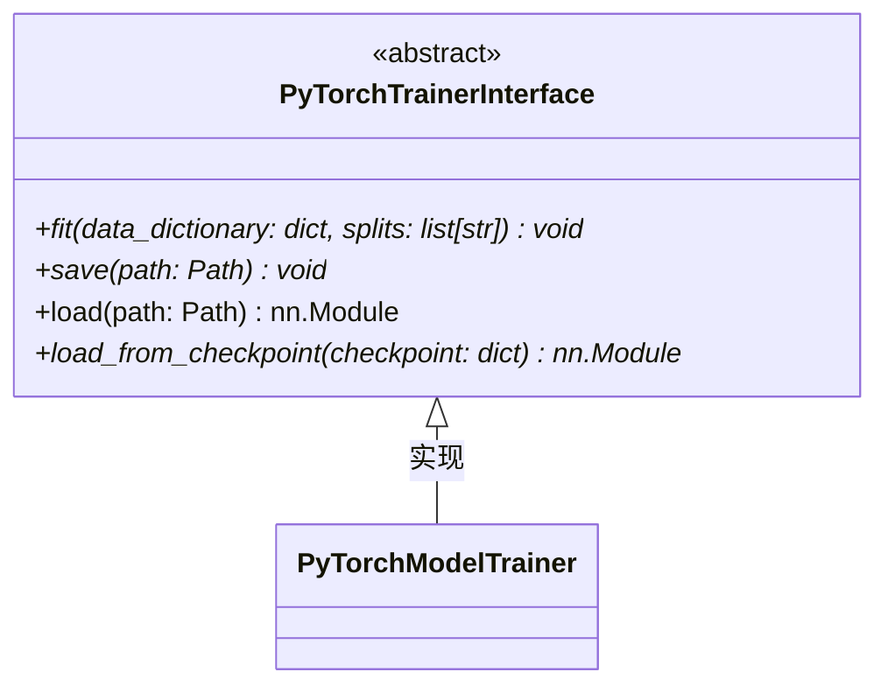

# PyTorchTrainerInterface.py

## 概述

`PyTorchTrainerInterface.py` 定义了 PyTorch 模型训练器的**抽象接口**。它是所有 FreqAI PyTorch 训练器必须实现的契约，定义了训练 (`fit`)、保存 (`save`)、加载 (`load`) 和从 checkpoint 恢复 (`load_from_checkpoint`) 四个核心方法。

该接口确保了训练器的可替换性——用户可以通过实现该接口来自定义训练逻辑，同时保持与 FreqAI 框架的兼容性。

## 架构图



## 核心类/函数

### PyTorchTrainerInterface (ABC)

抽象基类，定义了 PyTorch 训练器的标准接口。

#### `fit(data_dictionary: dict[str, pd.DataFrame], splits: list[str]) -> None` (抽象方法)
模型训练方法。
- **参数**：
  - `data_dictionary` — 由 DataHandler 构建的字典，包含 `train_features`、`train_labels`、`test_features`、`test_labels` 等
  - `splits` — 要使用的数据分割列表，必须包含 `"train"`，可选包含 `"test"`（通过设置 `freqai.data_split_parameters.test_size > 0`）
- **职责**：
  - 计算模型预测输出
  - 使用损失函数计算预测与实际输出之间的损失
  - 通过反向传播计算梯度
  - 使用优化器更新模型参数

#### `save(path: Path) -> None` (抽象方法)
保存模型到磁盘。
- **职责**：
  - 保存任何 `nn.Module` 的 `state_dict`
  - 保存 `model_meta_data` 字典，包含用户需要存储的额外数据（如分类模型的类别名称）

#### `load(path: Path) -> nn.Module`
从磁盘加载模型。这是一个**已实现的**方法（非抽象）：
```python
checkpoint = torch.load(path)
return self.load_from_checkpoint(checkpoint)
```
直接调用 `torch.load` 反序列化 checkpoint 文件，然后委托给 `load_from_checkpoint` 处理。

#### `load_from_checkpoint(checkpoint: dict) -> nn.Module` (抽象方法)
从 checkpoint 字典恢复模型状态。
- **参数**：`checkpoint` — 包含 model & optimizer state dicts、model_meta_data 等的字典
- **用途**：当使用 `continual_learning` 时，`DataDrawer` 会调用 `torch.load(path)` 加载字典，然后通过此方法恢复模型

## 依赖关系

### 内部依赖（本项目模块）
- 无

### 外部依赖（第三方库）
- `torch` — PyTorch 核心库，用于 `torch.load` 加载 checkpoint
- `torch.nn` — 提供 `nn.Module` 类型注解
- `pandas` — `pd.DataFrame` 类型注解

### 被依赖（谁引用了本文件）
- `freqtrade.freqai.torch.PyTorchModelTrainer` — `PyTorchModelTrainer` 实现了该接口
