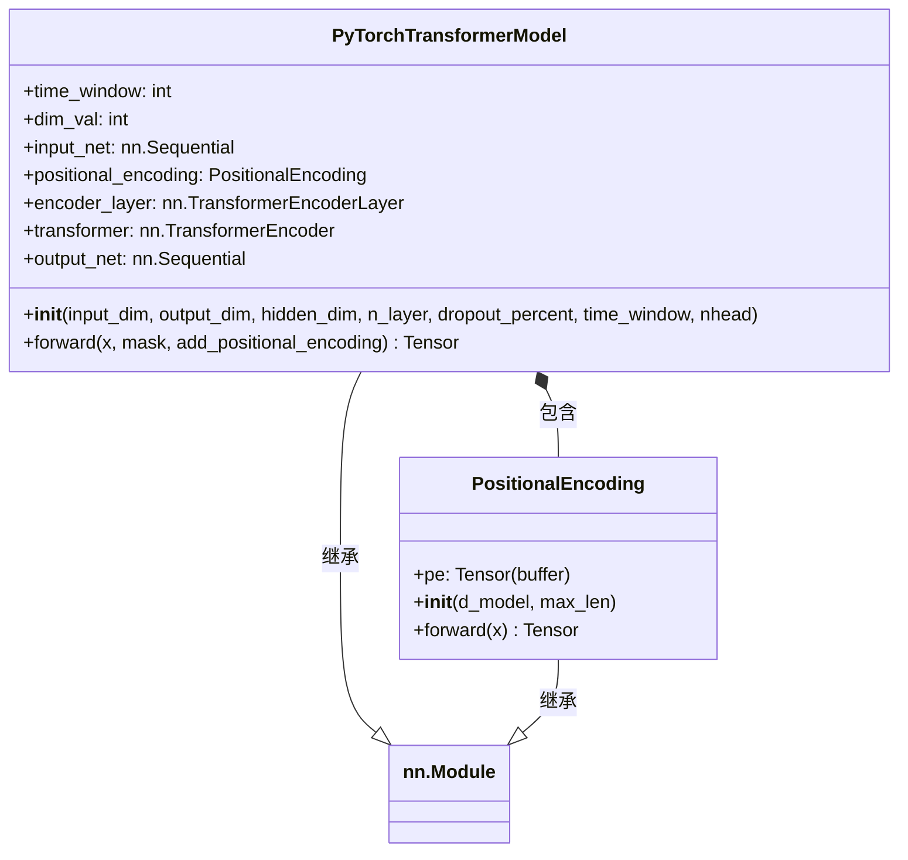

# PyTorchTransformerModel.py

## 概述

`PyTorchTransformerModel.py` 实现了一个基于 **Transformer** 架构的时间序列预测模型。该模型的架构灵感来源于经典论文 "Attention Is All You Need"（Vaswani et al., 2017），但仅使用了 Encoder 部分，并用全连接网络替代了 Decoder。

模型的核心思路是：
1. 将输入特征通过线性层映射到适合 multi-head attention 的维度
2. 使用位置编码 (Positional Encoding) 注入时序信息
3. 通过 Transformer Encoder 提取时序特征
4. 将 Encoder 输出展平后通过多层全连接网络得到最终预测

该模型主要用于 FreqAI 的回归任务（`PyTorchTransformerRegressor`）。

## 架构图



## 核心类/函数

### PyTorchTransformerModel (nn.Module)

Transformer 时间序列预测模型。

#### `__init__(input_dim, output_dim, hidden_dim, n_layer, dropout_percent, time_window, nhead)`
- **参数**：
  - `input_dim: int = 7` — 输入特征维度
  - `output_dim: int = 7` — 输出维度
  - `hidden_dim: int = 1024` — 全连接网络的隐藏维度
  - `n_layer: int = 2` — Transformer Encoder 层数
  - `dropout_percent: float = 0.1` — Dropout 概率
  - `time_window: int = 10` — 时间窗口大小
  - `nhead: int = 8` — Multi-head attention 的头数
- **关键逻辑**：
  - `dim_val = input_dim - (input_dim % nhead)`：确保输入维度能被 `nhead` 整除
  - `input_net`：`Dropout -> Linear(input_dim, dim_val)`，将输入映射到合适维度
  - `positional_encoding`：`PositionalEncoding(d_model=dim_val)`
  - `encoder_layer`：`TransformerEncoderLayer(d_model=dim_val, nhead=nhead, batch_first=True)`
  - `transformer`：`TransformerEncoder(encoder_layer, num_layers=n_layer)`
  - `output_net`：四层全连接网络，维度逐步减半：
    ```
    dim_val * time_window -> hidden_dim -> hidden_dim/2 -> hidden_dim/4 -> output_dim
    ```
    每层之间使用 ReLU + Dropout

#### `forward(x, mask=None, add_positional_encoding=True) -> Tensor`
前向传播：
1. `input_net(x)` — 输入投影
2. `positional_encoding(x)` — 添加位置编码（可选）
3. `transformer(x, mask=mask)` — Transformer Encoder 处理
4. `reshape(-1, 1, time_window * x.shape[-1])` — 展平时序维度
5. `output_net(x)` — 全连接输出网络

- **输入形状**：`[Batch, SeqLen, input_dim]`
- **输出形状**：`[Batch, 1, output_dim]`

### PositionalEncoding (nn.Module)

标准的正弦/余弦位置编码，用于为 Transformer 输入注入序列位置信息。

#### `__init__(d_model, max_len=5000)`
- **参数**：
  - `d_model: int` — 输入的隐藏维度
  - `max_len: int = 5000` — 支持的最大序列长度
- **实现**：
  - 创建 `[max_len, d_model]` 的位置编码矩阵
  - 偶数位使用 `sin`，奇数位使用 `cos`
  - 使用 `register_buffer("pe", pe, persistent=False)` 注册为非持久化 buffer（不会被保存到 state_dict）

#### `forward(x) -> Tensor`
将位置编码加到输入上：`x = x + pe[:, :seq_len]`

## 依赖关系

### 内部依赖（本项目模块）
- 无

### 外部依赖（第三方库）
- `math` — 用于位置编码中的 `math.log`
- `torch` — PyTorch 核心库
- `torch.nn` — 提供 `TransformerEncoder`、`TransformerEncoderLayer`、`Linear`、`ReLU`、`Dropout`、`Sequential` 等

### 被依赖（谁引用了本文件）
- `freqtrade.freqai.prediction_models.PyTorchTransformerRegressor` — 使用 `PyTorchTransformerModel` 构建 Transformer 回归器
