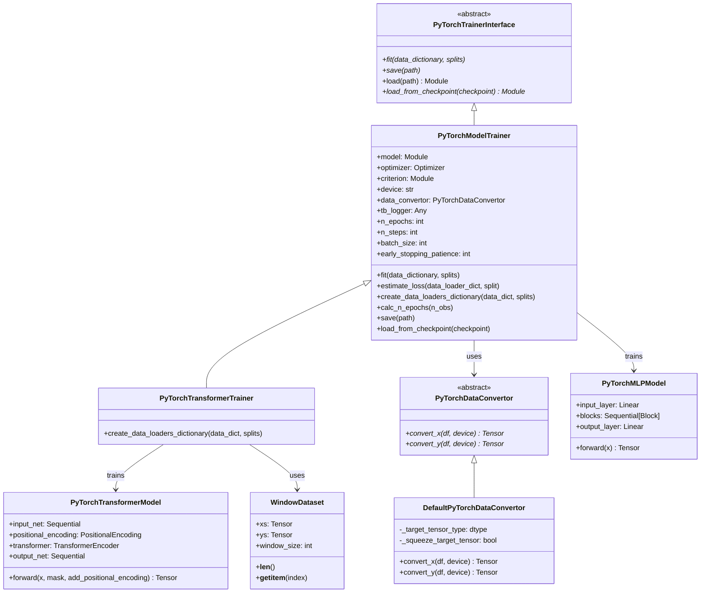
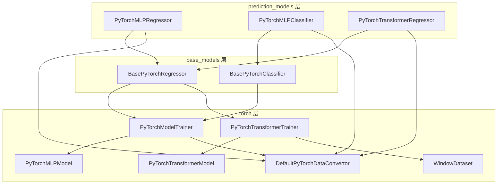
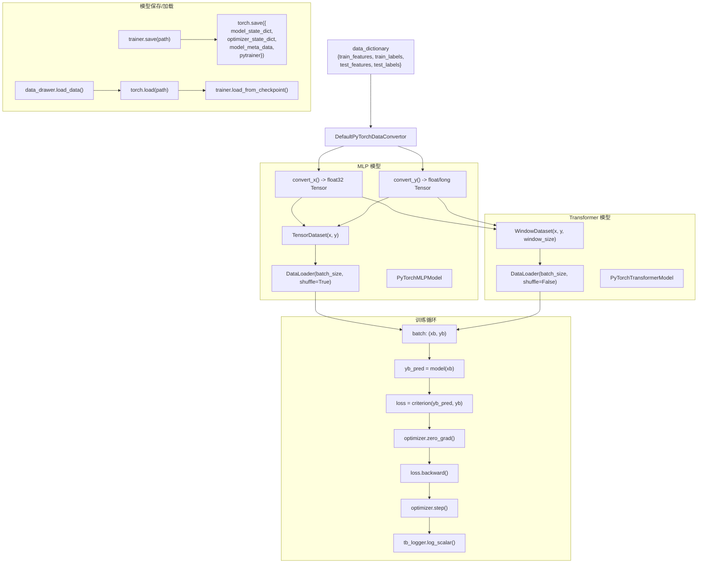
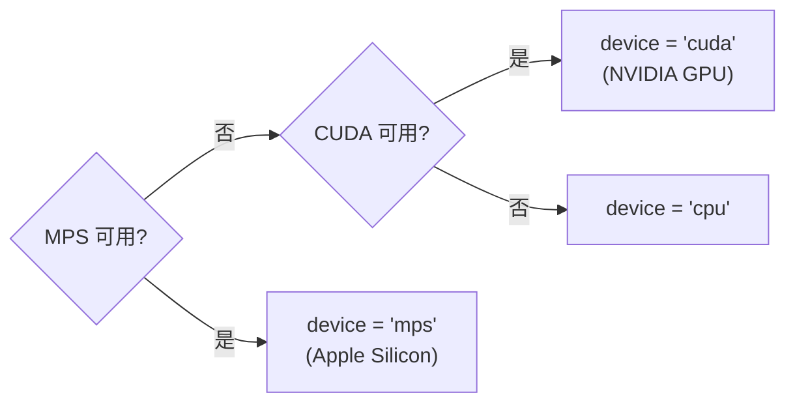
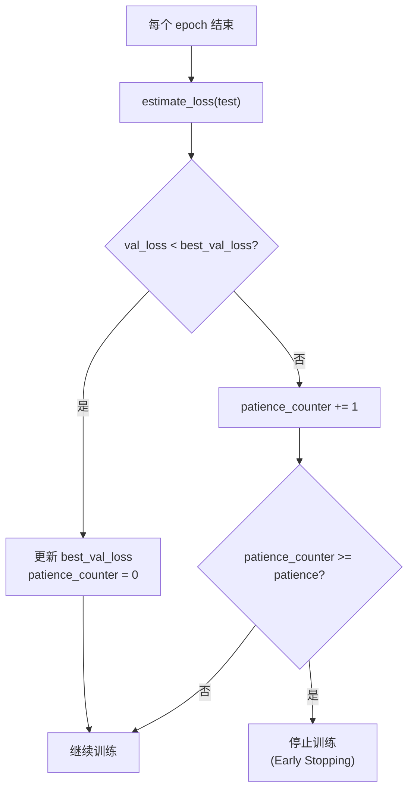

# FreqAI PyTorch 模型支持模块 (torch)

## 1. 模块概述

`torch` 目录提供了 FreqAI 对 PyTorch 深度学习框架的底层支持。该模块包含了完整的 PyTorch 模型训练基础设施，涵盖数据转换、数据集管理、模型定义、训练循环和模型持久化等功能。

该模块的设计遵循**关注点分离**原则，将以下职责拆分到独立的类中：

- **数据转换**（`PyTorchDataConvertor`）：pandas DataFrame -> PyTorch Tensor
- **数据集**（`WindowDataset`）：支持时间窗口的 Dataset
- **模型定义**（`PyTorchMLPModel`, `PyTorchTransformerModel`）：神经网络结构
- **训练接口**（`PyTorchTrainerInterface`）：训练/保存/加载的抽象接口
- **训练实现**（`PyTorchModelTrainer`）：完整的训练循环实现

用户可以通过继承这些基类来创建自定义的 PyTorch 模型，同时复用 FreqAI 的数据管道和训练基础设施。

### 核心设计：Trainer 模式

FreqAI 的 PyTorch 集成采用了 **Trainer 模式**：`PyTorchModelTrainer` 既是训练器又是最终返回给 FreqAI 的 "模型" 对象。这意味着 trainer 包含了模型的所有状态（权重、优化器状态、元数据），可以被整体保存和加载，同时支持 continual learning。

## 2. 目录结构

```
freqtrade/freqai/torch/
|-- __init__.py                      # 包初始化文件（空）
|-- PyTorchDataConvertor.py          # 数据转换器：DataFrame -> Tensor（约 58 行）
|-- datasets.py                      # 自定义 Dataset：WindowDataset（约 20 行）
|-- PyTorchMLPModel.py               # MLP 模型定义（约 97 行）
|-- PyTorchTransformerModel.py       # Transformer 模型定义（约 103 行）
|-- PyTorchTrainerInterface.py       # Trainer 抽象接口（约 52 行）
|-- PyTorchModelTrainer.py           # Trainer 具体实现（约 257 行）
```

### 文件功能说明

| 文件 | 功能 |
|------|------|
| `PyTorchDataConvertor.py` | 定义 DataFrame 到 Tensor 的转换接口和默认实现 |
| `datasets.py` | 定义 `WindowDataset`，支持基于时间窗口的数据加载（用于 Transformer） |
| `PyTorchMLPModel.py` | 定义多层感知机（MLP）模型，包含 Block 和 FeedForward 子组件 |
| `PyTorchTransformerModel.py` | 定义基于 Positional Encoding 的 Transformer 模型 |
| `PyTorchTrainerInterface.py` | 定义 Trainer 的抽象接口（fit, save, load） |
| `PyTorchModelTrainer.py` | 完整的训练循环实现，包含 early stopping 和 TensorBoard 集成 |

## 3. 架构图





## 4. 核心类/函数说明

### 4.1 PyTorchDataConvertor (PyTorchDataConvertor.py)

抽象基类，定义了 pandas DataFrame 到 PyTorch Tensor 的转换接口。

#### 抽象方法

| 方法 | 输入 | 输出 | 说明 |
|------|------|------|------|
| `convert_x(df, device)` | DataFrame, str | Tensor | 将特征 DataFrame 转换为输入 Tensor |
| `convert_y(df, device)` | DataFrame, str | Tensor | 将标签 DataFrame 转换为目标 Tensor |

#### DefaultPyTorchDataConvertor

默认实现，保持 DataFrame 的原始形状。

```python
class DefaultPyTorchDataConvertor(PyTorchDataConvertor):
    def __init__(self, target_tensor_type=torch.float32, squeeze_target_tensor=False):
        self._target_tensor_type = target_tensor_type
        self._squeeze_target_tensor = squeeze_target_tensor
```

**参数说明**：

| 参数 | 说明 | 典型用法 |
|------|------|----------|
| `target_tensor_type` | 目标 Tensor 的数据类型 | 回归用 `torch.float`，分类用 `torch.long` |
| `squeeze_target_tensor` | 是否压缩目标 Tensor 维度 | 分类时设为 `True`（CrossEntropyLoss 需要 1D） |

**转换逻辑**：

```python
def convert_x(self, df, device):
    return torch.tensor(df.values, device=device, dtype=torch.float32)

def convert_y(self, df, device):
    y = torch.tensor(df.values, device=device, dtype=self._target_tensor_type)
    if self._squeeze_target_tensor:
        y = y.squeeze()
    return y
```

### 4.2 WindowDataset (datasets.py)

用于 Transformer 模型的时间窗口 Dataset，继承自 `torch.utils.data.Dataset`。

```python
class WindowDataset(torch.utils.data.Dataset):
    def __init__(self, xs, ys, window_size):
        self.xs = xs          # 特征 Tensor
        self.ys = ys          # 标签 Tensor
        self.window_size = window_size

    def __len__(self):
        return len(self.xs) - self.window_size

    def __getitem__(self, index):
        idx_rev = len(self.xs) - self.window_size - index - 1
        window_x = self.xs[idx_rev : idx_rev + self.window_size, :]
        window_y = self.ys[idx_rev + self.window_size - 1, :].unsqueeze(0)
        return window_x, window_y
```

**关键设计细节**：

1. **反向索引**：`idx_rev = len(xs) - window_size - index - 1`，使得训练时从最新数据开始，有助于模型优先学习近期模式
2. **窗口对齐**：`window_x` 取 `[idx_rev, idx_rev + window_size)` 范围的特征，`window_y` 取该窗口最后一行对应的标签
3. **长度**：有效样本数 = 总样本数 - 窗口大小

### 4.3 PyTorchMLPModel (PyTorchMLPModel.py)

多层感知机（MLP）模型，由输入层、多个 Block、输出层组成。

#### 模型结构

```
Input(input_dim) -> Linear(hidden_dim) -> ReLU -> Dropout
  -> [Block(hidden_dim) x n_layer]
  -> Linear(output_dim)
```

#### 构造函数参数

| 参数 | 默认值 | 说明 |
|------|--------|------|
| `input_dim` | 必需 | 输入特征数 |
| `output_dim` | 必需 | 输出维度（回归为 1，分类为类别数） |
| `hidden_dim` | 256 | 隐藏层维度 |
| `dropout_percent` | 0.2 | Dropout 比率 |
| `n_layer` | 1 | Block 层数 |

#### Block 子组件

每个 Block 包含：
- `LayerNorm(hidden_dim)` -> `FeedForward(hidden_dim)` -> `Dropout`

#### FeedForward 子组件

```python
class FeedForward(nn.Module):
    def __init__(self, hidden_dim):
        self.net = nn.Sequential(
            nn.Linear(hidden_dim, hidden_dim),
            nn.ReLU(),
        )
```

#### Forward 过程

```python
def forward(self, x):
    x = self.relu(self.input_layer(x))  # [batch, hidden_dim]
    x = self.dropout(x)
    x = self.blocks(x)                   # [batch, hidden_dim]
    x = self.output_layer(x)             # [batch, output_dim]
    return x
```

### 4.4 PyTorchTransformerModel (PyTorchTransformerModel.py)

基于论文 "Attention Is All You Need" 的 Transformer 模型，用于时间序列预测。

#### 模型结构

```
Input(input_dim) -> Dropout -> Linear(dim_val)
  -> PositionalEncoding
  -> TransformerEncoder(n_layer layers)
  -> Reshape(-1, 1, time_window * dim_val)
  -> FC(hidden_dim) -> ReLU -> Dropout
  -> FC(hidden_dim/2) -> ReLU -> Dropout
  -> FC(hidden_dim/4) -> ReLU -> Dropout
  -> FC(output_dim)
```

#### 构造函数参数

| 参数 | 默认值 | 说明 |
|------|--------|------|
| `input_dim` | 7 | 输入特征数 |
| `output_dim` | 7 | 输出维度 |
| `hidden_dim` | 1024 | 解码网络隐藏维度 |
| `n_layer` | 2 | Transformer Encoder 层数 |
| `dropout_percent` | 0.1 | Dropout 比率 |
| `time_window` | 10 | 时间窗口大小（对应 `conv_width`） |
| `nhead` | 8 | 多头注意力的头数 |

#### 关键设计

1. **维度对齐**：`dim_val = input_dim - (input_dim % nhead)`，确保输入维度可被注意力头数整除
2. **Positional Encoding**：使用标准的正弦/余弦位置编码
3. **"伪解码" FC 层**：Transformer 输出经过 reshape 后，通过多层全连接网络映射到最终输出

#### PositionalEncoding 子组件

```python
class PositionalEncoding(nn.Module):
    def __init__(self, d_model, max_len=5000):
        pe = torch.zeros(max_len, d_model)
        position = torch.arange(0, max_len).unsqueeze(1)
        div_term = torch.exp(torch.arange(0, d_model, 2) * (-log(10000.0) / d_model))
        pe[:, 0::2] = torch.sin(position * div_term)
        pe[:, 1::2] = torch.cos(position * div_term)
        self.register_buffer("pe", pe.unsqueeze(0), persistent=False)

    def forward(self, x):
        return x + self.pe[:, :x.size(1)]
```

#### Forward 过程

```python
def forward(self, x, mask=None, add_positional_encoding=True):
    x = self.input_net(x)                    # [batch, seq_len, dim_val]
    if add_positional_encoding:
        x = self.positional_encoding(x)       # 添加位置编码
    x = self.transformer(x, mask=mask)        # Transformer 编码
    x = x.reshape(-1, 1, time_window * dim_val)  # flatten
    x = self.output_net(x)                    # FC 解码 -> [batch, 1, output_dim]
    return x
```

### 4.5 PyTorchTrainerInterface (PyTorchTrainerInterface.py)

Trainer 的抽象接口，定义了训练器必须实现的方法。

| 方法 | 说明 |
|------|------|
| `fit(data_dictionary, splits)` | **抽象方法**。执行训练循环 |
| `save(path)` | **抽象方法**。保存模型状态 |
| `load(path)` | 从路径加载模型（调用 `torch.load` + `load_from_checkpoint`） |
| `load_from_checkpoint(checkpoint)` | **抽象方法**。从 checkpoint 字典恢复状态 |

### 4.6 PyTorchModelTrainer (PyTorchModelTrainer.py)

完整的 PyTorch 训练循环实现。

#### 构造函数参数

| 参数 | 说明 |
|------|------|
| `model` | nn.Module 实例 |
| `optimizer` | 优化器（如 AdamW） |
| `criterion` | 损失函数（如 MSELoss, CrossEntropyLoss） |
| `device` | 计算设备 |
| `data_convertor` | PyTorchDataConvertor 实例 |
| `model_meta_data` | 额外元数据（如 class_names） |
| `window_size` | 时间窗口大小，默认 1 |
| `tb_logger` | TensorBoard Logger 实例 |
| `n_epochs` | 训练轮数，默认 10 |
| `n_steps` | 总训练步数（与 n_epochs 二选一） |
| `batch_size` | 批大小，默认 64 |
| `early_stopping_patience` | 早停耐心值，默认 0（禁用） |

#### `fit(data_dictionary, splits)`

核心训练循环：

```python
def fit(self, data_dictionary, splits):
    self.model.train()
    data_loaders = self.create_data_loaders_dictionary(data_dictionary, splits)
    n_epochs = self.n_epochs or self.calc_n_epochs(n_obs)

    for epoch in range(n_epochs):
        for batch_data in data_loaders["train"]:
            xb, yb = batch_data
            yb_pred = self.model(xb)
            loss = self.criterion(yb_pred, yb)
            self.optimizer.zero_grad(set_to_none=True)
            loss.backward()
            self.optimizer.step()
            self.tb_logger.log_scalar("train_loss", loss.item(), batch_counter)

        # 验证集评估 + 早停
        if "test" in splits:
            val_loss = self.estimate_loss(data_loaders, "test")
            if early_stopping_patience > 0 and val_loss < best_val_loss:
                ...
            elif patience_counter >= early_stopping_patience:
                break  # 早停
```

#### `estimate_loss(data_loader_dictionary, split) -> float | None`

在评估模式下计算指定数据集的平均损失：

```python
@torch.no_grad()
def estimate_loss(self, data_loader_dictionary, split):
    self.model.eval()
    for batch_data in data_loader_dictionary[split]:
        loss = self.criterion(self.model(xb), yb)
        total_loss += loss.item()
    self.model.train()
    return total_loss / num_batches
```

#### `create_data_loaders_dictionary(data_dictionary, splits)`

将 DataFrame 转换为 DataLoader：

```python
def create_data_loaders_dictionary(self, data_dictionary, splits):
    for split in splits:
        x = self.data_convertor.convert_x(data_dictionary[f"{split}_features"], self.device)
        y = self.data_convertor.convert_y(data_dictionary[f"{split}_labels"], self.device)
        dataset = TensorDataset(x, y)
        data_loader = DataLoader(dataset, batch_size=self.batch_size, shuffle=True, drop_last=True)
```

#### `calc_n_epochs(n_obs) -> int`

从 `n_steps` 计算 epoch 数：

```python
n_batches = n_obs // self.batch_size
n_epochs = max(self.n_steps // n_batches, 1)
```

#### `save(path)`

保存模型和训练器状态：

```python
torch.save({
    "model_state_dict": self.model.state_dict(),
    "optimizer_state_dict": self.optimizer.state_dict(),
    "model_meta_data": self.model_meta_data,
    "pytrainer": self,  # 序列化整个 trainer 对象
}, path)
```

#### `load_from_checkpoint(checkpoint)`

从 checkpoint 恢复状态（用于 continual learning）：

```python
def load_from_checkpoint(self, checkpoint):
    self.model.load_state_dict(checkpoint["model_state_dict"])
    self.optimizer.load_state_dict(checkpoint["optimizer_state_dict"])
    self.model_meta_data = checkpoint["model_meta_data"]
    return self
```

### 4.7 PyTorchTransformerTrainer

继承 `PyTorchModelTrainer`，重写 `create_data_loaders_dictionary` 以使用 `WindowDataset`：

```python
class PyTorchTransformerTrainer(PyTorchModelTrainer):
    def create_data_loaders_dictionary(self, data_dictionary, splits):
        for split in splits:
            x = self.data_convertor.convert_x(...)
            y = self.data_convertor.convert_y(...)
            dataset = WindowDataset(x, y, self.window_size)  # 使用窗口数据集
            data_loader = DataLoader(dataset, shuffle=False, ...)  # 注意：不 shuffle
```

与基类的关键区别：
- 使用 `WindowDataset` 替代 `TensorDataset`
- `shuffle=False`（保持时间顺序）
- 数据集长度为 `n_obs - window_size`

## 5. 依赖关系

### 内部依赖

```
PyTorchModelTrainer
  |-- PyTorchTrainerInterface (抽象接口)
  |-- PyTorchDataConvertor (数据转换)
  |-- datasets.WindowDataset (仅 Transformer trainer)
  |-- tensorboard (tb_logger)

PyTorchMLPModel, PyTorchTransformerModel
  |-- torch.nn (Module, Linear, ReLU, Dropout, LayerNorm, TransformerEncoder, etc.)

使用方:
  prediction_models/PyTorchMLPRegressor --> PyTorchMLPModel + PyTorchModelTrainer + DefaultPyTorchDataConvertor
  prediction_models/PyTorchMLPClassifier --> PyTorchMLPModel + PyTorchModelTrainer + DefaultPyTorchDataConvertor
  prediction_models/PyTorchTransformerRegressor --> PyTorchTransformerModel + PyTorchTransformerTrainer + DefaultPyTorchDataConvertor
  base_models/BasePyTorchModel --> PyTorchDataConvertor
  data_drawer.py --> PyTorchModelTrainer (加载模型)
```

### 外部依赖

| 库 | 用途 |
|----|------|
| `torch` | PyTorch 核心（Tensor, nn.Module, Optimizer） |
| `torch.nn` | 神经网络层（Linear, ReLU, Dropout, etc.） |
| `torch.optim` | 优化器（AdamW） |
| `torch.utils.data` | DataLoader, TensorDataset, Dataset |
| `torch.utils.tensorboard` | SummaryWriter（通过 tb_logger） |
| `pandas` | 数据输入（DataFrame） |
| `math` | Positional Encoding 计算 |

## 6. 数据流



### 设备选择逻辑



### Early Stopping 流程



### 配置示例

```json
{
    "freqai": {
        "model_training_parameters": {
            "learning_rate": 3e-4,
            "trainer_kwargs": {
                "n_steps": 5000,
                "batch_size": 64,
                "n_epochs": null,
                "early_stopping_patience": 5
            },
            "model_kwargs": {
                "hidden_dim": 512,
                "dropout_percent": 0.2,
                "n_layer": 1
            }
        },
        "conv_width": 30
    }
}
```

| 配置项 | 适用模型 | 说明 |
|--------|----------|------|
| `learning_rate` | 全部 | AdamW 学习率 |
| `n_steps` | 全部 | 总训练步数（与 n_epochs 二选一） |
| `n_epochs` | 全部 | 训练轮数 |
| `batch_size` | 全部 | 每批样本数 |
| `early_stopping_patience` | 全部 | 早停耐心值（0 禁用） |
| `hidden_dim` | MLP / Transformer | 隐藏层维度 |
| `dropout_percent` | MLP / Transformer | Dropout 比率 |
| `n_layer` | MLP / Transformer | 层数 |
| `conv_width` | Transformer | 时间窗口大小 |
| `nhead` | Transformer | 注意力头数（默认 8） |
