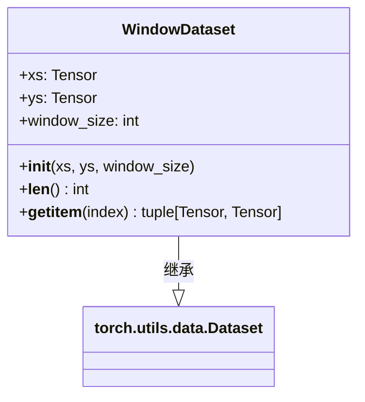

# datasets.py

## 概述

`datasets.py` 定义了 `WindowDataset` 类，它是一个自定义的 PyTorch `Dataset`，用于将时间序列数据转换为固定大小的滑动窗口样本。该数据集主要为 Transformer 模型服务，因为 Transformer 需要固定长度的序列输入。

与标准的 `TensorDataset` 不同，`WindowDataset` 会从时间序列数据中自动创建长度为 `window_size` 的滑动窗口，使得模型可以利用时序上下文信息进行预测。

## 架构图

## 核心类/函数

### WindowDataset

继承自 `torch.utils.data.Dataset`，用于创建时间序列的滑动窗口数据集。

#### `__init__(xs, ys, window_size)`
- **参数**：
  - `xs: Tensor` — 特征张量，形状通常为 `[N, feature_dim]`
  - `ys: Tensor` — 标签张量，形状通常为 `[N, label_dim]`
  - `window_size: int` — 滑动窗口大小
- **职责**：存储数据和窗口大小参数

#### `__len__() -> int`
返回数据集的有效样本数量：`len(xs) - window_size`。因为需要 `window_size` 个数据点来构成一个完整窗口，所以头部会有 `window_size` 个数据点不能作为独立样本的起始。

#### `__getitem__(index) -> tuple[Tensor, Tensor]`
根据索引获取一个样本。关键逻辑：
- **反向索引**：`idx_rev = len(xs) - window_size - index - 1`，从数据末尾向前索引，使得 `index=0` 对应最新的数据窗口
- `window_x`：取 `xs[idx_rev : idx_rev + window_size, :]`，即从 `idx_rev` 开始的 `window_size` 行特征
- `window_y`：取 `ys[idx_rev + window_size - 1, :]`，即窗口最后一行对应的标签，并通过 `unsqueeze(0)` 增加一个维度
- **注意**：`window_x` 和 `window_y` 的对齐方式——`window_y` 对应的是窗口中最后一个时间步的标签

## 依赖关系

### 内部依赖（本项目模块）
- 无

### 外部依赖（第三方库）
- `torch` — PyTorch 核心库，提供 `torch.utils.data.Dataset` 基类

### 被依赖（谁引用了本文件）
- `freqtrade.freqai.torch.PyTorchModelTrainer` — `PyTorchTransformerTrainer.create_data_loaders_dictionary` 中使用 `WindowDataset` 替代 `TensorDataset`
