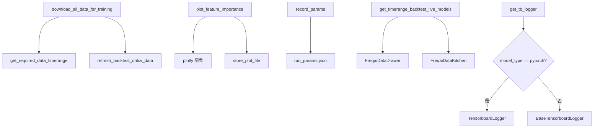

# utils.py

## 概述

FreqAI 的工具函数模块，提供数据下载、特征重要性可视化、参数记录、TensorBoard logger 创建等辅助功能。这些函数被 FreqAI 的核心模块调用，用于支持训练准备、结果可视化和实验可复现性。

## 架构图

## 核心类/函数

### `download_all_data_for_training(dp: DataProvider, config: Config) -> None`
在 bot 启动时调用一次，下载训练和填充指标所需的全部数据。

流程：
1. 从交易所获取可交易的市场列表
2. 使用 `dynamic_expand_pairlist` 展开交易对列表
3. 调用 `get_required_data_timerange` 计算所需时间范围
4. 调用 `refresh_backtest_ohlcv_data` 下载 OHLCV 数据

### `get_required_data_timerange(config: Config) -> TimeRange`
计算 FreqAI 自动数据下载所需的时间范围：
- 基于 `train_period_days` 确定训练数据的时间跨度
- 基于 `startup_candle_count` 和 `indicator_periods_candles` 的最大值乘以 1.5 倍安全因子
- 基于最大时间框架的秒数计算额外所需的历史数据量

参数：`config` -- 配置字典
返回值：`TimeRange` -- 计算后的数据下载时间范围

### `plot_feature_importance(model, pair, dk, count_max=25) -> None`
为单次子训练绘制最重要和最不重要的特征。

功能：
- 支持多输出模型（FreqaiMultiOutputRegressor）-- 为每个标签分别绘图
- 支持 CatBoost、LightGBM、XGBoost 模型的特征重要性提取
- 使用 Plotly 生成水平条形图，包含最好和最差特征各 `count_max` 个
- 保存为 HTML 文件到模型数据路径

参数：
- `model` -- 训练好的模型
- `pair` -- 交易对
- `dk` -- FreqaiDataKitchen 实例
- `count_max` -- 每列显示的特征数量，默认 25

### `record_params(config: dict, full_path: Path) -> None`
将运行参数记录到 `run_params.json` 文件中，用于实验可复现性。

记录的参数包括：freqai 配置、timeframe、stake_amount、stake_currency、max_open_trades、交易对列表。

### `get_timerange_backtest_live_models(config: Config) -> str`
获取用于回测 live/ready 模型的格式化时间范围字符串。

流程：创建 FreqaiDataKitchen -> 获取模型路径 -> 创建 FreqaiDataDrawer -> 从历史预测中提取时间范围。

### `get_tb_logger(model_type: str, path: Path, activate: bool) -> Any`
创建 TensorBoard logger 实例：
- 如果 model_type 为 "pytorch" 且 activate 为 True，返回 `TensorboardLogger`（带实际写入功能）
- 否则返回 `BaseTensorboardLogger`（空操作占位符）

## 依赖关系

### 内部依赖（本项目模块）
- `freqtrade.configuration.TimeRange` -- 时间范围
- `freqtrade.constants.Config` -- 配置类型
- `freqtrade.data.dataprovider.DataProvider` -- 数据提供者
- `freqtrade.data.history.history_utils.refresh_backtest_ohlcv_data` -- OHLCV 数据下载
- `freqtrade.exceptions.OperationalException` -- 异常
- `freqtrade.exchange.timeframe_to_seconds` -- 时间框架转换
- `freqtrade.freqai.data_drawer.FreqaiDataDrawer` -- 数据管理
- `freqtrade.freqai.data_kitchen.FreqaiDataKitchen` -- 数据处理
- `freqtrade.plugins.pairlist.pairlist_helpers.dynamic_expand_pairlist` -- 交易对列表展开
- `freqtrade.plot.plotting` -- 绘图工具（动态导入）
- `freqtrade.freqai.tensorboard` -- TensorBoard logger

### 外部依赖（第三方库）
- `numpy` -- 数值计算
- `pandas` -- 数据管理
- `rapidjson` -- JSON 序列化

### 被依赖（谁引用了本文件）
- `freqtrade.freqai.freqai_interface` -- IFreqaiModel 使用 `get_tb_logger`、`plot_feature_importance`、`record_params`
- `freqtrade.strategy.interface` -- 策略接口使用 `download_all_data_for_training`
- `freqtrade.optimize.backtesting` -- 回测模块使用 `get_timerange_backtest_live_models`
