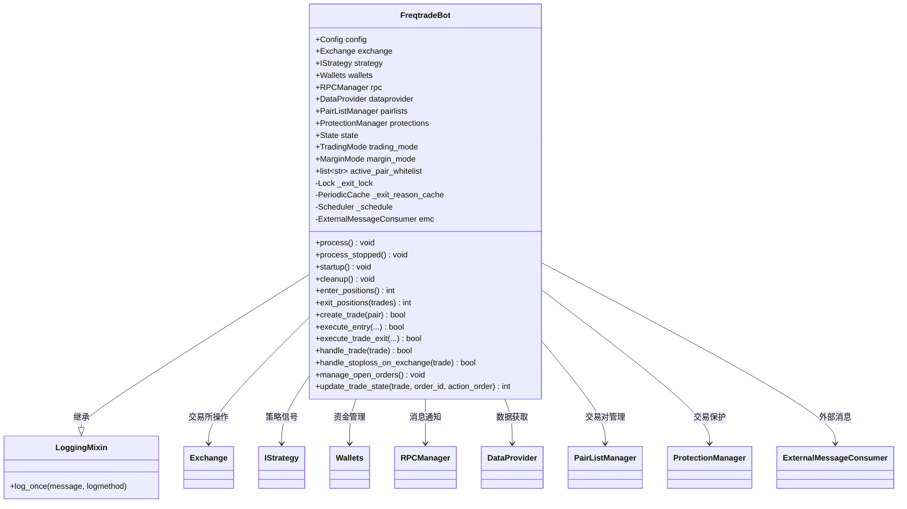
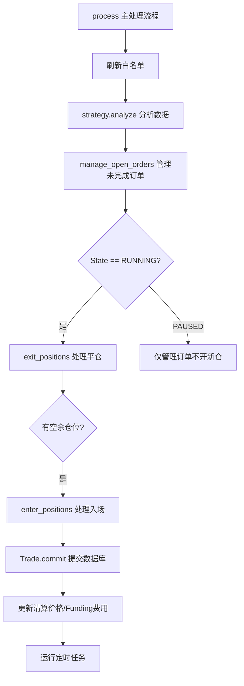

# freqtradebot.py

## 概述
`freqtrade/freqtradebot.py` 是 freqtrade 项目的核心模块，定义了 `FreqtradeBot` 类。该类是整个交易机器人的业务逻辑核心，负责协调交易所、策略、数据提供者、钱包、RPC 管理器、Pairlist 管理器、保护机制等所有组件。FreqtradeBot 实现了完整的交易生命周期管理，包括信号分析、入场执行、止损管理、平仓执行、订单管理、费用计算和通知发送。

## 架构图

## 核心类

### FreqtradeBot (继承 LoggingMixin)

#### 初始化 `__init__(self, config: Config)`
- **职责**: 初始化 bot 的全部组件，按以下顺序：
  1. 加载交易所（ExchangeResolver）并移除配置中的凭据
  2. 加载策略（StrategyResolver）
  3. 验证配置一致性和交易所兼容性
  4. 初始化数据库（init_db）
  5. 创建 Wallets 实例
  6. 创建 RPCManager（在独立线程中运行）
  7. 创建 DataProvider 和 PairListManager
  8. 将 DataProvider 和 Wallets 附加到 Strategy
  9. 可选：创建 ExternalMessageConsumer
  10. 执行首次 pairlist 刷新
  11. 设置初始状态（从配置读取或默认 STOPPED）
  12. 创建退出锁和退出原因缓存
  13. 为期货模式设置 funding fee 和清算价格更新定时任务
  14. 调用策略的 `ft_bot_start()` 回调
  15. 初始化 ProtectionManager

#### 主循环 `process(self) -> None`
- **职责**: 每次迭代的主处理逻辑：
  1. 刷新活跃交易对白名单
  2. 调用 `strategy.analyze()` 分析所有交易对的 K 线数据
  3. 调用 `manage_open_orders()` 处理超时和未完成的订单
  4. 如果状态为 RUNNING：
     - 调用 `exit_positions()` 检查并执行平仓
     - 如果有空余仓位，调用 `enter_positions()` 寻找入场机会
  5. 提交数据库事务
  6. 更新 funding fees 和清算价格（期货模式）
  7. 运行定时任务

#### 入场流程

##### `enter_positions(self) -> int`
- **返回值**: 成功开仓的交易数
- **逻辑**: 遍历白名单中的所有交易对，为每个满足条件的对调用 `create_trade()`

##### `create_trade(self, pair: str) -> bool`
- **职责**: 分析信号并创建交易
- **逻辑**:
  1. 获取策略的入场信号和方向
  2. 验证交易模式（如只做多时不允许做空）
  3. 检查保护机制是否允许交易
  4. 计算下注金额
  5. 获取入场价格
  6. 调用 `execute_entry()` 执行入场

##### `execute_entry(self, pair, stake_amount, price, ...) -> bool`
- **职责**: 执行入场订单（约 200 行，是最核心的入场方法）
- **逻辑**:
  1. 调用策略的 `custom_entry_price()` 获取自定义价格
  2. 调用策略的 `custom_stake_amount()` 获取自定义金额
  3. 验证并调整金额（validate_stake_amount）
  4. 计算数量、止损价格
  5. 检查是否有类似订单正在处理
  6. 在交易所创建订单
  7. 创建 Trade 数据库记录
  8. 如果需要，创建交易所止损单
  9. 发送 RPC 入场通知

#### 平仓流程

##### `exit_positions(self, trades: list[Trade]) -> int`
- **返回值**: 处理的平仓数
- **逻辑**: 遍历所有未平仓交易，处理交易所止损单，然后调用 `handle_trade()`

##### `handle_trade(self, trade: Trade) -> bool`
- **职责**: 检查单个交易是否满足退出条件
- **逻辑**: 调用策略的 `should_exit()` 判断是否退出，如果是，调用 `_check_and_execute_exit()`

##### `execute_trade_exit(self, trade, rate, exit_check, ...) -> bool`
- **职责**: 执行平仓订单
- **逻辑**:
  1. 计算安全的退出数量
  2. 调用策略的 `custom_exit_price()` 获取自定义价格
  3. 计算利润
  4. 在交易所创建卖出订单
  5. 更新 Trade 记录
  6. 发送 RPC 退出通知

#### 订单管理

##### `manage_open_orders(self) -> None`
- **职责**: 处理所有未完成订单的超时逻辑
- **逻辑**: 遍历有未完成订单的交易，根据订单类型和超时配置决定是否取消

##### `handle_stoploss_on_exchange(self, trade: Trade) -> bool`
- **职责**: 管理交易所上的止损单，包括创建、更新和追踪止损

##### `handle_cancel_enter(self, trade, order, ...) -> bool`
- **职责**: 处理入场订单取消，支持部分成交保留

##### `handle_cancel_exit(self, trade, order, ...) -> str`
- **职责**: 处理出场订单取消

##### `replace_order(self, order, order_obj, trade) -> None`
- **职责**: 替换现有订单（取消旧订单并创建新订单）

#### 订单状态更新

##### `update_trade_state(self, trade, order_id, action_order, ...) -> int`
- **返回值**: 已成交数量
- **职责**: 从交易所获取订单最新状态并更新数据库

##### `_update_trade_after_fill(self, trade, order, send_msg) -> Trade`
- **职责**: 订单完全成交后的后处理（更新利润、止损、杠杆信息、清算价格等）

#### 辅助功能

##### `handle_protections(self, pair, side) -> None`
- **职责**: 交易关闭后调用保护机制，检查是否需要锁定交易对

##### `get_real_amount(self, trade, order, order_obj) -> float | None`
- **职责**: 计算扣除手续费后的实际到账金额

##### `get_valid_price(self, custom_price, proposed_price) -> float`
- **职责**: 验证自定义价格是否在允许范围内（不超过 custom_price_max_distance_ratio）

##### `update_funding_fees(self) -> None`
- **职责**: 更新所有未平仓期货交易的 funding fee

##### `update_all_liquidation_prices(self) -> None`
- **职责**: 更新所有未平仓期货交易的清算价格

##### `startup(self) -> None`
- **职责**: bot 启动时的初始化（同步交易所订单、更新费用、回填精度等）

##### `cleanup(self) -> None`
- **职责**: 优雅关闭（清理 RPC、关闭 ExternalMessageConsumer、取消订单等）

## 核心方法数量统计
该文件包含约 **60+ 个方法**，超过 **2600 行代码**，是项目中最大的单个文件。

## 依赖关系

### 内部依赖（本项目模块）
- `freqtrade.constants` — Config、交易常量、取消原因等
- `freqtrade.configuration` — 配置验证和凭据移除
- `freqtrade.data.converter` — 订单簿数据转换
- `freqtrade.data.dataprovider` — DataProvider 数据提供
- `freqtrade.enums` — State, ExitType, TradingMode, SignalDirection, RPCMessageType 等
- `freqtrade.exceptions` — 各种异常类
- `freqtrade.exchange` — Exchange 交易所接口，舍入常量，时间框架工具
- `freqtrade.leverage` — 清算价格更新
- `freqtrade.misc` — safe_value_fallback, safe_value_fallback2
- `freqtrade.mixins.LoggingMixin` — 日志去重 Mixin
- `freqtrade.persistence` — Trade, Order, PairLocks, init_db
- `freqtrade.plugins` — PairListManager, ProtectionManager
- `freqtrade.resolvers` — ExchangeResolver, StrategyResolver
- `freqtrade.rpc` — RPCManager, ExternalMessageConsumer, RPC 消息类型
- `freqtrade.strategy` — IStrategy, strategy_safe_wrapper
- `freqtrade.util` — FtPrecise, MeasureTime, PeriodicCache, dt_now 等
- `freqtrade.wallets` — Wallets 钱包管理

### 外部依赖（第三方库）
- `schedule` — 定时任务调度（funding fee 更新等）
- `logging` — 日志记录
- `threading.Lock` — 线程锁，防止并发退出操作
- `copy.deepcopy` — 深拷贝配置
- `math.isclose` — 浮点数近似比较

### 被依赖（谁引用了本文件）
- `freqtrade.worker` — 创建和管理 FreqtradeBot 实例
- `freqtrade.rpc.rpc` — 通过 FreqtradeBot 访问交易状态和执行操作
- `tests/freqtradebot/test_freqtradebot.py` — 大量单元测试
- `tests/conftest.py` — 测试 fixtures
