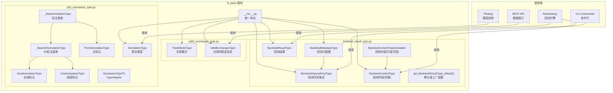
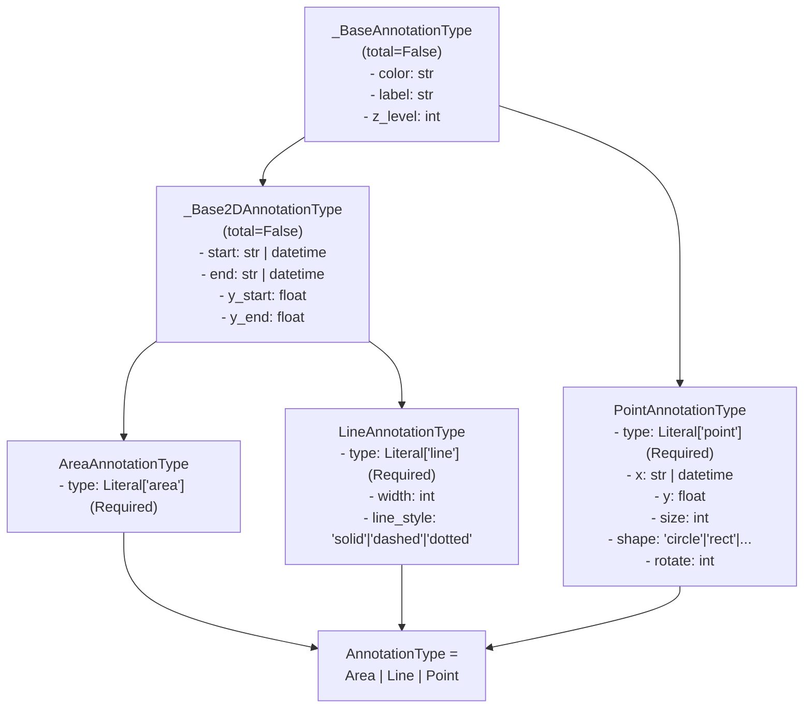
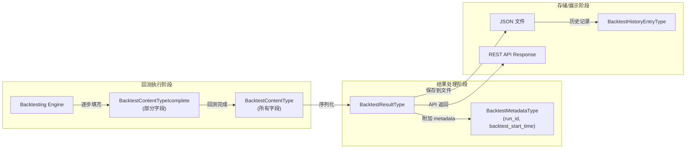
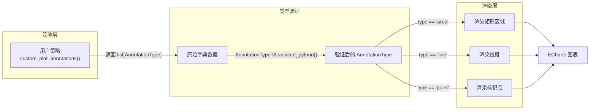
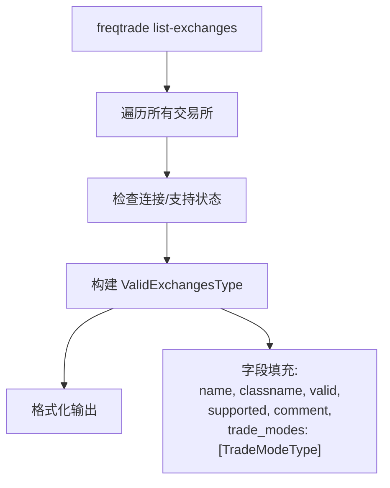

# ft_types -- 类型定义

## 1. 模块概述

`freqtrade.ft_types` 模块是 Freqtrade 的**集中类型定义模块**，使用 Python 的 `TypedDict`、`Literal` 和 Pydantic 的 `TypeAdapter` 等类型工具为项目中的复杂数据结构提供静态类型标注。

该模块的核心价值在于：
- **类型安全**：为回测结果、交易所信息、图表标注等复杂数据结构提供编译时类型检查
- **文档性**：TypedDict 定义清晰地记录了各数据结构的字段名称和类型
- **运行时验证**：图表标注类型通过 Pydantic `TypeAdapter` 支持运行时数据验证
- **解耦**：将类型定义从业务逻辑中分离，避免循环依赖

## 2. 目录结构

| 文件 | 行数约 | 功能说明 |
|---|---|---|
| `__init__.py` | ~12 | 模块入口，统一导出所有类型定义 |
| `backtest_result_type.py` | ~62 | 回测结果相关类型定义（`BacktestResultType`、`BacktestContentType` 等） |
| `valid_exchanges_type.py` | ~22 | 交易所验证信息类型（`ValidExchangesType`、`TradeModeType`） |
| `plot_annotation_type.py` | ~43 | 图表标注类型定义（`AnnotationType`：区域、线段、点标注） |

## 3. 架构图



## 4. 核心类/函数说明

### 4.1 回测结果类型 (`backtest_result_type.py`)

#### `BacktestMetadataType`

回测元数据，标识一次回测运行。

```python
class BacktestMetadataType(TypedDict):
    run_id: str              # 回测运行唯一标识符
    backtest_start_time: int # 回测开始时间戳（毫秒）
```

#### `BacktestResultType`

回测的完整结果结构，包含元数据、策略详情和策略对比。

```python
class BacktestResultType(TypedDict):
    metadata: dict[str, Any]       # 回测元数据（BacktestMetadataType）
    strategy: dict[str, Any]       # 各策略的详细结果（key=策略名）
    strategy_comparison: list[Any] # 策略对比数据列表
```

**默认值工厂函数：**

```python
def get_BacktestResultType_default() -> BacktestResultType:
    """返回空的默认 BacktestResultType 实例"""
    return {
        "metadata": {},
        "strategy": {},
        "strategy_comparison": [],
    }
```

注意：使用 `deepcopy()` 确保每次调用返回独立的实例，避免共享可变对象。

#### `BacktestHistoryEntryType`

回测历史记录中的单个条目，继承自 `BacktestMetadataType`，扩展了文件和策略信息。

```python
class BacktestHistoryEntryType(BacktestMetadataType):
    filename: str                    # 回测结果文件名
    strategy: str                    # 策略名称
    notes: str                       # 用户笔记
    backtest_start_ts: int | None    # 回测数据开始时间戳
    backtest_end_ts: int | None      # 回测数据结束时间戳
    timeframe: str | None            # 主时间框架
    timeframe_detail: str | None     # 详细时间框架（如使用了 detail timeframe）
```

#### `BacktestContentTypeIcomplete` 和 `BacktestContentType`

回测引擎内部使用的内容类型，包含回测执行过程中的各种统计数据。

```python
class BacktestContentTypeIcomplete(TypedDict, total=False):
    results: DataFrame               # 回测交易结果 DataFrame
    config: Config                   # 配置对象
    locks: Any                       # PairLock 信息
    rejected_signals: int            # 被拒绝的信号数量
    timedout_entry_orders: int       # 超时的入场订单数量
    timedout_exit_orders: int        # 超时的出场订单数量
    canceled_trade_entries: int      # 被取消的交易入场数量
    canceled_entry_orders: int       # 被取消的入场订单数量
    replaced_entry_orders: int       # 被替换的入场订单数量
    final_balance: float             # 回测结束时的最终余额
    backtest_start_time: int         # 回测执行开始时间
    backtest_end_time: int           # 回测执行结束时间
    run_id: str                      # 运行 ID
```

`BacktestContentTypeIcomplete` 使用 `total=False`，表示所有字段都是可选的。`BacktestContentType` 继承它并使用 `total=True`，表示所有字段都是必需的。这种模式允许在回测过程中逐步填充数据。

### 4.2 交易所类型 (`valid_exchanges_type.py`)

#### `TradeModeType`

交易模式类型定义。

```python
class TradeModeType(TypedDict):
    trading_mode: str  # 交易模式: "spot" / "margin" / "futures"
    margin_mode: str   # 保证金模式: "cross" / "isolated" / ""
```

#### `ValidExchangesType`

交易所验证信息，用于 `list-exchanges` 命令的输出。

```python
class ValidExchangesType(TypedDict):
    name: str                       # 交易所显示名称
    classname: str                  # 对应的 Python 类名
    valid: bool                     # 是否有效（可连接）
    supported: bool                 # 是否被 Freqtrade 官方支持
    comment: str                    # 现货模式备注
    comment_futures: str            # 合约模式备注
    dex: bool                       # 是否为去中心化交易所
    is_alias: bool                  # 是否为其他交易所的别名
    alias_for: str | None           # 若为别名，指向的真实交易所名称
    trade_modes: list[TradeModeType] # 支持的交易模式列表
```

**使用场景示例：**
```python
# list-exchanges 命令输出
{
    "name": "Binance",
    "classname": "Binance",
    "valid": True,
    "supported": True,
    "comment": "",
    "comment_futures": "",
    "dex": False,
    "is_alias": False,
    "alias_for": None,
    "trade_modes": [
        {"trading_mode": "spot", "margin_mode": ""},
        {"trading_mode": "futures", "margin_mode": "isolated"}
    ]
}
```

### 4.3 图表标注类型 (`plot_annotation_type.py`)

该文件定义了 Freqtrade 图表系统中的标注（Annotation）类型，采用 TypedDict 继承体系和联合类型实现多态。

#### 类型继承关系



#### `_BaseAnnotationType`

所有标注的基类，定义通用属性（均可选）：

| 字段 | 类型 | 说明 |
|---|---|---|
| `color` | str | 标注颜色 |
| `label` | str | 标注标签文本 |
| `z_level` | int | Z 轴层级（叠放顺序） |

#### `_Base2DAnnotationType`

2D 标注基类（区域和线段共用），扩展了空间坐标：

| 字段 | 类型 | 说明 |
|---|---|---|
| `start` | str \| datetime | X 轴起始位置（时间） |
| `end` | str \| datetime | X 轴结束位置（时间） |
| `y_start` | float | Y 轴起始位置（价格/值） |
| `y_end` | float | Y 轴结束位置（价格/值） |

#### `AreaAnnotationType`

区域标注，用于在图表上标记一个矩形区域。

```python
class AreaAnnotationType(_Base2DAnnotationType, total=False):
    type: Required[Literal["area"]]  # 固定为 "area"
```

**使用示例：**
```python
annotation: AreaAnnotationType = {
    "type": "area",
    "start": "2024-01-01",
    "end": "2024-01-15",
    "y_start": 40000,
    "y_end": 45000,
    "color": "rgba(0,255,0,0.2)",
    "label": "Accumulation Zone"
}
```

#### `LineAnnotationType`

线段标注，用于绘制趋势线、支撑线/阻力线等。

```python
class LineAnnotationType(_Base2DAnnotationType, total=False):
    type: Required[Literal["line"]]
    width: int                                        # 线宽
    line_style: Literal["solid", "dashed", "dotted"]  # 线型
```

**使用示例：**
```python
annotation: LineAnnotationType = {
    "type": "line",
    "start": "2024-01-01",
    "end": "2024-02-01",
    "y_start": 40000,
    "y_end": 50000,
    "color": "red",
    "width": 2,
    "line_style": "dashed",
    "label": "Resistance"
}
```

#### `PointAnnotationType`

点标注，用于标记特定的交易信号或事件。

```python
class PointAnnotationType(_BaseAnnotationType, total=False):
    type: Required[Literal["point"]]
    x: str | datetime    # X 轴位置（时间）
    y: float             # Y 轴位置（价格/值）
    size: int            # 点大小
    shape: Literal["circle", "rect", "roundRect", "triangle", "pin", "arrow", "none"]
    rotate: int          # 旋转角度
```

支持的形状（`shape`）：
- `circle`: 圆形
- `rect`: 矩形
- `roundRect`: 圆角矩形
- `triangle`: 三角形
- `pin`: 定位标记
- `arrow`: 箭头
- `none`: 无形状（仅显示标签）

**使用示例：**
```python
annotation: PointAnnotationType = {
    "type": "point",
    "x": "2024-01-15 08:00",
    "y": 42500.0,
    "color": "green",
    "shape": "triangle",
    "size": 15,
    "label": "Buy Signal"
}
```

#### `AnnotationType` 联合类型

```python
AnnotationType = AreaAnnotationType | LineAnnotationType | PointAnnotationType
```

三种标注类型的联合（Union），允许在同一个列表中混合使用不同类型的标注。

#### `AnnotationTypeTA` (TypeAdapter)

```python
AnnotationTypeTA: TypeAdapter[AnnotationType] = TypeAdapter(AnnotationType)
```

Pydantic 的 `TypeAdapter`，提供运行时验证和序列化能力：
- `AnnotationTypeTA.validate_python(data)`: 验证字典数据是否符合 AnnotationType
- `AnnotationTypeTA.dump_python(annotation)`: 将 AnnotationType 序列化为字典

通过 `type` 字段（`"area"` / `"line"` / `"point"`）作为判别器（discriminator），自动选择正确的类型进行验证。

## 5. 依赖关系

### 内部依赖

| 模块 | 用途 |
|---|---|
| `freqtrade.constants.Config` | `BacktestContentType` 中使用 `Config` 类型 |

### 外部依赖

| 库 | 用途 | 使用文件 |
|---|---|---|
| `typing` / `typing_extensions` | `TypedDict`、`Literal`、`Required` 类型工具 | 所有文件 |
| `pandas.DataFrame` | 回测结果中的交易数据容器 | `backtest_result_type.py` |
| `pydantic.TypeAdapter` | 运行时类型验证 | `plot_annotation_type.py` |
| `copy.deepcopy` | 默认值深拷贝 | `backtest_result_type.py` |
| `datetime` | 时间类型标注 | `plot_annotation_type.py` |

## 6. 数据流

### 6.1 回测结果类型的使用流程



### 6.2 图表标注的使用流程



### 6.3 交易所类型的使用场景



### 6.4 TypedDict 的 total 参数说明

该模块大量使用 `TypedDict` 的 `total` 参数控制字段可选性：

| 类 | total | 含义 |
|---|---|---|
| `BacktestMetadataType` | True (默认) | 所有字段必须存在 |
| `BacktestContentTypeIcomplete` | False | 所有字段可选（逐步填充） |
| `BacktestContentType` | True | 所有字段必须存在（最终状态） |
| `_BaseAnnotationType` | False | 基类属性可选 |
| `_Base2DAnnotationType` | False | 坐标属性可选 |
| `AreaAnnotationType` | False（继承），但 `type` 为 `Required` | type 必填，其余可选 |
| `LineAnnotationType` | False（继承），但 `type` 为 `Required` | type 必填，其余可选 |
| `PointAnnotationType` | False（继承），但 `type` 为 `Required` | type 必填，其余可选 |

这种设计利用 `total=False` + `Required[]` 的组合，精确控制每个字段的必填/可选语义。
