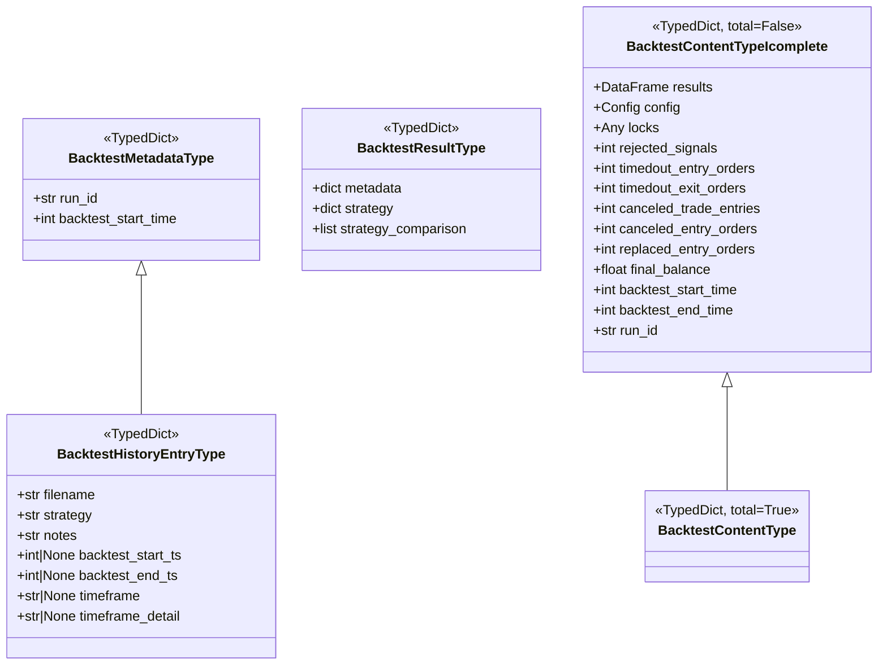

# backtest_result_type.py

## 概述

定义回测结果相关的 TypedDict 类型，用于在回测引擎、报告生成和结果存储之间传递结构化数据。这些类型为回测数据提供了严格的类型注解，便于 IDE 提示和静态类型检查。

## 架构图

## 核心类/函数

### BacktestMetadataType

回测元数据类型。

| 字段 | 类型 | 说明 |
|------|------|------|
| `run_id` | str | 回测运行唯一标识 |
| `backtest_start_time` | int | 回测开始时间戳 |

### BacktestResultType

回测结果的顶层容器类型。

| 字段 | 类型 | 说明 |
|------|------|------|
| `metadata` | dict[str, Any] | 元数据，按策略名索引 |
| `strategy` | dict[str, Any] | 策略结果，按策略名索引 |
| `strategy_comparison` | list[Any] | 策略间对比数据 |

### get_BacktestResultType_default() -> BacktestResultType

工厂函数，返回 `BacktestResultType` 的默认值（空字典/空列表）。使用 `deepcopy` 确保每次调用返回独立的实例。

### BacktestHistoryEntryType

继承自 `BacktestMetadataType`，用于回测历史记录列表。

| 字段 | 类型 | 说明 |
|------|------|------|
| `filename` | str | 结果文件名 |
| `strategy` | str | 策略名称 |
| `notes` | str | 备注信息 |
| `backtest_start_ts` | int \| None | 回测数据开始时间戳 |
| `backtest_end_ts` | int \| None | 回测数据结束时间戳 |
| `timeframe` | str \| None | 主 K 线周期 |
| `timeframe_detail` | str \| None | 详细 K 线周期 |

### BacktestContentTypeIcomplete

回测内容类型（所有字段可选，`total=False`）。

包含回测的完整输出数据：交易结果 DataFrame、配置、锁定信息、各类信号统计（rejected_signals、timedout 订单等）、最终余额、运行时间等。

### BacktestContentType

继承自 `BacktestContentTypeIcomplete`，`total=True` 表示所有字段必填。目前类体为空（`pass`），仅通过继承改变 total 设置。

## 依赖关系

### 内部依赖（本项目模块）
- `freqtrade.constants.Config` -- 配置类型

### 外部依赖（第三方库）
- `copy.deepcopy` -- 深拷贝默认值
- `typing_extensions.TypedDict` -- 类型化字典
- `pandas.DataFrame` -- 回测结果数据

### 被依赖（谁引用了本文件）
- `freqtrade.ft_types.__init__` -- 导出所有类型
- （通过 `__init__` 被 optimize、rpc、data 等模块间接使用）
