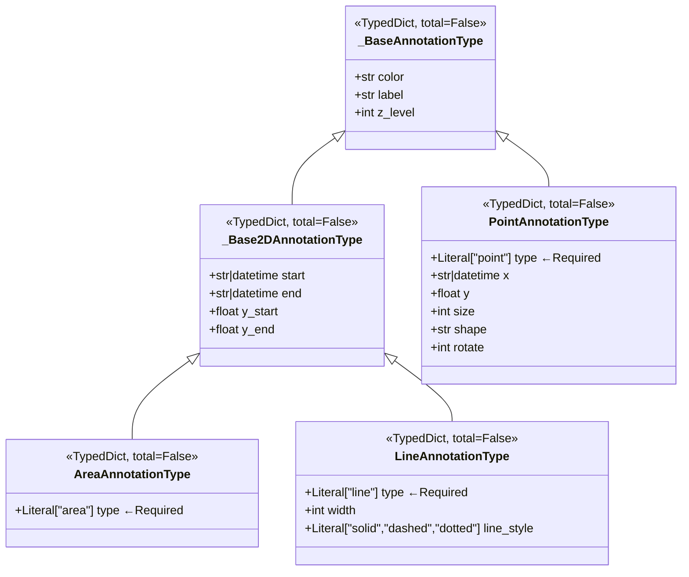

# plot_annotation_type.py

## 概述

定义图表注释（annotation）的类型系统，用于策略在 K 线图上绘制标记点、线段和区域。支持三种注释类型：点（point）、线（line）和区域（area），每种类型有各自的属性集。使用 Pydantic 的 `TypeAdapter` 提供运行时验证能力。

## 架构图



## 核心类/函数

### _BaseAnnotationType

所有注释类型的基础 TypedDict（`total=False`，所有字段可选）。

| 字段 | 类型 | 说明 |
|------|------|------|
| `color` | str | 颜色 |
| `label` | str | 标签文本 |
| `z_level` | int | Z 轴层级（控制叠放顺序） |

### _Base2DAnnotationType

二维注释的基础类型，继承 `_BaseAnnotationType`。

| 字段 | 类型 | 说明 |
|------|------|------|
| `start` | str \| datetime | 起始时间（X 轴） |
| `end` | str \| datetime | 结束时间（X 轴） |
| `y_start` | float | 起始价格（Y 轴） |
| `y_end` | float | 结束价格（Y 轴） |

### AreaAnnotationType

区域注释类型。`type` 字段为 `Required[Literal["area"]]`（必填且值必须为 "area"）。继承所有 2D 属性，定义起止时间和价格范围之间的区域。

### LineAnnotationType

线段注释类型。`type` 字段为 `Required[Literal["line"]]`。

| 额外字段 | 类型 | 说明 |
|----------|------|------|
| `width` | int | 线宽 |
| `line_style` | Literal["solid", "dashed", "dotted"] | 线型 |

### PointAnnotationType

点注释类型。`type` 字段为 `Required[Literal["point"]]`。

| 额外字段 | 类型 | 说明 |
|----------|------|------|
| `x` | str \| datetime | X 坐标（时间） |
| `y` | float | Y 坐标（价格） |
| `size` | int | 点大小 |
| `shape` | Literal[...] | 形状：circle, rect, roundRect, triangle, pin, arrow, none |
| `rotate` | int | 旋转角度 |

### AnnotationType

联合类型别名：
```python
AnnotationType = AreaAnnotationType | LineAnnotationType | PointAnnotationType
```

### AnnotationTypeTA

Pydantic `TypeAdapter` 实例，用于对 `AnnotationType` 进行运行时验证和序列化。

## 依赖关系

### 内部依赖（本项目模块）
无

### 外部依赖（第三方库）
- `typing.Literal, Required` -- 字面量类型和必填标记
- `typing_extensions.TypedDict` -- 类型化字典
- `datetime.datetime` -- 日期时间类型
- `pydantic.TypeAdapter` -- 运行时类型验证

### 被依赖（谁引用了本文件）
- `freqtrade.ft_types.__init__` -- 导出 AnnotationType
- `freqtrade.strategy.interface` -- 策略中使用注释类型绘制图表标记
