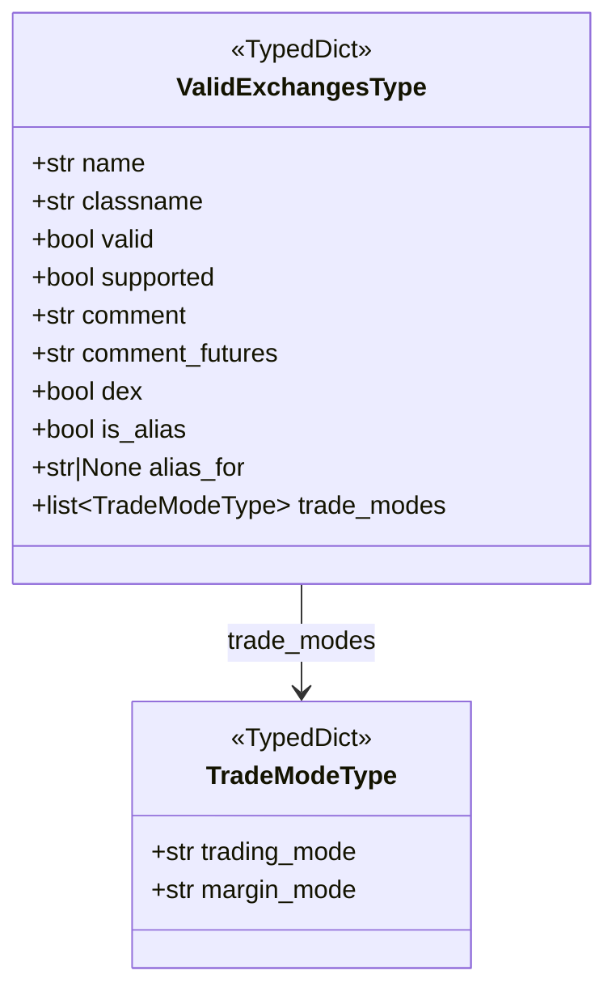

# valid_exchanges_type.py

## 概述

定义交易所信息的 TypedDict 类型，用于 `list-exchanges` 命令和交易所选择逻辑中结构化表示交易所的属性。包括交易所的名称、支持状态、交易模式等信息。

## 架构图

## 核心类/函数

### TradeModeType

交易模式类型定义。

| 字段 | 类型 | 说明 |
|------|------|------|
| `trading_mode` | str | 交易模式（如 "spot", "futures"） |
| `margin_mode` | str | 保证金模式（如 "cross", "isolated"） |

### ValidExchangesType

合法交易所信息的完整类型定义。

| 字段 | 类型 | 说明 |
|------|------|------|
| `name` | str | 交易所显示名称 |
| `classname` | str | 交易所类名 |
| `valid` | bool | 是否有效（可正常使用） |
| `supported` | bool | 是否被 freqtrade 官方支持 |
| `comment` | str | 备注（现货交易） |
| `comment_futures` | str | 备注（期货交易） |
| `dex` | bool | 是否为去中心化交易所 |
| `is_alias` | bool | 是否为另一个交易所的别名 |
| `alias_for` | str \| None | 如果是别名，指向的原始交易所名称 |
| `trade_modes` | list[TradeModeType] | 支持的交易模式列表 |

## 依赖关系

### 内部依赖（本项目模块）
无

### 外部依赖（第三方库）
- `typing_extensions.TypedDict` -- 类型化字典

### 被依赖（谁引用了本文件）
- `freqtrade.ft_types.__init__` -- 导出 TradeModeType, ValidExchangesType
- （通过 `__init__` 被 exchange_utils、list_commands 等模块间接使用）
