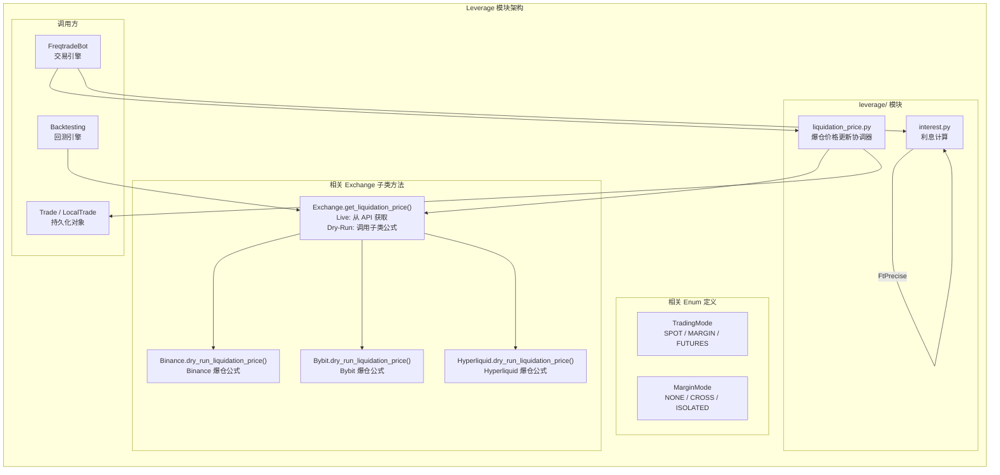
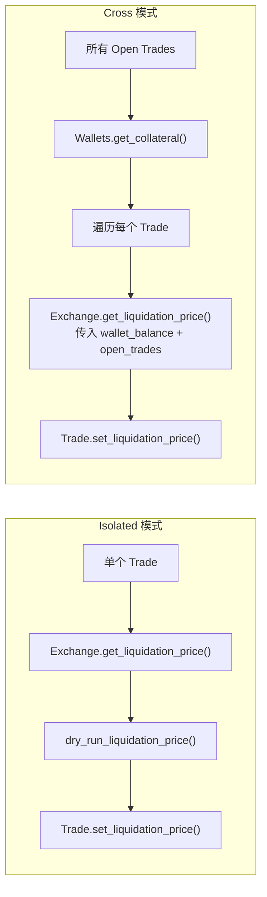
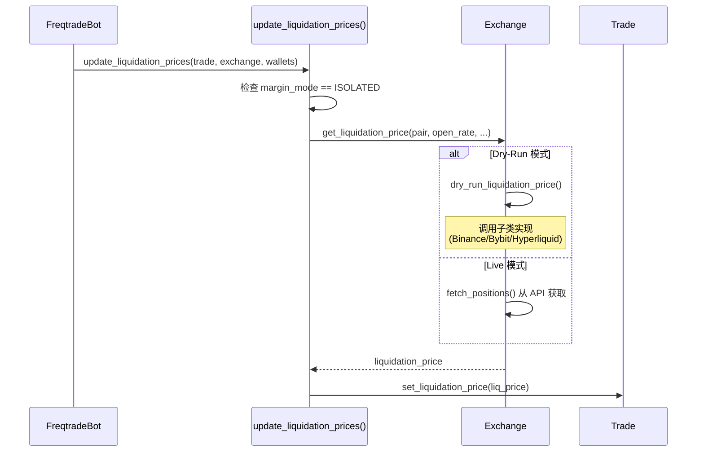
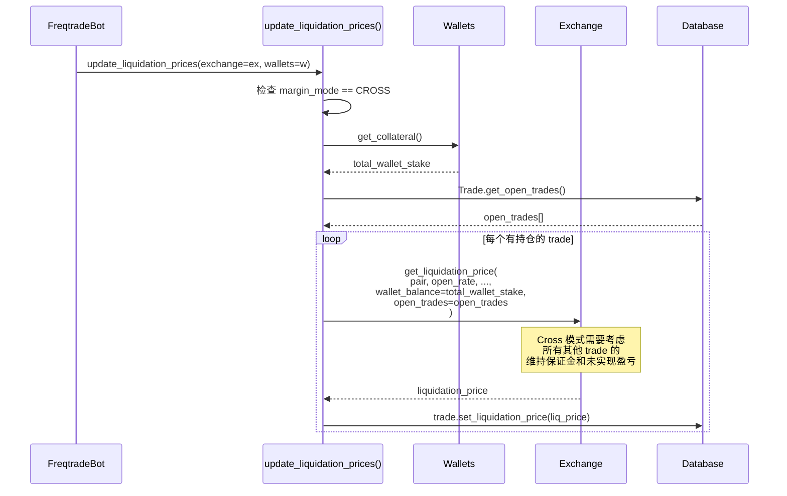
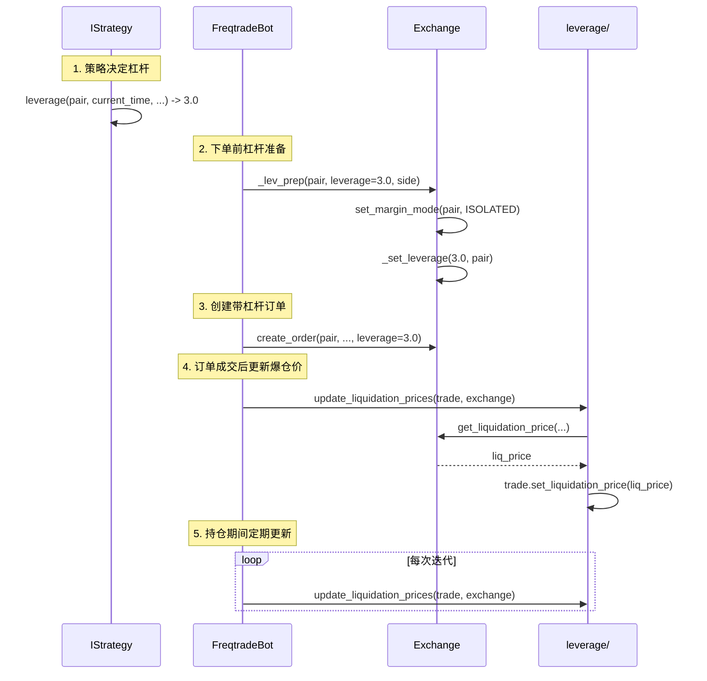

# Leverage -- 杠杆交易源码文档

## 1. 模块概述

`freqtrade/leverage/` 是 Freqtrade 中处理杠杆交易（Margin / Futures）相关计算的模块。该模块相对精简，主要包含两大功能：

1. **利息计算** (`interest.py`) - 计算保证金交易中借入资金的利息
2. **爆仓价格更新** (`liquidation_price.py`) - 协调各交易所的爆仓价格计算与更新

需要注意的是，杠杆交易的完整实现分布在多个模块中：
- `freqtrade/exchange/` - 各交易所子类实现了具体的 `dry_run_liquidation_price()` 方法
- `freqtrade/persistence/` - `Trade` / `LocalTrade` 对象存储杠杆和爆仓相关字段
- `freqtrade/strategy/interface.py` - `IStrategy` 提供 `leverage()` callback 让用户自定义杠杆倍数
- `freqtrade/enums/` - 定义 `TradingMode`（Spot/Margin/Futures）和 `MarginMode`（Cross/Isolated）

### 核心设计理念

- **交易所特定计算**：不同交易所的爆仓公式差异极大，因此具体的爆仓价格计算逻辑下沉到各交易所子类
- **Cross vs Isolated**：隔离保证金（Isolated）只考虑单个 trade 的保证金；全仓保证金（Cross）需要考虑所有 open trades 的保证金和未实现盈亏
- **高精度计算**：利息计算使用 `FtPrecise` 类避免浮点误差
- **Live/Dry-Run 双模式**：Live 模式从交易所 API 获取爆仓价格，Dry-Run 模式使用本地公式计算

---

## 2. 目录结构

| 文件名 | 大小 | 功能说明 |
|--------|------|----------|
| `__init__.py` | ~70B | 模块入口，导出 `interest` 函数 |
| `interest.py` | ~1.2KB | 保证金利息计算函数，支持 Binance 和 Kraken 的不同利息模型 |
| `liquidation_price.py` | ~2KB | 爆仓价格更新协调器，区分 Isolated 和 Cross 模式的更新逻辑 |

---

## 3. 架构图



### 爆仓价格计算流程



---

## 4. 核心类/函数说明

### 4.1 `interest()` 函数 (`interest.py`)

计算保证金交易中借入资金的利息。

```python
def interest(
    exchange_name: str,        # 交易所名称
    borrowed: FtPrecise,       # 借入金额
    rate: FtPrecise,           # 日利率
    hours: FtPrecise           # 借入时长（小时）
) -> FtPrecise:
```

**支持的交易所及公式：**

| 交易所 | 利息公式 | 说明 |
|--------|---------|------|
| Binance | `borrowed * rate * ceil(hours) / 24` | 按小时向上取整，再除以 24 转换为日利率 |
| Kraken | `borrowed * rate * (1 + ceil(hours / 4))` | 每 4 小时为一个计费周期，基于 [Kraken 费率计算器](https://kraken-fees-calculator.github.io/) |

**参数说明：**
- `borrowed`: 使用 `FtPrecise` 精确数值类型，避免浮点精度问题
- `rate`: 日利率（非年化利率）
- `hours`: 借入时间，单位为小时
- 不支持的交易所会抛出 `OperationalException`

**注意事项：**
- 该函数目前主要用于 Margin 模式（非 Futures）
- Futures 模式使用 funding fee（资金费率）而非利息，其计算在 Exchange 类中

### 4.2 `update_liquidation_prices()` 函数 (`liquidation_price.py`)

爆仓价格更新的协调函数，根据保证金模式选择不同的更新策略。

```python
def update_liquidation_prices(
    trade: LocalTrade | None = None,  # 目标 trade（Isolated 模式必需）
    *,
    exchange: Exchange,               # 交易所实例
    wallets: Wallets,                 # 钱包实例
    stake_currency: str,              # 计价货币
    dry_run: bool = False,            # 是否 Dry-Run 模式
):
```

**Cross 模式（全仓保证金）：**

```
1. 获取 wallet collateral (总保证金)
2. 获取所有 open trades
3. 遍历每个有持仓的 trade:
   -> exchange.get_liquidation_price(
        pair, open_rate, is_short, amount, stake_amount,
        leverage, wallet_balance=total_wallet_stake,
        open_trades=open_trades  # 传入所有 open trades
      )
   -> trade.set_liquidation_price(result)
```

在 Cross 模式下，任何一个 trade 的变化都会影响所有 trade 的爆仓价格，因此需要全部更新。

**Isolated 模式（逐仓保证金）：**

```
1. 使用单个 trade 的 stake_amount 作为 wallet_balance
2. exchange.get_liquidation_price(
     pair, open_rate, is_short, amount, stake_amount,
     leverage, wallet_balance=trade.stake_amount
   )
3. trade.set_liquidation_price(result)
```

Isolated 模式下，每个 trade 的爆仓价格独立计算。

**错误处理：**
- 如果 Isolated 模式下没有传入 `trade` 参数，抛出 `DependencyException`
- 计算失败时记录 warning 日志而不是抛出异常（避免影响交易循环）

### 4.3 交易所子类中的爆仓价格计算

虽然不在 `leverage/` 目录中，但这些是杠杆交易的核心计算逻辑：

#### Binance 爆仓公式 (`exchange/binance.py`)

```
Liquidation Price = (wallet_balance + cross_vars + maintenance_amt - side * amount * open_rate)
                    / (amount * mm_ratio - side * amount)

其中:
- side = -1 (short) 或 1 (long)
- mm_ratio = 维持保证金率
- maintenance_amt = 维持保证金金额 (CUM)
- cross_vars = upnl_ex_1 - mm_ex_1 (Cross 模式下其他仓位的未实现盈亏和维持保证金)
```

Cross 模式还需要计算：
- `mm_ex_1`: 除当前合约外所有其他合约的维持保证金
- `upnl_ex_1`: 除当前合约外所有其他合约的未实现盈亏
- 使用 `fetch_funding_rates()` 获取 mark price 来计算以上值

#### Bybit 爆仓公式 (`exchange/bybit.py`)

```
USDT/USDC (Isolated):
  Long:  LP = entry_price - (initial_margin - maintenance_margin) / amount
  Short: LP = entry_price + (initial_margin - maintenance_margin) / amount

其中:
  initial_margin = position_value / leverage
  maintenance_margin = position_value * mm_ratio
  position_value = amount * open_rate
```

#### Hyperliquid 爆仓公式 (`exchange/hyperliquid.py`)

```
maintenance_margin_required = position_value / max_leverage / 2
maintenance_leverage = max_leverage * 2
l = 1 / maintenance_leverage
side = 1 (long) 或 -1 (short)

Isolated: margin_available = stake_amount - maintenance_margin_required
Cross:    margin_available = wallet_balance - maintenance_margin_required

liq_price = price - side * margin_available / position_size / (1 - l * side)
```

此公式经 196 个真实持仓数据验证，平均偏差仅 0.00029%。

---

## 5. 依赖关系

### 外部依赖

| 依赖 | 用途 |
|------|------|
| (无直接外部依赖) | 该模块仅使用 Python 标准库和 Freqtrade 内部模块 |

### 内部依赖

| 模块 | 用途 |
|------|------|
| `freqtrade.util.FtPrecise` | 高精度数值计算（替代 float） |
| `freqtrade.enums.MarginMode` | Cross / Isolated 保证金模式枚举 |
| `freqtrade.exchange.Exchange` | 交易所基类，提供 `get_liquidation_price()` 方法 |
| `freqtrade.persistence.Trade` / `LocalTrade` | 交易对象，存储和更新爆仓价格 |
| `freqtrade.wallets.Wallets` | 钱包对象，获取 collateral（全仓保证金） |
| `freqtrade.exceptions` | `OperationalException`、`DependencyException` |

### 被依赖关系

| 调用方 | 用途 |
|--------|------|
| `freqtrade.freqtradebot.FreqtradeBot` | 每次迭代更新爆仓价格 |
| `freqtrade.optimize.backtesting.Backtesting` | 回测时计算爆仓价格 |

---

## 6. 数据流

### 6.1 爆仓价格更新流程（Isolated 模式）



### 6.2 爆仓价格更新流程（Cross 模式）



### 6.3 利息计算在交易生命周期中的位置


### 6.4 杠杆交易完整数据流（从策略到交易所）


