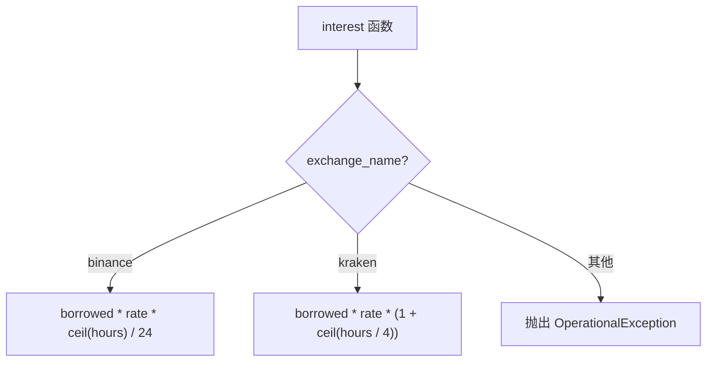

# interest.py

## 概述

`freqtrade/leverage/interest.py` 提供了保证金（margin）交易的利息计算函数。不同交易所有不同的利息计算公式，该模块针对 Binance 和 Kraken 分别实现了各自的计算逻辑。

## 架构图

## 核心类/函数

### interest()

计算保证金交易的利息。

**参数：**
- `exchange_name: str` — 交易所名称
- `borrowed: FtPrecise` — 借入的货币数量
- `rate: FtPrecise` — 利率（日利率）
- `hours: FtPrecise` — 借入时长（小时）

**返回：** `FtPrecise` — 应付利息金额（币种与 borrowed 相同）

**各交易所计算公式：**

| 交易所 | 公式 | 说明 |
|--------|------|------|
| Binance | `borrowed * rate * ceil(hours) / 24` | 按小时向上取整，除以 24 转为日利率 |
| Kraken | `borrowed * rate * (1 + ceil(hours / 4))` | 按 4 小时周期向上取整计费 |

**精度处理：**
使用 `FtPrecise` 高精度计算类避免浮点精度问题。模块级预定义了常用常量 `one`, `four`, `twenty_four`。

**异常：**
- 不支持的交易所抛出 `OperationalException`

## 依赖关系

### 内部依赖（本项目模块）
- `freqtrade.exceptions.OperationalException` — 异常处理
- `freqtrade.util.FtPrecise` — 高精度计算

### 外部依赖（第三方库）
- `math.ceil` — 向上取整

### 被依赖（谁引用了本文件）
- `freqtrade.leverage.__init__` — 导出 interest 函数
- `freqtrade.persistence.trade_model` — 计算交易利息
