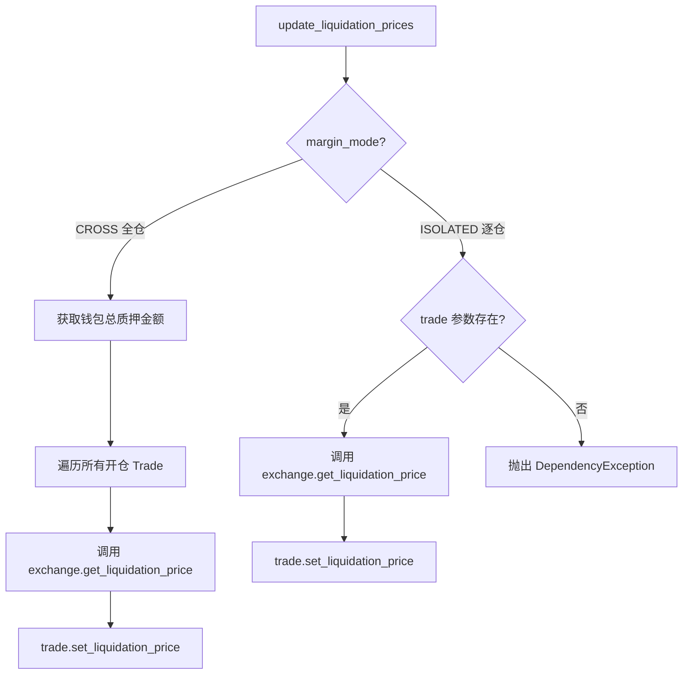

# liquidation_price.py

## 概述

`freqtrade/leverage/liquidation_price.py` 提供了清算价格（liquidation price）的更新逻辑。在杠杆交易中，当仓位亏损到一定程度时，交易所会强制平仓（清算）。此模块负责根据当前仓位和保证金模式计算并更新清算价格。

## 架构图

## 核心类/函数

### update_liquidation_prices()

更新交易的清算价格。

**参数：**
- `trade: LocalTrade | None` — 要更新的交易对象（逐仓模式必须）
- `exchange: Exchange` — 交易所实例（keyword-only）
- `wallets: Wallets` — 钱包实例（keyword-only）
- `stake_currency: str` — 质押货币（keyword-only）
- `dry_run: bool = False` — 是否为模拟运行（keyword-only）

**全仓模式（CROSS）处理：**
1. 如果是 dry_run，获取钱包总质押金额作为 `total_wallet_stake`
2. 遍历所有有持仓的 open trade
3. 对每个 trade 调用 `exchange.get_liquidation_price()` 计算清算价
4. 传入 `wallet_balance=total_wallet_stake` 和 `open_trades` 列表（全仓模式下所有仓位共享保证金）

**逐仓模式（ISOLATED）处理：**
1. 要求提供 `trade` 参数
2. 仅计算该单笔交易的清算价格
3. `wallet_balance` 使用该交易自身的 `stake_amount`

**异常处理：**
- 逐仓模式下未提供 `trade` 参数时抛出 `DependencyException`
- 所有 `DependencyException` 被捕获并记录 warning 日志

## 依赖关系

### 内部依赖（本项目模块）
- `freqtrade.enums.MarginMode` — 保证金模式枚举（CROSS / ISOLATED）
- `freqtrade.exceptions.DependencyException` — 依赖异常
- `freqtrade.exchange.Exchange` — 交易所基类
- `freqtrade.persistence.LocalTrade` / `Trade` — 交易对象
- `freqtrade.wallets.Wallets` — 钱包管理

### 被依赖（谁引用了本文件）
- `freqtrade.freqtradebot` — 在实盘/模拟运行中更新清算价格
- `freqtrade.optimize.backtesting` — 回测中更新清算价格
