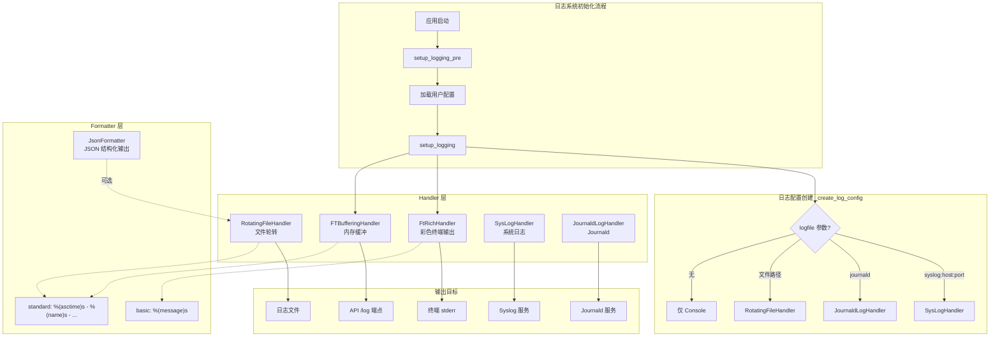
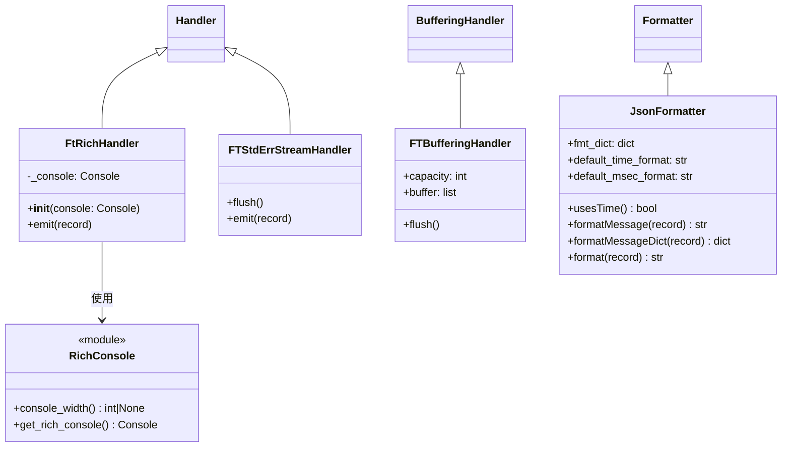
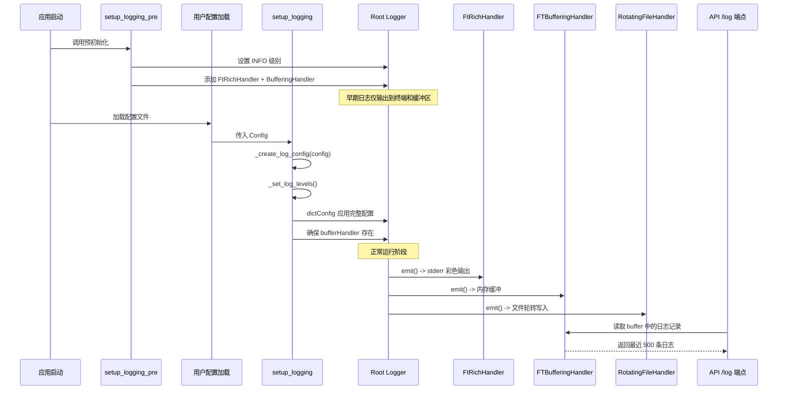

# Freqtrade Loggers -- 日志系统模块

## 1. 模块概述

`freqtrade/loggers/` 模块是 Freqtrade 交易机器人的日志基础设施，负责整个应用程序的日志记录、格式化和输出管理。该模块基于 Python 标准库 `logging` 构建，并集成了 [Rich](https://github.com/Textualize/rich) 库以提供彩色终端输出。

模块的核心设计理念：
- **分阶段初始化**：支持预初始化（`setup_logging_pre`）和正式初始化（`setup_logging`）两个阶段，确保在配置加载前后都能正常记录日志
- **多输出目标**：同时支持终端输出（Rich 彩色格式）、文件日志（RotatingFileHandler）、Syslog、Journald 等多种输出目标
- **缓冲机制**：内置缓冲 Handler，为 API `/log` 端点提供最近日志记录的查询能力
- **JSON 格式化**：支持将日志输出为结构化 JSON 格式，便于日志聚合系统采集
- **可配置性**：支持通过 `dictConfig` 方式完全自定义日志配置

## 2. 目录结构

```
freqtrade/loggers/
|-- __init__.py                  # 模块入口，包含日志系统初始化逻辑和全局配置
|-- buffering_handler.py         # 缓冲日志 Handler，保留最近的日志记录供 API 查询
|-- ft_rich_handler.py           # 基于 Rich 库的彩色日志 Handler
|-- json_formatter.py            # JSON 格式的日志 Formatter
|-- rich_console.py              # Rich Console 实例的创建和管理
|-- set_log_levels.py            # 偏差测试器（Bias Tester）日志级别控制
|-- std_err_stream_handler.py    # 标准错误流日志 Handler（备用，当前未启用）
```

## 3. 架构图





## 4. 核心类/函数说明

### 4.1 `__init__.py` -- 日志系统入口

#### 全局常量与对象

| 名称 | 类型 | 说明 |
|------|------|------|
| `LOGFORMAT` | `str` | 默认日志格式字符串：`"%(asctime)s - %(name)s - %(levelname)s - %(message)s"` |
| `bufferHandler` | `FTBufferingHandler` | 全局缓冲 Handler 实例，容量 1000 条，供 API `/log` 端点使用 |
| `error_console` | `Console` | Rich Console 实例，输出到 stderr，初始无颜色 |
| `FT_LOGGING_CONFIG` | `dict` | 默认的 `dictConfig` 日志配置字典 |

#### `setup_logging_pre() -> None`

预初始化函数，在用户配置加载之前调用。设置 `INFO` 级别，仅启用 `FtRichHandler` 和 `bufferHandler` 两个 Handler。此阶段的日志不会写入文件或其他目标。

#### `setup_logging(config: Config) -> None`

正式初始化函数，根据用户配置完成日志系统的完整设置。主要流程：
1. 调用 `_create_log_config(config)` 构建日志配置字典
2. 调用 `_set_log_levels()` 设置各模块日志级别
3. 通过 `logging.config.dictConfig()` 应用配置
4. 将 `bufferHandler` 添加到 root logger
5. 根据 `print_colorized` 配置决定是否启用彩色输出
6. 设置 root logger 的 verbosity 级别

#### `_create_log_config(config: Config) -> dict`

根据用户配置构建 `dictConfig` 格式的日志配置字典。支持三种文件日志模式：
- **Syslog 模式**：`logfile` 参数格式为 `syslog:host:port`（已废弃，建议使用 `log_config` 配置项）
- **Journald 模式**：`logfile` 参数格式为 `journald`（已废弃，需要 `cysystemd` 包）
- **文件模式**：`logfile` 参数为文件路径，使用 `RotatingFileHandler`（10MB 轮转，保留 10 个备份）

#### `_set_log_levels(log_config, verbosity, api_verbosity)`

根据 verbosity 级别设置第三方库的日志级别：

| 模块名 | verbosity=0 | verbosity=1 | verbosity=2 | verbosity>=3 |
|--------|-------------|-------------|-------------|-------------|
| `freqtrade` | INFO | DEBUG | DEBUG | DEBUG |
| `ccxt.base.exchange` | INFO | INFO | INFO | DEBUG |
| `requests` / `urllib3` | INFO | INFO | DEBUG | DEBUG |
| `telegram` | INFO | INFO | INFO | INFO |
| `httpx` | WARNING | WARNING | WARNING | WARNING |
| `werkzeug` | 取决于 api_verbosity | - | - | - |

### 4.2 `buffering_handler.py` -- FTBufferingHandler

继承自 `logging.handlers.BufferingHandler`，重写了 `flush()` 方法。当缓冲区满时，不会清空所有记录，而是保留后半部分（capacity/2 条记录），确保 API 端点始终能返回最近的日志数据。

```python
class FTBufferingHandler(BufferingHandler):
    def flush(self):
        # 保留后半部分记录，避免日志查询时出现空白
        records_to_keep = -int(self.capacity / 2)
        self.buffer = self.buffer[records_to_keep:]
```

### 4.3 `ft_rich_handler.py` -- FtRichHandler

基于 Rich 库的自定义日志 Handler，提供彩色终端输出。使用硬编码的日志格式，不完全支持标准 logging Handler 的所有特性。

输出格式为：`时间戳 - 模块名(紫色) - 日志级别(按级别着色) - 消息内容`

特殊处理：
- 当 Console 输出到 `NullFile`（如 pythonw 环境）时，调用 `handleError` 而非尝试写入
- 捕获 `ImportError` 以处理关闭时的异常
- `RecursionError` 不被捕获，直接向上抛出

### 4.4 `json_formatter.py` -- JsonFormatter

将日志记录格式化为 JSON 字符串，适用于日志聚合系统（如 ELK Stack、Loki 等）。

默认 JSON 字段映射：

| JSON 字段 | LogRecord 属性 |
|-----------|---------------|
| `timestamp` | `asctime` |
| `level` | `levelname` |
| `logger` | `name` |
| `message` | `message` |

支持自定义字段映射，并自动包含异常信息（`exc_info`）和堆栈信息（`stack_info`）。

### 4.5 `rich_console.py` -- Rich Console 管理

提供两个工具函数：

- **`console_width() -> int | None`**：获取终端宽度。在 pytest 和 ipykernel 环境中返回固定值 200；终端宽度不可用时也返回 200
- **`get_rich_console(**kwargs) -> Console`**：创建带有默认宽度设置的 Rich Console 实例

### 4.6 `set_log_levels.py` -- Bias Tester 日志级别控制

为偏差测试器（Bias Tester）提供日志级别的临时调整功能。偏差测试器会多次加载同一策略，为避免日志刷屏，临时将以下模块的日志级别提高到 WARNING：
- `freqtrade.resolvers`
- `freqtrade.strategy.hyper`
- `freqtrade.configuration.config_validation`

测试完成后可调用 `restore_verbosity_for_bias_tester()` 恢复原始级别。

### 4.7 `std_err_stream_handler.py` -- FTStdErrStreamHandler

直接向 `sys.stderr` 写入日志的 Handler。当前在主初始化流程中已被注释掉，由 `FtRichHandler` 替代。保留作为备用方案。

特点：不持有 stderr 的引用（每次 emit 时直接访问 `sys.stderr`），避免与进度条等组件冲突。

## 5. 依赖关系

### 内部依赖

```
freqtrade.loggers
|-- freqtrade.constants          # Config 类型定义
|-- freqtrade.exceptions         # OperationalException
```

### 外部依赖

| 库 | 用途 |
|----|------|
| `rich` | 彩色终端输出（Console, Text, NullFile） |
| `logging` | Python 标准日志库 |
| `logging.handlers` | BufferingHandler, RotatingFileHandler, SysLogHandler |
| `cysystemd` | Journald 日志支持（可选依赖） |

### 被依赖关系

该模块被 Freqtrade 几乎所有其他模块使用，是基础设施层的核心组件：
- `freqtrade.main` -- 应用启动时调用初始化
- `freqtrade.rpc` -- API `/log` 端点读取 `bufferHandler`
- `freqtrade.util.progress_tracker` -- 使用 `error_console`
- `freqtrade.util.rich_tables` -- 使用 `get_rich_console`

## 6. 数据流



### 日志级别控制流

```
命令行 -v 参数
    |
    v
config["verbosity"] = 0, 1, 2, 3...
    |
    v
_set_log_levels() 设置第三方库级别
    |
    v
setup_logging() 设置 root logger 级别
    |-- verbosity < 1 -> INFO
    |-- verbosity >= 1 -> DEBUG
```

### Bias Tester 日志流

```
Bias Tester 启动
    |
    v
reduce_verbosity_for_bias_tester()
    |-- freqtrade.resolvers -> WARNING
    |-- freqtrade.strategy.hyper -> WARNING
    |-- freqtrade.configuration.config_validation -> WARNING
    |
    v
[执行多次策略加载，日志被抑制]
    |
    v
restore_verbosity_for_bias_tester()
    |-- 所有模块 -> NOTSET (恢复默认)
```
