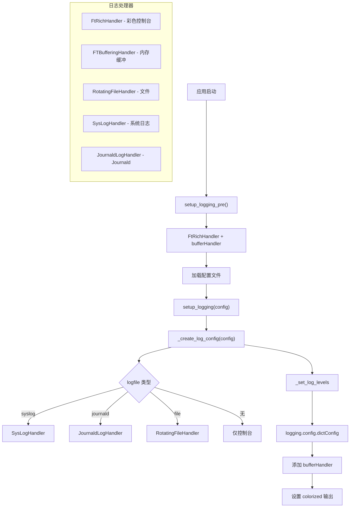
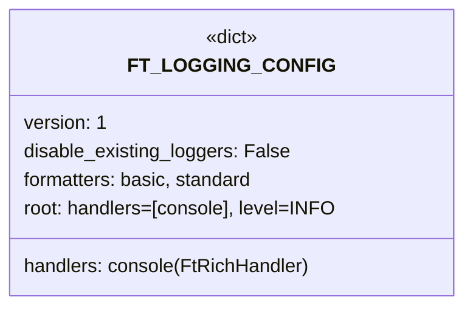

# __init__.py

## 概述

`freqtrade/loggers/__init__.py` 是 Freqtrade 日志系统的核心初始化模块。它负责配置整个应用的日志记录行为，包括控制台输出（基于 Rich 的彩色日志）、文件日志（RotatingFileHandler）、系统日志（syslog/journald）、内存缓冲日志（用于 API `/log` 端点）等。该模块提供两阶段日志初始化机制：`setup_logging_pre`（早期简单初始化）和 `setup_logging`（完整配置初始化）。

## 架构图

## 核心类/函数

### 模块级变量

- **`LOGFORMAT`** — 标准日志格式字符串：`"%(asctime)s - %(name)s - %(levelname)s - %(message)s"`
- **`bufferHandler`** — `FTBufferingHandler(1000)` 实例，容量 1000 条记录，用于 API `/log` 端点的内存日志缓冲
- **`error_console`** — `Console` 实例（`stderr=True, color_system=None`），用于日志输出到 stderr
- **`FT_LOGGING_CONFIG`** — 默认日志配置字典，遵循 `logging.config.dictConfig` 格式

### get_existing_handlers(handlertype) -> Handler | None

查找 root logger 中是否已存在指定类型的 handler。

- **参数**：`handlertype` — handler 类型
- **返回值**：已存在的 handler 实例或 `None`

### setup_logging_pre() -> None

日志系统的早期初始化。在完整配置加载之前调用。

- **职责**：
  1. 创建 `FtRichHandler`（彩色控制台输出到 stderr）
  2. 设置 INFO 级别
  3. 注册 `FtRichHandler` 和 `bufferHandler` 到 root logger
- **设计意图**：确保配置加载过程中的日志也能被记录，但这些早期日志不会被发送到文件等后续配置的 handler（因为 handler 还未添加）

### _set_log_levels(log_config, verbosity=0, api_verbosity="info") -> None

根据 verbosity 级别设置各 logger 的日志等级。

- **参数**：
  - `log_config` — 日志配置字典（会被原地修改）
  - `verbosity` — 详细级别（0=INFO, 1=DEBUG, 2+=更多 DEBUG）
  - `api_verbosity` — API 服务器的日志级别
- **日志级别规则**：

| Logger | -v (0) | -vv (1) | -vvv (2+) |
|--------|--------|---------|-----------|
| `freqtrade` | INFO | DEBUG | DEBUG |
| `freqtrade.exchange.exchange_ws` | INFO | INFO | DEBUG |
| `requests`, `urllib3`, `asyncio`, `httpcore` | INFO | INFO | DEBUG |
| `ccxt.base.exchange` | INFO | INFO | DEBUG (v>=3) |
| `telegram` | INFO | INFO | INFO |
| `httpx` | WARNING | WARNING | WARNING |
| `werkzeug` | ERROR/INFO | ERROR/INFO | ERROR/INFO |

### _add_root_handler(log_config, handler_name) -> None

向日志配置的 root handlers 列表中添加 handler（如果尚未添加）。

### _add_formatter(log_config, format_name, format_) -> None

向日志配置的 formatters 中添加格式化器（如果尚未添加）。

### _create_log_config(config: Config) -> dict[str, Any]

根据用户配置创建完整的日志配置字典。

- **参数**：`config` — Freqtrade 配置
- **返回值**：`logging.config.dictConfig` 兼容的配置字典
- **职责**：
  1. 以 `FT_LOGGING_CONFIG` 或用户自定义 `log_config` 为基础
  2. 根据 `logfile` 配置添加对应的 handler：
     - `syslog:host:port` — 添加 SysLogHandler（已废弃，警告用户使用 log_config）
     - `journald` — 添加 JournaldLogHandler（已废弃）
     - 其他值 — 添加 RotatingFileHandler（10MB，保留 10 个备份）
  3. 动态更新 handler 配置：
     - 为 `FtRichHandler` 注入 `error_console` 实例
     - 为 `RotatingFileHandler` 创建日志目录

### setup_logging(config: Config) -> None

日志系统的完整初始化。在配置加载完成后调用。

- **参数**：`config` — Freqtrade 完整配置
- **职责**：
  1. 跳过测试环境（`PYTEST_VERSION` 环境变量存在时），除非 `ft_tests_force_logging` 为 True
  2. 调用 `_create_log_config` 构建日志配置
  3. 调用 `_set_log_levels` 设置日志级别
  4. 调用 `logging.config.dictConfig` 应用配置
  5. 确保 `bufferHandler` 已添加到 root logger
  6. 如果启用了 `print_colorized`，激活颜色系统
  7. 根据 verbosity 设置 root logger 级别

## 依赖关系

### 内部依赖（本项目模块）
- `freqtrade.constants.Config` — 配置类型
- `freqtrade.exceptions.OperationalException` — 操作异常
- `freqtrade.loggers.buffering_handler.FTBufferingHandler` — 内存缓冲 handler
- `freqtrade.loggers.ft_rich_handler.FtRichHandler` — Rich 彩色日志 handler
- `freqtrade.loggers.rich_console.get_rich_console` — Rich Console 工厂函数

### 外部依赖（第三方库）
- `logging` — 标准库，日志系统核心
- `logging.config` — 标准库，字典式日志配置
- `os` — 标准库，环境变量检查
- `copy.deepcopy` — 标准库，深拷贝默认配置
- `pathlib.Path` — 标准库，日志文件路径处理
- `cysystemd.journal.JournaldLogHandler` — Journald 日志（可选依赖，延迟导入）

### 被依赖（谁引用了本文件）
- `freqtrade.configuration.configuration` — 导入 `setup_logging`
- `freqtrade.main` — 导入 `setup_logging_pre`
- `freqtrade.rpc.rpc` — 导入 `bufferHandler` 用于 `/log` API 端点
- `freqtrade.util.progress_tracker` — 导入 `error_console`
- `tests/test_log_setup.py` — 导入并测试日志配置
- `tests/rpc/test_rpc_telegram.py` — 导入 `setup_logging`
- `tests/rpc/test_rpc_apiserver.py` — 导入 `setup_logging`, `setup_logging_pre`
